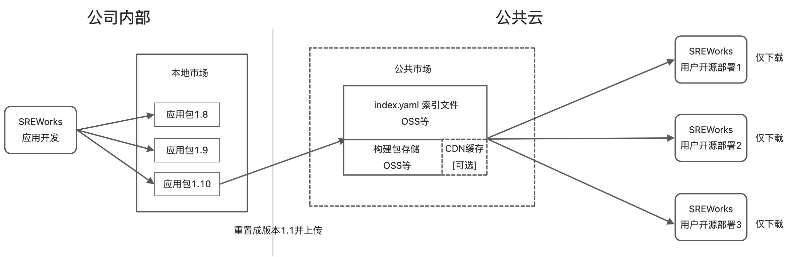
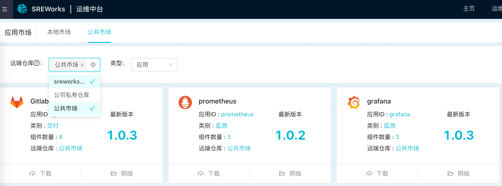
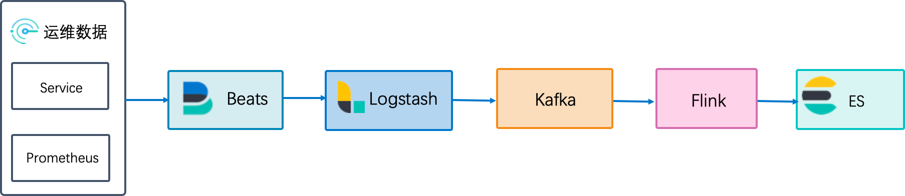

在v1.1版本发布之后，SREWorks团队开始了常态化的功能版本迭代，v1.1提供了组件插拔能力，v1.2更进一步，将会发布规划已久的**运维市场**，助力团队构筑运维生态，也会发布诸多企业用户关注的**纯内网源码构建**方案。

切入正题，下面是本次 v1.2 版本的**新功能解读**。

<a name="LwPXz"></a>

## 1. 应用市场
SREWorks团队参考helm/rpm等常见软件仓库模型，设计了SREWorks的市场分发机制如下图所示:



该市场分发机制具有如下特点:

- 公共市场理论上可以基于任何**静态存储服务**搭建，并且可以支持**缓存加速**，当前支持阿里云OSS，后续会支持 MinIO/S3 等常见存储服务。
- 支持多个SREWorks平台向同一个市场发布包，也支持一个SREWorks平台同时订阅多个市场。

<br />SREWorks团队欢迎用户在应用市场之上构建自己公司内部的**私有市场**，后续也会在公共市场上线更多的运维应用，方便用户**开箱即用**享受更多的功能和特性。

<a name="RI5o3"></a>

## 2. 纯内网源码构建部署
本次版本迭代，SREWorks团队将源码构建依赖资源进行了整理和分类，用户可自行选择或替换对应的资源，进行内网或特殊环境的源码构建部署。

<a name="vyR4M"></a>

#### 底座源码构建
在执行 `./build.sh` 命令前可传入下列的环境变量来改变资源地址，如不传入则使用默认值
```bash
# 容器镜像
ex port SW_PYTHON3_IMAGE="python:3.9.12-alpine"
ex port MIGRATE_IMAGE="migrate/migrate"
ex port MAVEN_IMAGE="maven:3.8.3-adoptopenjdk-11"
ex port GOLANG_IMAGE="golang:alpine"
ex port GOLANG_BUILD_IMAGE="golang:1.16"
ex port DISTROLESS_IMAGE="sreworks-registry.cn-beijing.cr.aliyuncs.com/mirror/distroless-static:nonroot"

# 软件仓库
ex port APK_REPO_DOMAIN="mirrors.tuna.tsinghua.edu.cn"
ex port PYTHON_PIP="http://mirrors.aliyun.com/pypi/simple"
ex port GOPROXY="https://goproxy.cn"
ex port MAVEN_SETTINGS_XML="https://sreworks.oss-cn-beijing.aliyuncs.com/resource/settings.xml"

# 二进制命令
ex port HELM_BIN_URL="https://abm-storage.oss-cn-zhangjiakou.aliyuncs.com/lib/helm"
ex port KUSTOMIZE_BIN_URL="https://abm-storage.oss-cn-zhangjiakou.aliyuncs.com/lib/kustomize"
ex port MINIO_CLIENT_URL="https://sreworks.oss-cn-beijing.aliyuncs.com/bin/mc-linux-amd64"

# SREWorks内置应用包
ex port SREWORKS_BUILTIN_PACKAGE_URL="https://sreworks.oss-cn-beijing.aliyuncs.com/packages"

...
```
完整资源清单请访问 [2.2 源码构建安装](https://www.yuque.com/sreworks-doc/docs/mzz07m?view=doc_embed)
<a name="M0Za0"></a>

#### 运维应用源码构建
在执行helm install/upgrade 命令的时候，可以选择性传入以下参数，使得运维应用可以在内网进行构建及部署。
```bash
# 容器镜像
--set global.artifacts.mavenImage="sreworks-registry.cn-beijing.cr.aliyuncs.com/mirror/maven:3.8.3-adoptopenjdk-11" \
--set global.artifacts.openjdk8Image="sreworks-registry.cn-beijing.cr.aliyuncs.com/mirror/openjdk8:alpine-jre" \
--set global.artifacts.openjdk11Image="sreworks-registry.cn-beijing.cr.aliyuncs.com/mirror/openjdk:11.0.10-jre" \
--set global.artifacts.openjdk11AlpineImage="sreworks-registry.cn-beijing.cr.aliyuncs.com/mirror/openjdk11:alpine-jre" \
--set global.artifacts.alpineImage="sreworks-registry.cn-beijing.cr.aliyuncs.com/mirror/alpine:latest" \
--set global.artifacts.nodeImage="sreworks-registry.cn-beijing.cr.aliyuncs.com/mirror/node:10-alpine" \
--set global.artifacts.migrateImage="sw-migrate" \
--set global.artifacts.postrunImage="sw-postrun" \
--set global.artifacts.python3Image="sreworks-registry.cn-beijing.cr.aliyuncs.com/mirror/python:3.9.12-alpine" \
--set global.artifacts.bentomlImage="sreworks-registry.cn-beijing.cr.aliyuncs.com/mirror/bentoml-model-server:0.13.1-py37" \

# 软件仓库
--set global.artifacts.apkRepoDomain="mirrors.tuna.tsinghua.edu.cn" \
--set global.artifacts.mavenSettingsXml="https://sreworks.oss-cn-beijing.aliyuncs.com/resource/settings.xml" \
--set global.artifacts.npmRegistryUrl="https://registry.npmmirror.com" \
--set global.artifacts.pythonPip="http://mirrors.aliyun.com/pypi/simple" \

# 二进制命令
--set global.artifacts.minioClientUrl="https://sreworks.oss-cn-beijing.aliyuncs.com/bin/mc-linux-amd64" \

...
```
完整资源清单请访问 [2.2 源码构建安装 · 语雀](https://www.yuque.com/sreworks-doc/docs/mzz07m?view=doc_embed)

<a name="AAt3D"></a>

## 3. 数据平台能力增强
<a name="hNdij"></a>

#### <br />
<a name="D55JT"></a>

#### 指标采集能力增强
纳管集群通过metricbeat支持采集prometheus ex porter能力，默认pod(ex porter)标签满足 sreworks-prometheus-scrape-metric: enable具备服务自动发现能力，自动拉取ex porter的/metrics接口数据。<br />前序版本默认仅支持针对Service标签满足 sreworks-telemetry-metric: enable 具备服务自动发现和指标接口定时pull能力，考虑到Prometheus已经成为云原生领域监控的事实标准，因此在v1.2版本中增强指标采集能力，即支持从用户服务中主动pull指标数据，也支持主动从prometheus ex porter pull指标数据。

<a name="GxjzR"></a>

#### 数据消费能力增强
新增**logstash**数据服务组件，支持对运维数据多管道分发。<br />前序版本默认数据落地到Elasticsearch存储，对数据加工处理主要依赖作业平台的数据处理任务，但作业平台对时序数据处理的时效性较弱。v1.2版本支持采集的用户运维数据（主要指Metric数据）主动流入消息队列服务Kafka，用户可通过VVP平台对时序数据进行**自定义加工处理**。<br />


<a name="pIbxq"></a>

## 4. 其他优化

- 优化应用卸载时service未回收的问题
- 优化代码依赖，去除工程中对python2.7的依赖
- 运维应用部署时支持命名空间(namespace)自定义
- 站点搜索服务支持实例详情页索引
- 前端组件文档补齐

<a name="EGjV8"></a>

### 如何从当前版本升级到v1.2

- 升级包含底座，页面可能会有5-10分钟的不可访问，请注意。
- 用户自行开发的云原生应用不会受影响(不重启)，SREWorks网关到应用的流量会有中断。
```
git clone http://github.com/alibaba/sreworks.git -b v1.2 sreworks

cd sreworks
./sbin/upgrade-cluster.sh --kubeconfig="****"
```


如在使用过程中遇到问题，欢迎各位在GitHub中提出Issues或Pull requests。<br />SREWorks开源地址：[https://github.com/alibaba/sreworks](https://github.com/alibaba/sreworks)

