在v1.2版本发布之后，SREWorks团队着手开始了v1.3版本的迭代。此次v1.3版本融合了较多用户需求，以及对底座机制进行了较大调整和优化，故发版时间长了很多。下面让我们切入正题，来看看这些大变化究竟是哪些？
<a name="K8LZx"></a>

## 1. 插件机制
<a name="oG0d2"></a>

### 插件包
在OAM应用体系中，组件(Component)和运维特征(Trait)本身即属于可插拔的部分。在v1.3版本中，SREWorks团队优化了appmanager的加载机制，将这些插拔模块从appmanager的源码中剥离出来，成为了**独立插件包**。插件管理以及包结构如下图：
<a name="OgIkQ"></a>

### 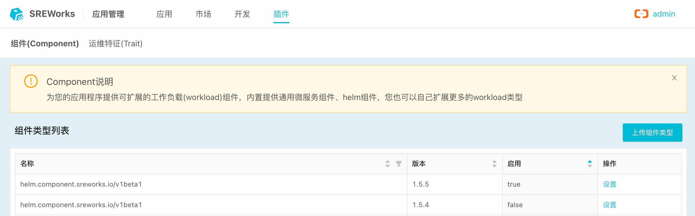
```shell
├── definition.yaml                           /* 组件定义，描述了组件的元信息 */
├── frontends
│   ├── deploy.json                           /* 组件部署时前端定制交互 */
│   ├── build.json                            /* 组件构建方案的前端定制交互 */
│   └── source.json                           /* 组件构建源的前端定制交互 */
└── dynamicscripts
    ├── ComponentDeployHandler.groovy         /* 组件的部署脚本 */
    ├── ComponentBuildHandler.groovy          /* 组件的构建脚本 */
    ├── ComponentDestroyHandler.groovy        /* 组件运行时实例销毁脚本 */
    └── ComponentHandler.groovy               /* 组件定义 */

```
在后续的小版本中，SREWorks团队以及生态开发者们，会持续地将内置组件及运维特征转换成标准插件，预计迁移过程会持续1-2个版本。<br />鉴于当前插件的开发存在一定的学习门槛，v1.3版本还暂未对外公开插件的开发体系。待相应的开发者工具配套完善后，我们会将其与开发者手册一起提供给社区。
<a name="btwEx"></a>

### 插件可视化
通常一个插件会包含前端页面，参照上图插件的目录结构，frontends目录下即为插件独有的前端定制页面。<br />以Helm组件为例，在选择添加该组件后，用户可以选择两种源，一种为该组件的**定制源**：社区仓库(Artifact Hub)，另外一种为**通用源**：代码仓库。组件在进行构建的时候，appmanager会执行`ComponentDeployHandler.groovy`脚本，该脚本会自动从用户选择的源中拉取Helm包打包进应用包中。该组件添加可视化过程如下图所示：<br />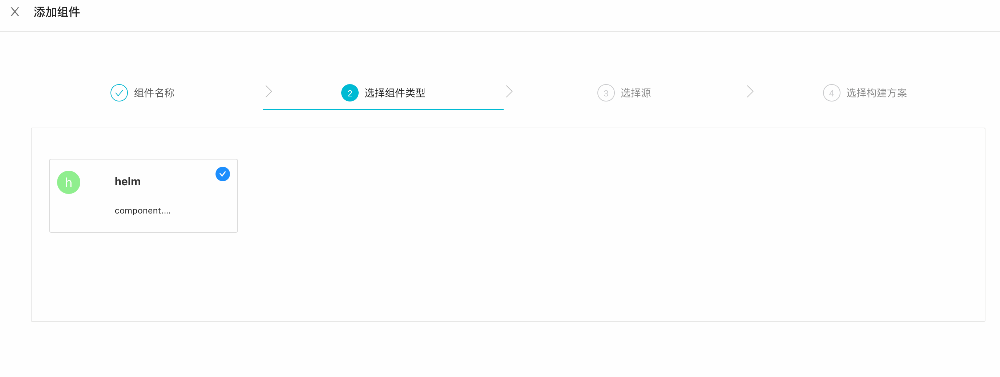<br />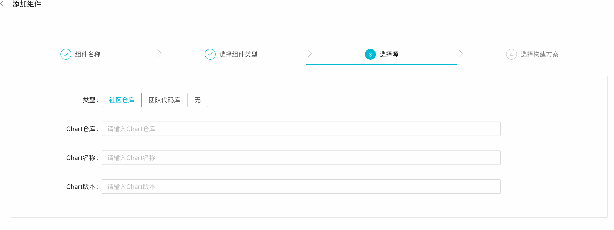

在完成组件添加之后，可以为该组件配置部署的参数基线。这个参数基线前端是由插件中的`deploy.json`控制：Helm的参数均被放置在values这个大变量中。同时，这些变量也可以利用OAM中的dataInputs机制由应用层的全局变量来传入。<br />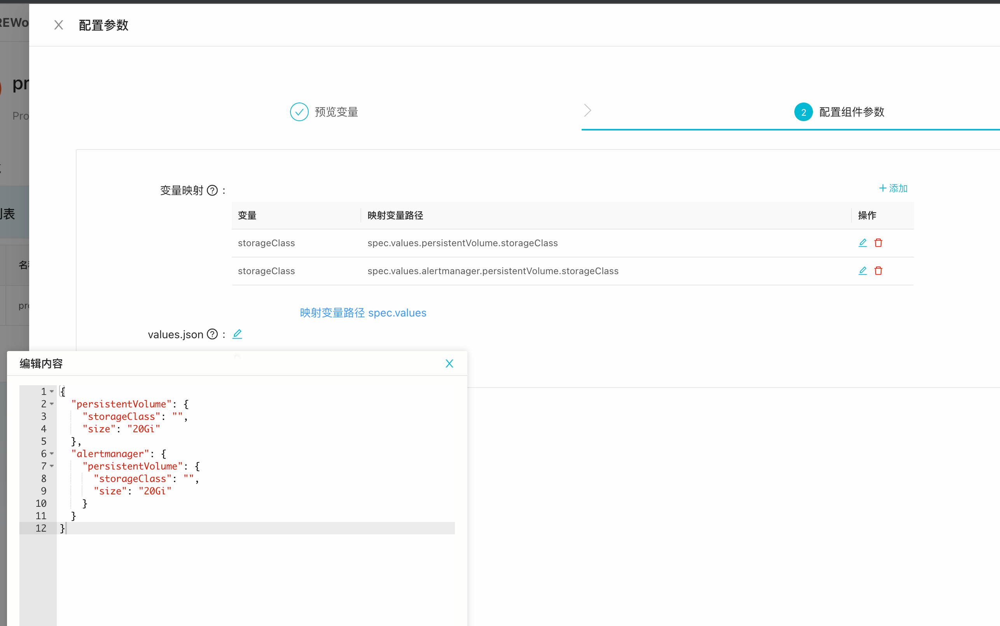

上述的一系列的配置完成后，OAM部署YAML(ApplicationConfiguration)会被自动生成，在应用构建页面可以预览到这份YAML文件。<br />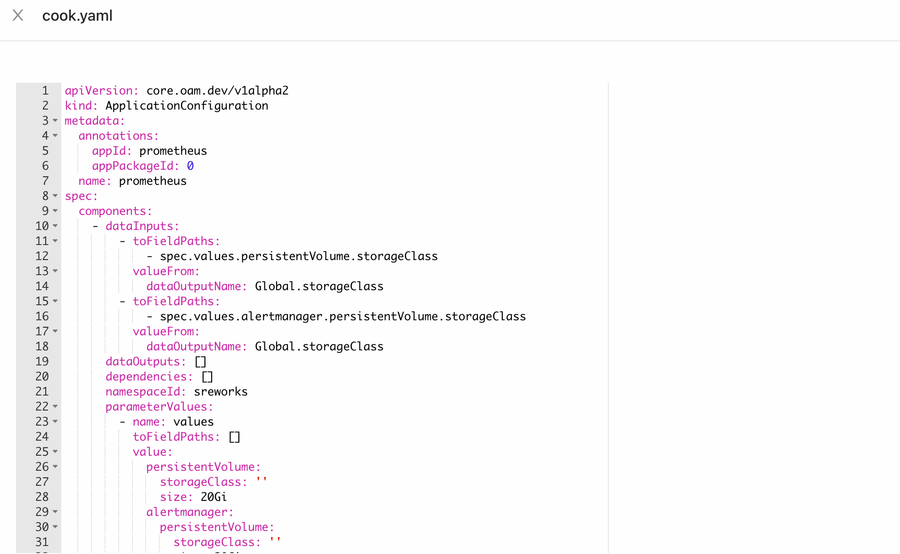

_PS: 这套插件的可视化机制也全部是利用前端低代码能力实现，有兴趣的同学可以把企业应用管理(APP_ID: app)这个应用在【运维开发】中导入开发查看其前端低代码编排明细。_

<a name="ecDbb"></a>

### 组件定义流程标准化
从插件可视化那里，细心的同学可能会发现，我们的组件定义流程从单步变成了四步。是的，随着组件的开发体系进一步完善，SREWorks团队对组件的定义过程也进行了明确细化：<br />原本单步的组件定义拆了**4+1步**，4步如下图所示<br />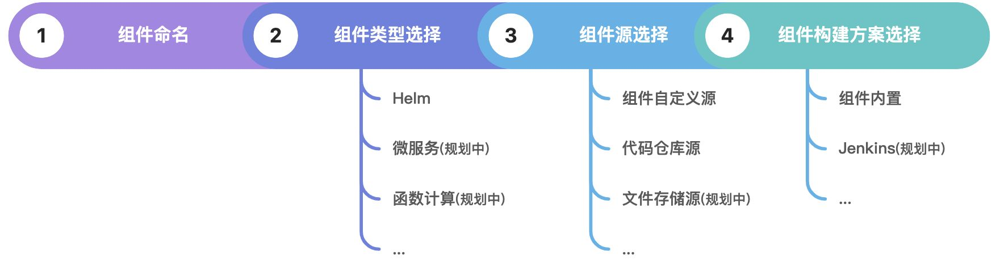

另外的+1步即组件**部署基线**。SREWorks遵循OAM规范，将运维特征(Trait)这种运行时(Runtime)的能力，严格地剥离到组件定义周期之外，作为**部署基线**依附在组件上。比如一个组件需要使用Ingress或网关，这些与组件本身定义无关，只是运行时的运维特征附加，而如果真的让使用者到部署时候再去附加，又会增加部署的复杂度：于是以这种部署基线的方式进行维护，使用者只需要在部署基线之上，针对性地少量配置即可。<br />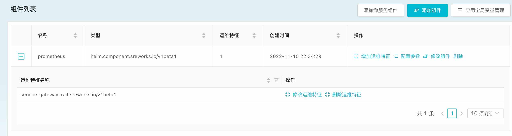
<a name="gSl3r"></a>

## 2. 应用机制优化
<a name="I0BPN"></a>

### 应用体系升级
SREWorks上线以来，由于【运维开发】中的应用和【应用开发】中的应用存在一些相似，会给使用者带去一定的困扰，尤其是一些运维团队。于是SREWorks团队针对内部使用场景以及外部意见反馈，重新明确了一下这两种应用，如下图所示：<br />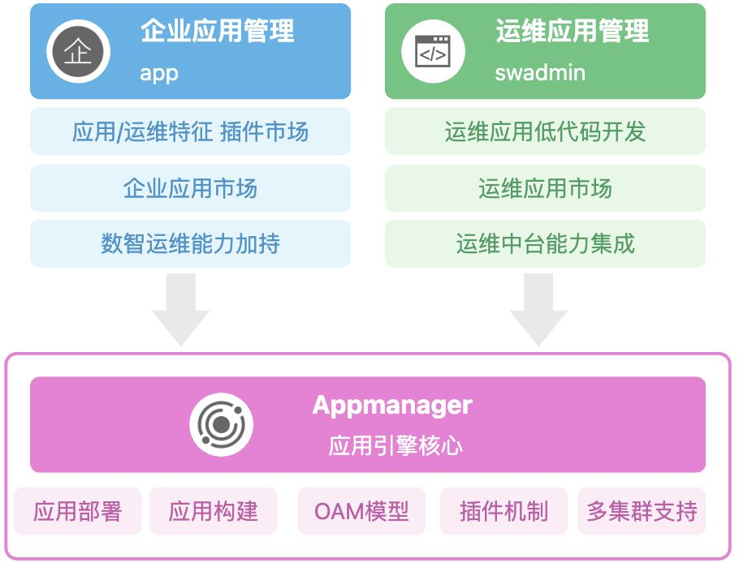


**企业应用 -> 企业应用市场:**

- 承载企业核心业务的云原生应用
- 能够被加持数智运维能力，展开进一步的数智化运维治理
- 市面上各类开源应用或大数据解决方案，会被以企业应用形式上架企业应用市场


**运维应用 -> 运维应用市场:**

- 使用SREWorks前端低代码模式构建的云原生运维应用
- 能够被快速嵌入集成运维中台能力
- 所有运维应用均经过开发及模型抽象，不会直接上架开源应用至运维应用市场。

<a name="hm6tC"></a>

### 企业应用市场
企业应用市场中的云端仓库在v1.3正式上线，依据上文的应用边界定义，在企业应用市场上会上架各类开源应用的云原生部署方案，让使用者可以一键部署**复杂应用**支撑业务。<br />企业应用市场与运维应用市场使用同一套应用机制，应用包结构相同，但使用不同的连接串(endpoint)。同时在这套机制之上，也欢迎用户构建自己的公司的云原生应用市场。<br />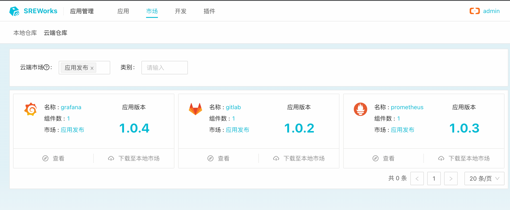

<a name="MsnLF"></a>

### 运维应用市场
随着应用体系的升级，原本内置运维应用也都被上架到了**云端运维应用市场**。每个内置运维应用功能更新后，会被优先发布至云端市场，用户可以保持更快的更新频率（运维应用的小版本迭代频率会快于SREWorks大版本）。<br />同时后续版本中会进一步对SREWorks底座和运维应用进行解耦（底座不升级也可以通过云端市场升级到最新），整体采取这样的更新策略：底座更新频率下降，运维应用更新频率上升。<br />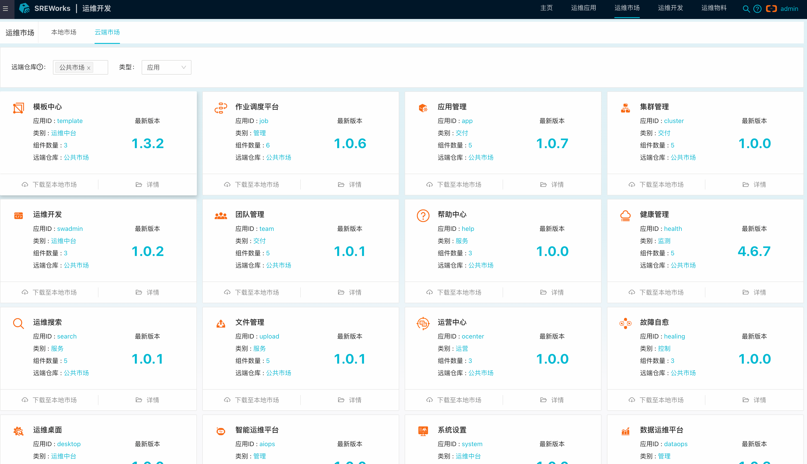

针对用户反馈的孤岛环境部署难的问题，我们在这个版本开放了**离线运维应用包**便捷导入导出的能力，进一步降低使用者应用交付门槛。如下图为SREWorks 云端/离线 两个应用分发渠道。<br />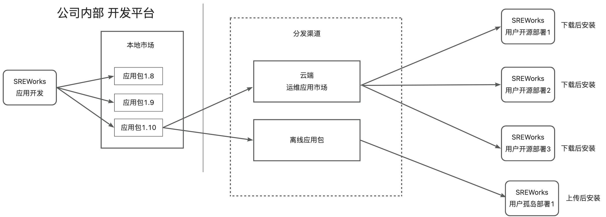

下图为离线应用包的前端交互操作链路：<br />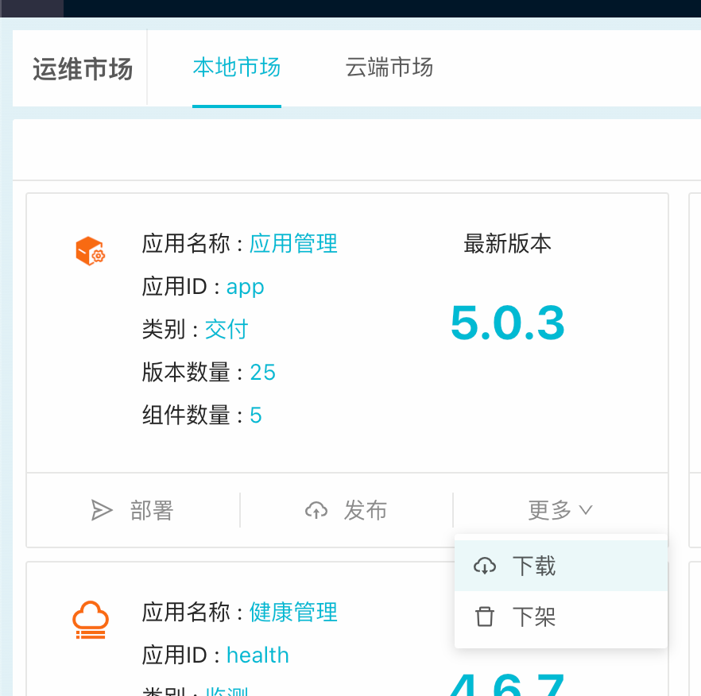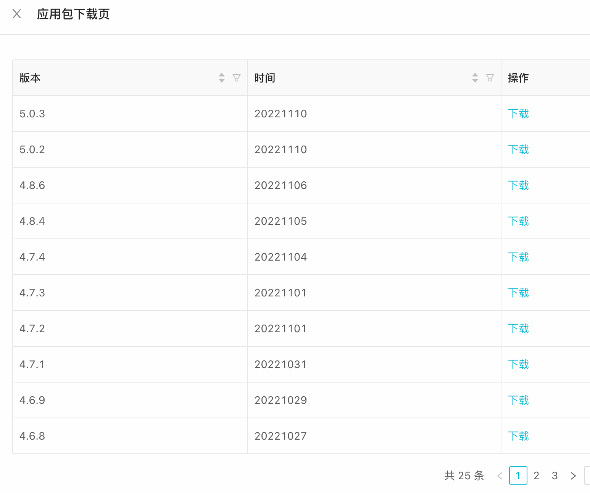<br />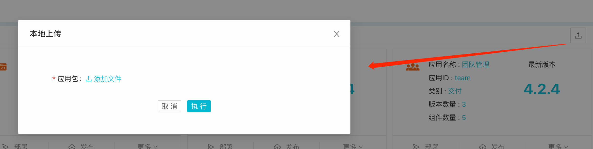


<a name="PFqof"></a>

## 3. 前端组件自定义集成
很多用户深度使用了运维应用的前端组件编排之后，觉得当前的通用前端组件还无法满足需求，提出希望开发自己的前端组件。但进行尝试的用户需要将自行编写的组件源码合并到frontend的源码目录中重新编译出包，这大大增加了用户的开发成本。于是我们在底层结构上做了适配优化，**支持组件可以用UMD包形态远程加载**。<br />这也就意味着，用户可以直接将自己写的组件打成UMD包，整个打包构建过程与frontend编译无关，可以独立完成。前端组件在构建完成后，支持在运维物料中一键快速导入，导入后**使用体验完全等同内置组件**。

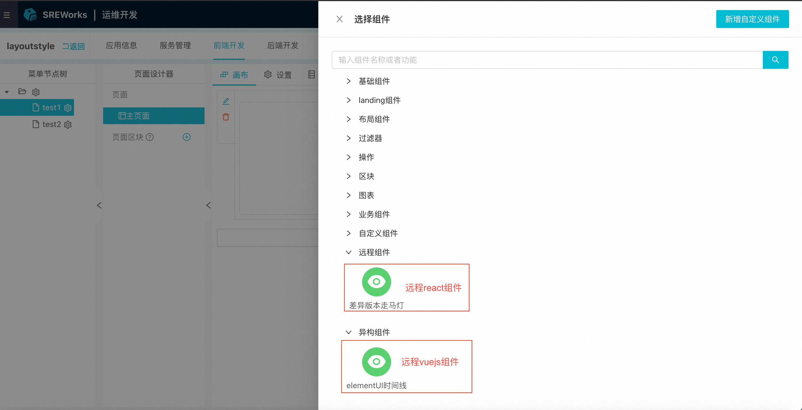<br />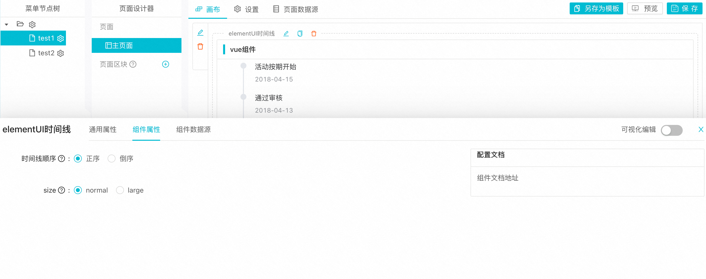

提供`@sreworks/widget-cli `远程组件开发脚手架，内置vue 和 react 工程初始化配置模板，用户可根据自身技术栈自由选择，将已有业务组件发布到npm或自定义私有仓库，快捷集成使用，且方便版本管理，支持组件runtime在线升级更新。<br />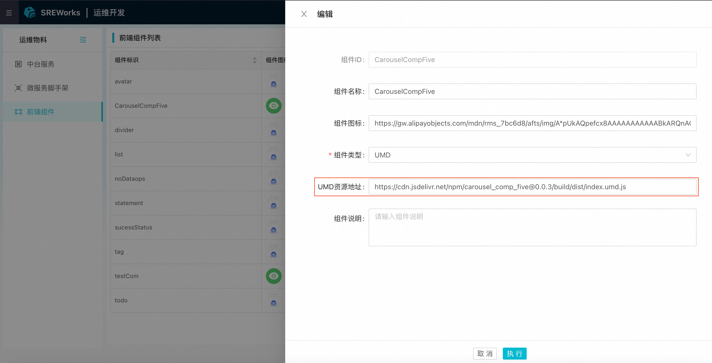

<a name="Cg4PH"></a>

## 4. 数据运维平台的流计算作业监控大盘
数据运维平台中的流计算部分基于开源VVP平台实现，由于其缺失有效的作业监控大盘，v1.3版本基于Grafana，以全托管方式新增VVP作业的监控大盘。<br />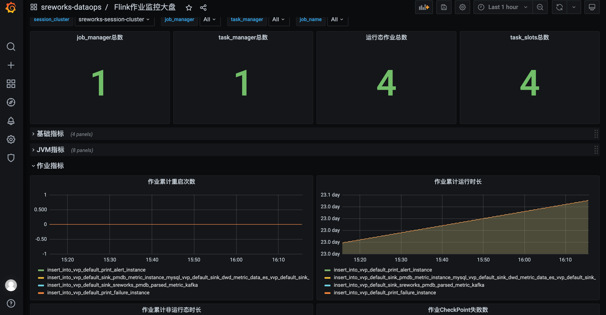
<a name="t9G9e"></a>

## 5. 其他

1. 支持helm install SREWorks之后的进度跟踪查询
2. 增加表格组件行高亮动态配置功能，支持5种颜色
3. 增加前端组件: wordcloud 词云图 / heatmap热力图， 优化前端组件: Tab竖向过滤器支持
4. 增加操作提交提示信息自定义能力 [https://github.com/alibaba/SREWorks/issues/86](https://github.com/alibaba/SREWorks/issues/86)
5. 优化kankio容器构建机制
6. 增加应用管理默认纳管自身k8s集群
7. 桌面背景伸缩适配优化

<a name="Of6ou"></a>

## 如何从当前版本升级到v1.3

- 升级包含底座，页面可能会有5-10分钟的不可访问，请注意。
- 用户自行开发的云原生应用不会受影响(不重启)，SREWorks网关到应用的流量会有中断。
```
git clone http://github.com/alibaba/sreworks.git -b v1.3 sreworks

cd sreworks
./sbin/upgrade-cluster.sh --kubeconfig="****"
```

如在使用过程中遇到问题，欢迎各位在GitHub中提出Issues或Pull requests。<br />SREWorks开源地址：[https://github.com/alibaba/sreworks](https://github.com/alibaba/sreworks)

也欢迎各位加入钉钉群（群号：35853026）分享和交流～
