随着行业不断发展，大数据&AI也逐渐呈现云原生化的趋势，在阿里，所有商业化场景使用的大数据 & AI 系统产品都是统一由阿里云计算平台建设和交付维护。复杂的业务场景及其背后涉及到的不同技术方向的开源和自研，使得产品运维面临技术复杂度高、规模大、场景多等挑战。

阿里巴巴云原生大数据运维平台 SREWorks，沉淀了团队近10年经过内部业务锤炼的 SRE 工程实践，今天正式对外开源，秉承“数据化、智能化”运维思想，帮助运维行业更多的从业者采用“数智”思想做好高效运维。

## 1 SREWorks 是什么？

谷歌在2003年提出了一种岗位叫做 SRE (Site Reliability Engineer，**站点可靠性工程师**)，它是软件工程师和系统管理员的结合，重视运维人员的开发能力，要求运维日常琐事在50%以内，另外50%精力开发自动化工具减少人力需求。

SREWorks 作为阿里云大数据SRE团队对SRE理念的工程实践，专注于以应用为中心的一站式“云原生”、“数智化”运维 SaaS 管理套件，提供**企业应用&资源管理及运维开发**两大核心能力，帮助企业实现**云原生应用&资源**的交付运维。

阿里云大数据 SRE 团队天然靠近大数据和AI，对大数据&AI技术非常熟悉，且具有随取随用的大数据&AI算力资源，一直努力践行“数据化”、“智能化”的运维理念，行业里的 DataOps（数据化运维）最早由该团队提出。SREWorks 中有一套端到端的 DataOps 闭环工程化实践，包括标准的运维数仓、数据运维平台、运营中心等。 传统IT运维领域已经有大量优秀的开源运维平台，反观云原生场景，目前还缺乏一些体系化的运维解决方案。随着云原生时代大趋势的到来，阿里云大数据 SRE 团队将SREWorks运维平台开源，希望为运维工程师们提供开箱即用的运维平台。

## 2 SREWorks 有什么优势？
回归到运维领域的需求，无论上层产品和业务形态怎么变化，运维本质上解决的还是“质量、成本、效率、安全”相关需求。SREWorks 用一个运维 SaaS 应用界面来支撑上述需求，同时以“数智”思想为内核驱动 SaaS 能力，具体包括交付、监测、管理、控制、运营、服务六部分。 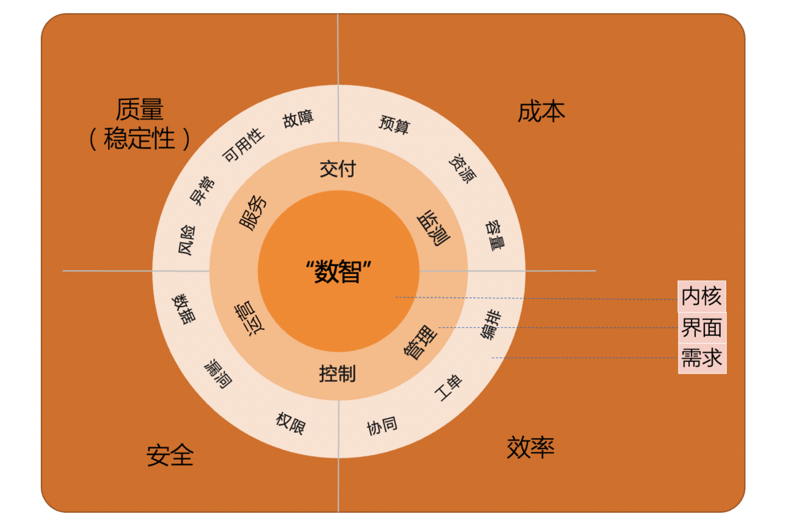

### 2.1 体系化运维平台分层架构
从“质量、成本、效率、安全”四个维度出发看运维本质相关工作，运维除了要搭平台、建规范、做标准，还要用自动理念提升效率，用数据驱动测试/开发/运维，用智能手段提前发现/预测风险问题等。这些可以看成是方法论。如何能从理论快速获得一套体系化、工程化、产品化的能力实践，去支撑满足上述四个维度的需求，就是 SREWorks 所考虑的问题。 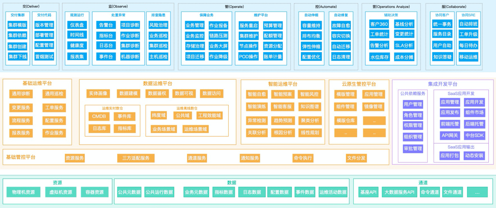 阿里云大数据 SRE 团队利用分层思想构筑了 SREWorks 平台产品体系，借鉴经典 SPI（SaaS/PaaS/IaaS）三层划分思路，SREWorks 由“运维 SaaS 应用场景层、运维 PaaS 中台服务层、运维 IaaS 接入层”三部分构成。 SREWorks 中还融入了运维规范、标准化思想，利用产品承载自动化流程、数据驱动、智能内核的方法论。从代码到线上业务服务的整个过程，运维或多或少地参与了其中一些工作，因此，围绕应用的生命周期，在SaaS场景层划分了“交付、监测、管理、控制、运营、服务”六大区。如下图所示，每块内容里都有代表性的核心功能。

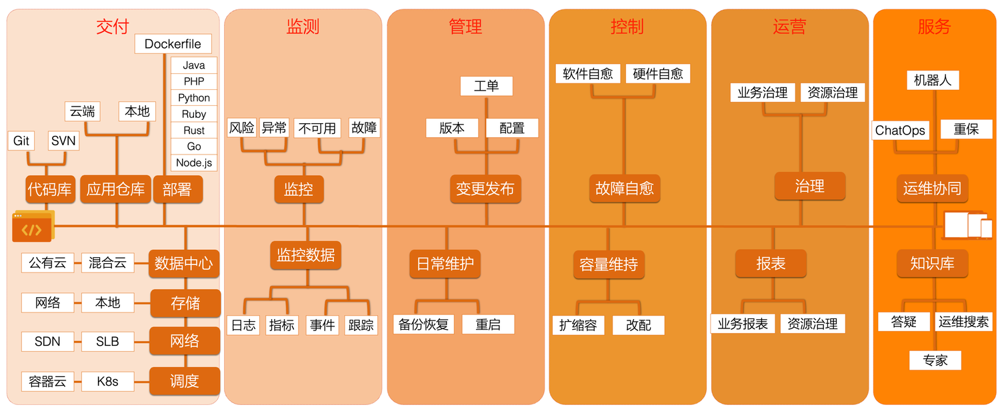 SREWorks 中统一以应用抽象来描述业务系统，在开发人员将研发完成的应用制品**交付**上线后，就会对线上应用实例生命周期进行**监测、管理、控制**。SREWorks所拥有的运维数据能力会提供增值化的**运营、服务**，为有需要的人员提供便捷的视图、管理能力等。 “交付、监测、管理、控制、运营、服务”六大场景在SREWorks产品手册中有详细的定义及边界说明。

### 2.2 完整的数据化运维体系实践
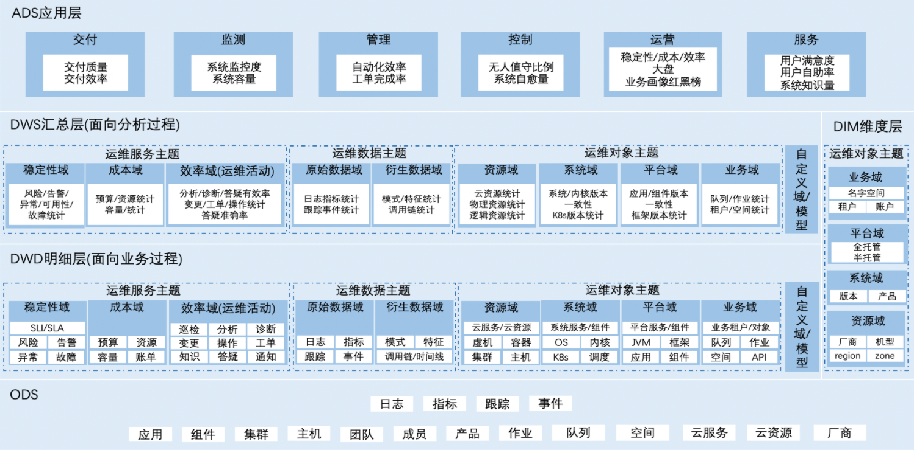 一套数据化运维体系，会把所有系统的运维数据全部采集起来、真正打通，并深度挖掘这些数据的价值，为运维提供数据决策；同时构建数据化运维业务模型，基于该模型建立标准化运维数仓，建设数据运维平台，在平台中规范运维数据的采集、存储、计算及分析，并提供一系列数据化服务，供上层运维场景使用。

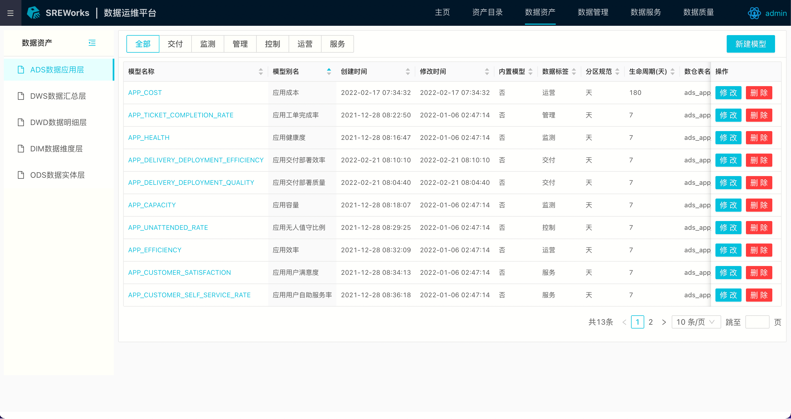 有了运维相关的量化数据，对运维工作的描述和衡量将更加立体化，可以建立长期可持续优化的运维工作模式，实现真正的运维价值。 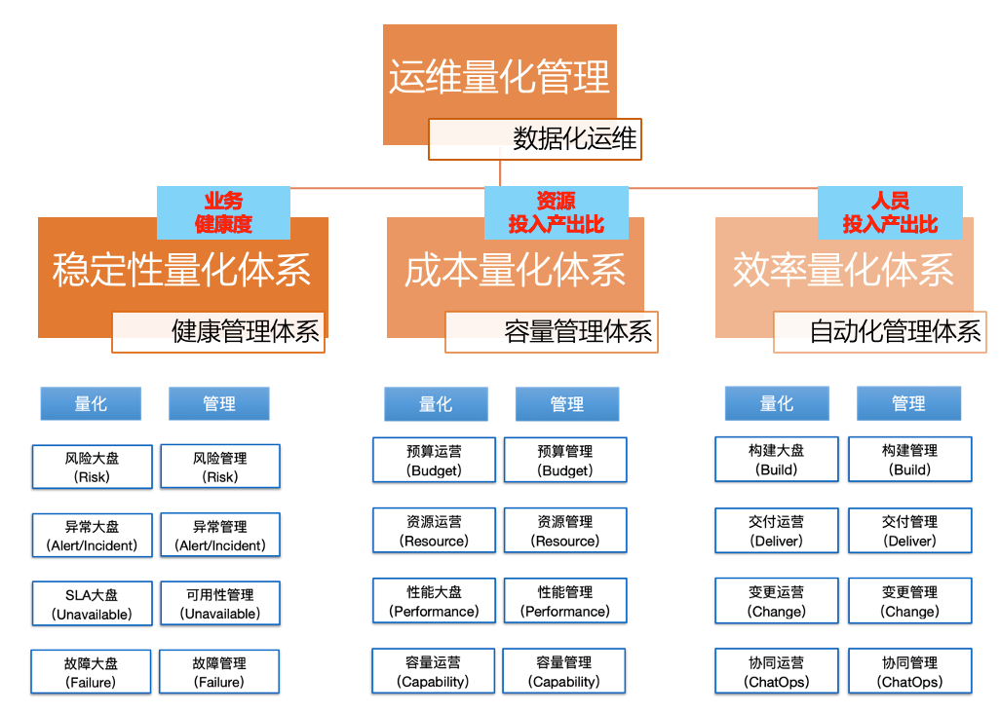

### 2.3 服务化的 AIOps 智能运维平台
在阿里云大数据 SRE 团队看来， AIOps 的出现并没有改变运维的表现形式，依旧还是“交付、监测、管理、控制、运营、服务”的界面，只是在大量运维数据化工作的基础之上，利用AI能力探索、挖掘智能化运维场景。因此，在一开始构筑 AIOps 工程实践时，就坚持打造“感知、决策、执行”的闭环，类似自动驾驶的理念。 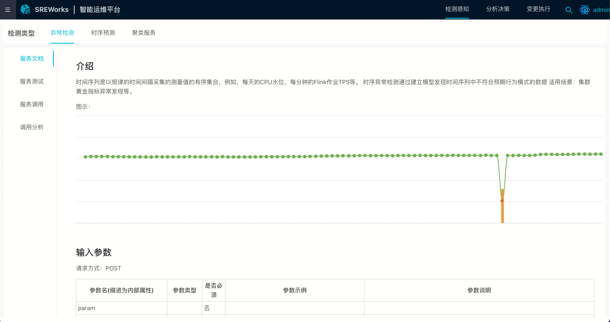 SREWorks将量身定制的算法与运维场景化结合，能够提前预测、关联分析，增强风险预防、故障定界定位能力，实现传统手段无法获得的运维价值。具体而言，将每一个智能化的运维服务包装成感知的“监测器”、决策的“分析器”、执行的“策略器”，供健康管理、变更管理等系列服务调用，即可增强已有运维场景，解决一些普通手段无法解决的问题。

### 2.4 运维中台化、低代码化及云原生化运维开发体验
SREWorks 套件自身也是云原生化的应用，并且采用运维中台思想构建，在中台里构建大量的PaaS 化运维服务能力，在前台围绕“交、监、管、控、营、服”六大场景提供SaaS 化运维场景应用。 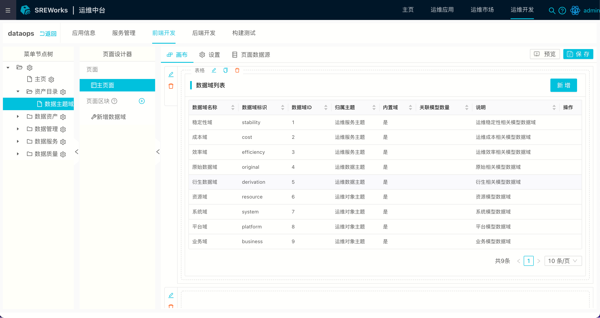 大部分页面为企业后端控制台类系统，不太需要很酷炫的交互设计，故而，运维开发领域的前端开发始终难于追赶前端流行趋势。针对这些特点，SREWorks 创新性地设计了一套 Serverless 体验的前端开发模式。 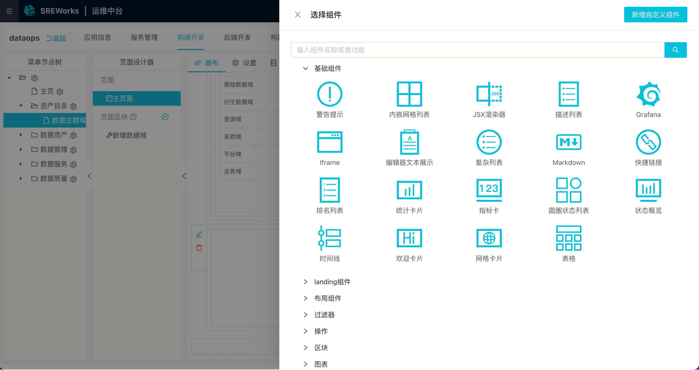

## 3 为什么要开源？
阿里云大数据 SRE 团队之前在多次技术分享时重点介绍过“DataOps、AIOps”的能力，但都是纯理论层面的介绍。具体在 SRE 领域，到底在工程实践上实现这一套理论？对运维的需求、界面、内核这三层的理解如何落地？ 为了把数据化、智能化这套数智内核故事讲明白，阿里云大数据 SRE 团队将具有低门槛、高效率特点的云原生运维平台SREWorks开源出来。 他们坚定地认为，运维团队更需要拥抱云原生，只有这样，运维才能在云原生浪潮下找到一席之地。 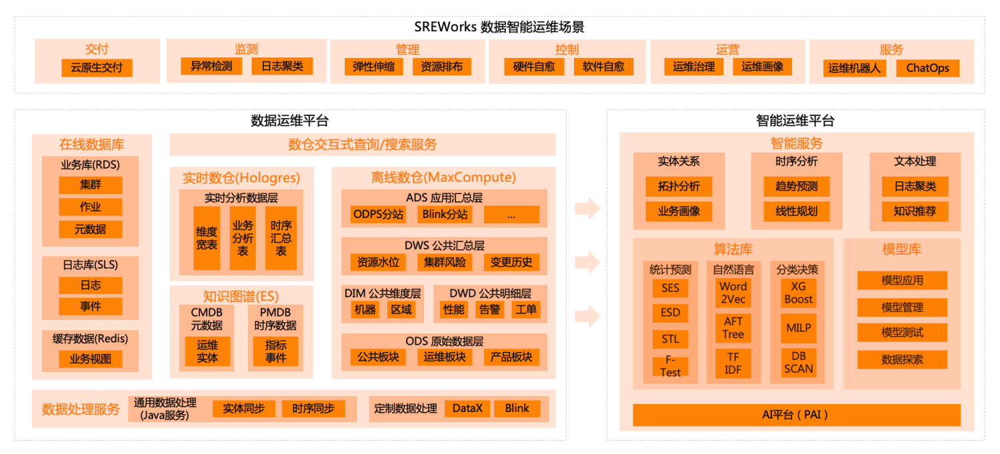

该团队也希望， SREWorks 的开源，能让更多从业者使用“大数据和AI”的能力做好运维，**实现“数据+智能”的运维平台内核**。 据介绍，SREWorks背靠阿里云计算平台系列“大数据&AI”产品，如 MaxCompute、Flink、DataWorks、Hologres、Elasticsearch 等，开源版中同样选取了这些产品对应的开源版本，比如开源版 Flink、Elasticsearch 等。

## 4 后续规划
SREWorks平台目前每个月会进行一次迭代开发任务，后续将由版本管理员统一维护合入相关功能及问题修复等内容，以保证最新的云原生化运维能力持续进入后期版本中。

当前， SREWorks 中有一套 OAM（Open Application Model）规范的工程化实践，可以把该实践看成是 SREWorks 的核心引擎。围绕该引擎，SREWorks团队建设了系列运维中台服务，包含自动化、数据化、智能化能力，之后也将跟随社区 OAM 规范的发展，持续迭代。

## 5 写在最后
今天 SREWorks 的开源只是迈出的一小步，非常期待得到开发者的反馈。SREWorks中也设计了插件化扩展能力，欢迎使用 SREWorks 来打造属于自己的运维平台。 最后，如果您对 SRE、DataOps、AIOps 或云原生等领域有兴趣，都可以参与到我们的建设中来，这将是我们莫大的荣幸，欢迎扫描钉钉交流群二维码，一起打造最具特色的 SRE 云原生运维平台！

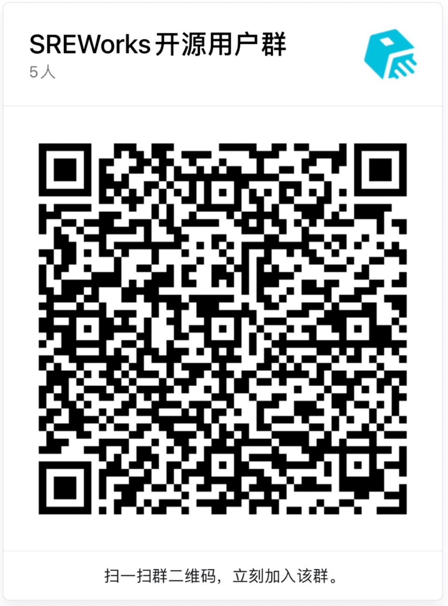

项目地址：[https://github.com/alibaba/sreworks](https://github.com/alibaba/sreworks)

