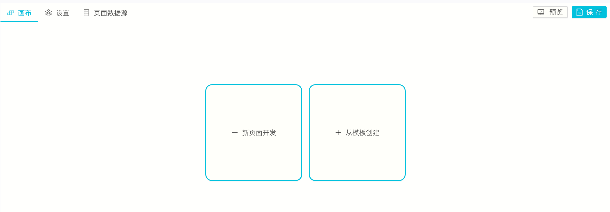
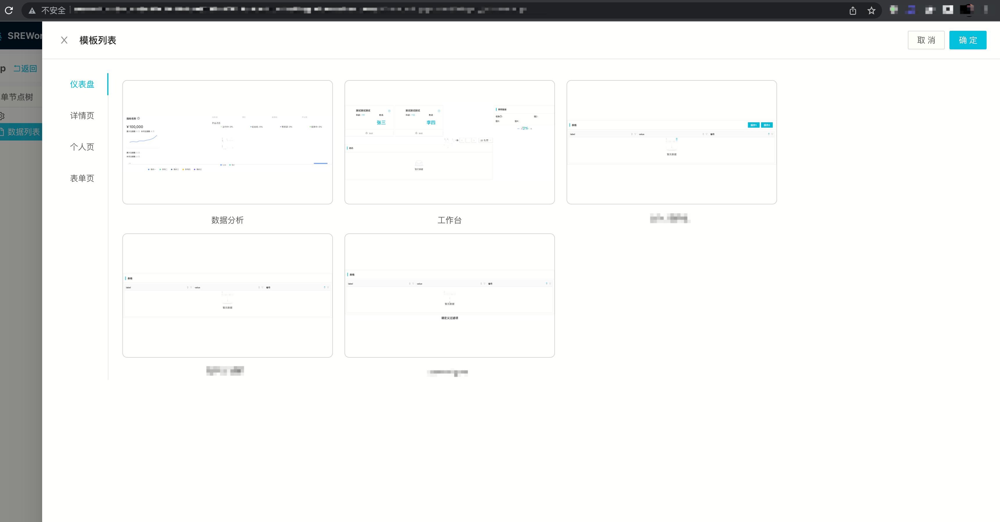

自SREWorks v1.0 版本在3月份开源以来，通过钉钉群、微信群、GitHub等渠道，团队陆续收到了各种反馈。随即团队开始了v1.1版本的功能优化迭代，优先解决用户反馈上来的TOP3问题: **组件插拔、最小资源部署、存储类使用**，同时针对用户使用过程中暴露出来的小问题也做了相应的优化。

后续产品会持续保持较快的发布频率，快速解决各渠道用户反馈的痛点问题，帮助用户利用SREWorks更好地构建云原生下的数智运维平台。

下面是本次 v1.1 版本发布的新功能介绍: 

<a name="jVBkA"></a>

### 1. 基础版/数智版

k8s集群的资源消耗让不少尝鲜用户望而却步，因此v1.1版本将基础应用和数智应用部署分离，让用户可以只体验SREWorks的底座平台，而不开启较占用资源的数智化应用。

基础版SREWorks在**单台4核16G**机器上即可正常启动。

基础应用包含8个应用: 

- 运维中台
- 应用管理
- 团队管理
- 集群管理
- 模板中心
- 帮助中心
- 文件管理
- 系统设置

数智应用包含7个应用:

- 数据运维平台
- 智能运维平台
- 故障自愈
- 健康管理
- 运营中心
- 作业调度平台
- 运维搜索

在进行helm部署的时候，传入如下参数即可使用基础版(默认为数智版):
```
--set saas.onlyBase=true
```

<a name="daZ6i"></a>

### 2. 组件插拔: ElasticSearch/MySQL/MinIO

当前不少公司的生产环境下均包含可靠的存储模块，比如ES/MySQL/MinIO等，所以部分用户在部署应用时不希望使用SREWorks v1.0版本中自带的存储模块，而是希望将那些中间件的endpoint直接注入。<br />团队经过整理和优化，将SREWorks中使用的各种存储模块，抽取出变量支持用户在部署时修改。

在进行helm部署的时候，根据需求传入如下参数即可:
```
# 替换基础应用的主MySQL数据库
# MySQL这块需要注意，通常将主MySQL数据库和数智化MySQL数据库(吞吐较大)分成两个

--set appmanager.server.database.host="*.mysql.rds.aliyuncs.com" 
--set appmanager.server.database.password="****"
--set appmanager.server.database.user="root"
--set appmanager.server.database.port=3306
--set appmanagerbase.mysql.enabled=false

# 替换数智化应用的MySQL数据库
--set saas.dataops.dbHost="*.mysql.rds.aliyuncs.com"
--set saas.dataops.dbUser=root
--set saas.dataops.dbPassword="*****"
--set saas.dataops.dbPort=3306

# 替换数智化应用的ElasticSearch
--set saas.dataops.esHost="*.public.elasticsearch.aliyuncs.com"
--set saas.dataops.esPort="9200"
--set saas.dataops.esUser="elastic"
--set saas.dataops.esPassword="*******"

# 替换基础应用的MinIO存储
--set global.minio.accessKey="*******"
--set global.minio.secretKey="*******"
--set appmanager.server.package.endpoint="minio.*.com:9000"
--set appmanagerbase.minio.enabled=false

```

<a name="ZELUF"></a>

### 3. 页面模板中心

低代码的前端开发模式，对于之前没有接触过相关应用的用户依然存在一定的门槛，于是团队借鉴了文档模板的这一概念，将前端组件按照常见的场景类别编排成模板，让用户可以快速导入一个现成的模板页面，在模板之上继续进行前端开发。

同时v1.1版本也支持用户将自己常用的页面保存成模板，提升日常的页面开发效率。

<br />

<a name="SwSOF"></a>

### 
<a name="Aj0EL"></a>

### 4. 默认存储类支持

很多使用k8s的用户不太清楚StorageClass的使用逻辑，常在这个问题的排查上耗费较多时间。<br />在综合分析比较了各种社区存储方案后，v1.1版本使用了基于OpenEBS的方案，给用户提供了一个默认的LocalPV方案，减少大家的使用成本。<br />**用户在使用时务必注意，如果使用自己架设的存储集或该k8s集群已经有存储类，请务必将这个默认存储类对应的存储供应openebs关闭，否则容易出现存储目录争抢的问题**。

关闭SREWorks默认存储类方案的helm参数如下，以使用阿里云ACK集群的存储类alicloud-disk-available为例:
```
--set appmanagerbase.openebs.enabled=false
--set global.storageClass="alicloud-disk-available"
```

<a name="sw91G"></a>

### 5. 其他优化

- 解决后端微服务的编辑页面报错
- 增加后端微服务的默认鉴权开关
- 解决运维应用删除报错
- 解决appmanager多次初始化的幂等异常
- 解决在慢数据库场景下productopsv2导入时候的报错(针对NFS慢数据库场景同样有效)
- 数据源密码框采用密码输入


<a name="IzfXK"></a>

### 如何从当前版本升级到v1.1

- 升级包含底座，故可能页面会有5-10分钟的不可访问，请注意。
- 用户自行开发的云原生应用不会受影响(不重启)，SREWorks网关到应用的流量会有中断。
```
git clone http://github.com/alibaba/sreworks.git -b v1.1 sreworks

cd sreworks
./sbin/upgrade-cluster.sh --kubeconfig="****"
```


如在使用过程中遇到问题，欢迎各位在GitHub中提出Issues或Pull requests。<br />SREWorks开源地址：[https://github.com/alibaba/sreworks](https://github.com/alibaba/sreworks)<br />[<br />](https://yuque.antfin.com/abm/vt2s8x/br0fdf)

