随着行业不断发展，大数据&AI也逐渐呈现云原生化的趋势，在阿里，所有商业化场景使用的大数据 & AI 系统产品都是统一由阿里云计算平台建设和交付维护。复杂的业务场景及其背后涉及到的不同技术方向的开源和自研，使得产品运维面临技术复杂度高、规模大、场景多等挑战。

阿里巴巴云原生大数据运维平台 SREWorks，沉淀了团队近10年经过内部业务锤炼的 SRE 工程实践，今天正式对外开源，秉承“数据化、智能化”运维思想，帮助运维行业更多的从业者采用“数智”思想做好高效运维。
<a name="KSh3R"></a>

## 1 SREWorks 是什么？

谷歌在2003年提出了一种岗位叫做 SRE (Site Reliability Engineer，**站点可靠性工程师**)，它是软件工程师和系统管理员的结合，重视运维人员的开发能力，要求运维日常琐事在50%以内，另外50%精力开发自动化工具减少人力需求。<br />SREWorks 作为阿里云大数据SRE团队对SRE理念的工程实践，专注于以应用为中心的一站式“云原生”、“数智化”运维 SaaS 管理套件，提供**企业应用&资源管理及运维开发**两大核心能力，帮助企业实现**云原生应用&资源**的交付运维。<br />阿里云大数据 SRE 团队天然靠近大数据和AI，对大数据&AI技术非常熟悉，且具有随取随用的大数据&AI算力资源，一直努力践行“数据化”、“智能化”的运维理念，行业里的 DataOps（数据化运维）最早由该团队提出。SREWorks 中有一套端到端的 DataOps 闭环工程化实践，包括标准的运维数仓、数据运维平台、运营中心等。<br />传统IT运维领域已经有大量优秀的开源运维平台，反观云原生场景，目前还缺乏一些体系化的运维解决方案。随着云原生时代大趋势的到来，阿里云大数据 SRE 团队将SREWorks运维平台开源，希望为运维工程师们提供开箱即用的运维平台。

<a name="n5ljV"></a>

## 2 SREWorks 有什么优势？
回归到运维领域的需求，无论上层产品和业务形态怎么变化，运维本质上解决的还是“质量、成本、效率、安全”相关需求。SREWorks 用一个运维 SaaS 应用界面来支撑上述需求，同时以“数智”思想为内核驱动 SaaS 能力，具体包括交付、监测、管理、控制、运营、服务六部分。<br />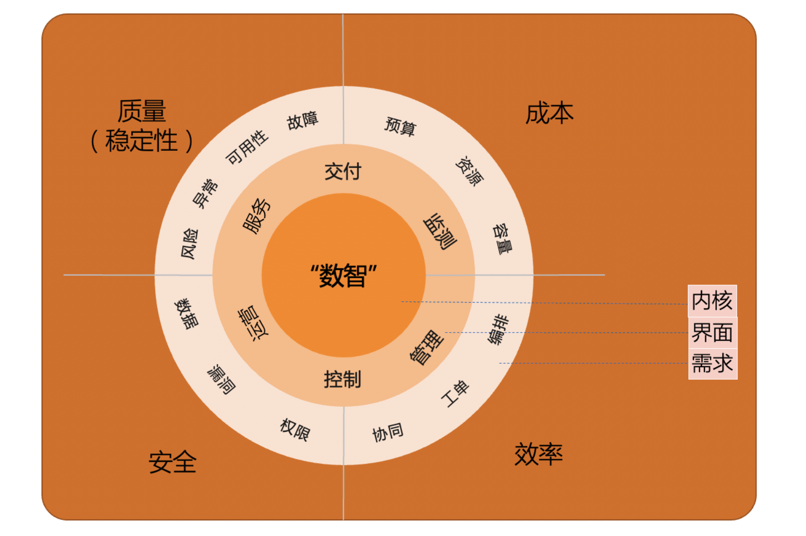
<a name="d0zcE"></a>

### 2.1 体系化运维平台分层架构
从“质量、成本、效率、安全”四个维度出发看运维本质相关工作，运维除了要搭平台、建规范、做标准，还要用自动理念提升效率，用数据驱动测试/开发/运维，用智能手段提前发现/预测风险问题等。这些可以看成是方法论。如何能从理论快速获得一套体系化、工程化、产品化的能力实践，去支撑满足上述四个维度的需求，就是 SREWorks 所考虑的问题。<br />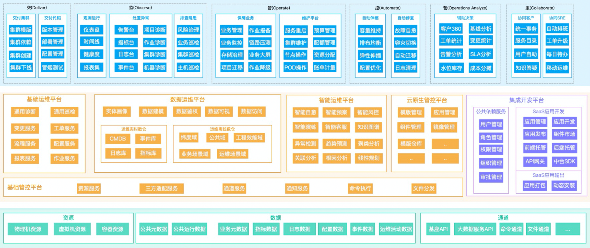<br />阿里云大数据 SRE 团队利用分层思想构筑了 SREWorks 平台产品体系，借鉴经典 SPI（SaaS/PaaS/IaaS）三层划分思路，SREWorks 由“运维 SaaS 应用场景层、运维 PaaS 中台服务层、运维 IaaS 接入层”三部分构成。<br />SREWorks 中还融入了运维规范、标准化思想，利用产品承载自动化流程、数据驱动、智能内核的方法论。从代码到线上业务服务的整个过程，运维或多或少地参与了其中一些工作，因此，围绕应用的生命周期，在SaaS场景层划分了“交付、监测、管理、控制、运营、服务”六大区。如下图所示，每块内容里都有代表性的核心功能。<br />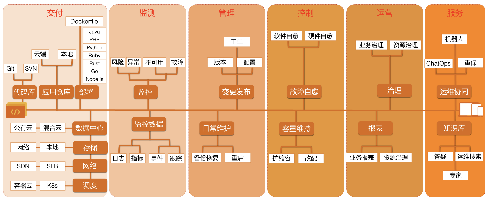

SREWorks 中统一以应用抽象来描述业务系统，在开发人员将研发完成的应用制品**交付**上线后，就会对线上应用实例生命周期进行**监测、管理、控制**。SREWorks所拥有的运维数据能力会提供增值化的**运营、服务**，为有需要的人员提供便捷的视图、管理能力等。<br />“交付、监测、管理、控制、运营、服务”六大场景在SREWorks产品手册中有详细的定义及边界说明。
<a name="qSbHN"></a>

### 2.2 完整的数据化运维体系实践
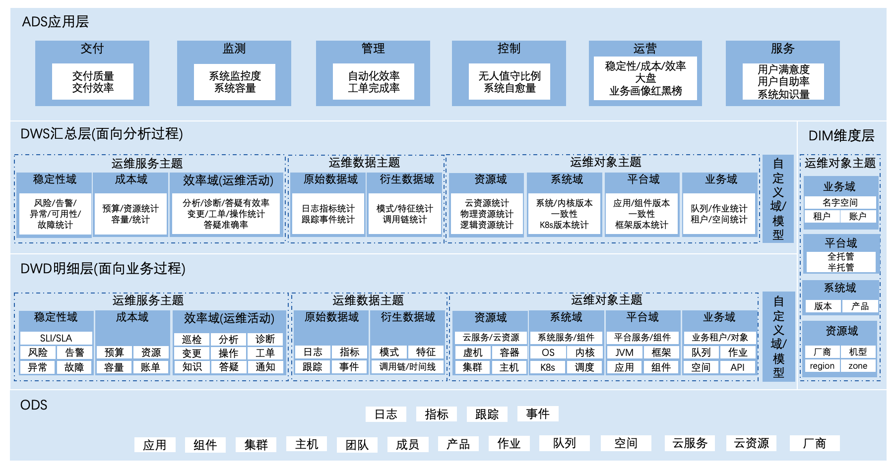<br />一套数据化运维体系，会把所有系统的运维数据全部采集起来、真正打通，并深度挖掘这些数据的价值，为运维提供数据决策；同时构建数据化运维业务模型，基于该模型建立标准化运维数仓，建设数据运维平台，在平台中规范运维数据的采集、存储、计算及分析，并提供一系列数据化服务，供上层运维场景使用。

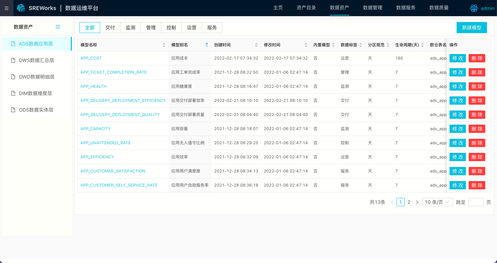<br />有了运维相关的量化数据，对运维工作的描述和衡量将更加立体化，可以建立长期可持续优化的运维工作模式，实现真正的运维价值。<br />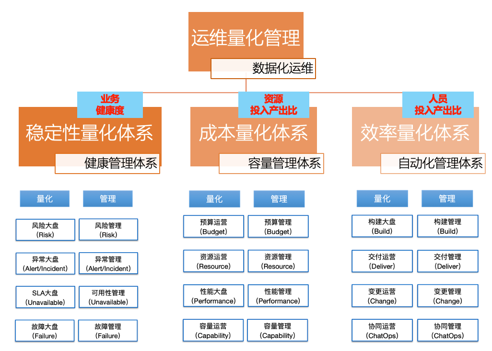

<a name="Nfrgr"></a>

### 2.3 服务化的 AIOps 智能运维平台
在阿里云大数据 SRE 团队看来， AIOps 的出现并没有改变运维的表现形式，依旧还是“交付、监测、管理、控制、运营、服务”的界面，只是在大量运维数据化工作的基础之上，利用AI能力探索、挖掘智能化运维场景。因此，在一开始构筑 AIOps 工程实践时，就坚持打造“感知、决策、执行”的闭环，类似自动驾驶的理念。<br />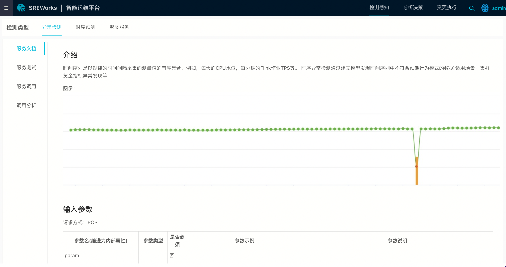<br />SREWorks将量身定制的算法与运维场景化结合，能够提前预测、关联分析，增强风险预防、故障定界定位能力，实现传统手段无法获得的运维价值。具体而言，将每一个智能化的运维服务包装成感知的“监测器”、决策的“分析器”、执行的“策略器”，供健康管理、变更管理等系列服务调用，即可增强已有运维场景，解决一些普通手段无法解决的问题。

<a name="cU52r"></a>

### 2.4 运维中台化、低代码化及云原生化运维开发体验
SREWorks 套件自身也是云原生化的应用，并且采用运维中台思想构建，在中台里构建大量的PaaS 化运维服务能力，在前台围绕“交、监、管、控、营、服”六大场景提供SaaS 化运维场景应用。<br />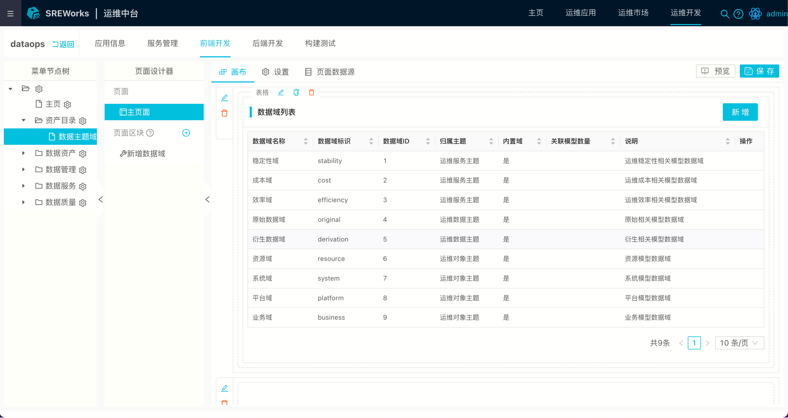<br />大部分页面为企业后端控制台类系统，不太需要很酷炫的交互设计，故而，运维开发领域的前端开发始终难于追赶前端流行趋势。针对这些特点，SREWorks 创新性地设计了一套 Serverless 体验的前端开发模式。<br />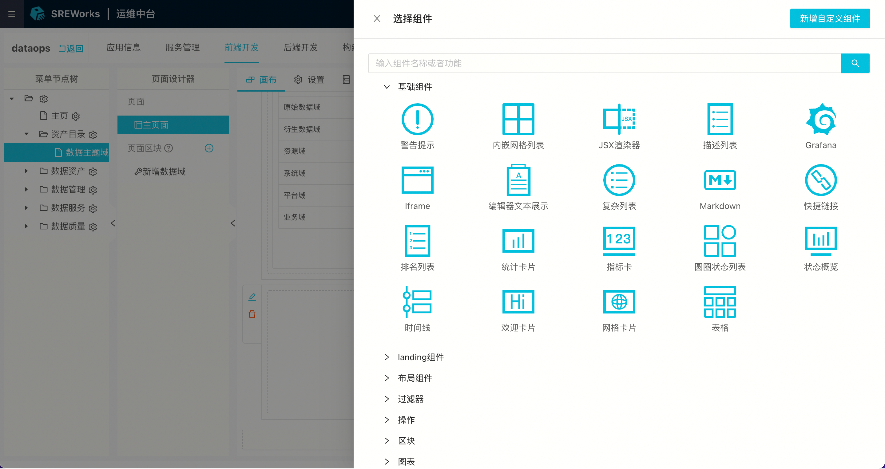

<a name="WdFC3"></a>

## 3 SREWorks安装
首先需要有一个大于等于 1.20 版本的 Kubernetes 集群。

- 分布式部署: 建议至少 3 台节点（配置为 4 核 CPU，16G 内存），存储需要 300G 以上空间，90 个 Pod 以上配额
- 单机部署: 建议至少 8 核/32G 内存/300G 硬盘

这里我们使用 Helm 的方式来安装 SREWorks。

<a name="O9tKh"></a>

#### 1. 模式一: 采用 Ingress 方式访问
SREWorks 的部署必须指定 ingress 的域名，阿里云 ACK 集群的域名在【基本信息】中可以找到，例如 http://*.ceea604.cn-huhehaote.alicontainer.com ，* 部分用户可以自行填写，比如 [http://sreworks.c34a60e3c93854680b590b0d5a190310a.cn-zhangjiakou.alicontainer.com](http://sreworks.c34a60e3c93854680b590b0d5a190310a.cn-zhangjiakou.alicontainer.com) ，在安装时传入 appmanager.home.url 参数即可。

首先下载 sreworks 代码到本地。
```shell
$ git clone http://github.com/alibaba/sreworks.git -b v1.2 sreworks
$ cd sreworks/chart/sreworks-chart
```
然后使用下面的命令一键安装即可。
```shell
# 安装SREWorks
$ helm upgrade --install sreworks ./ \
    --kubeconfig="****" \
    --create-namespace --namespace sreworks \
    --set appmanager.home.url="https://your-website.***.com" \
    --set global.storageClass="alicloud-disk-available" \
    --set appmanagerbase.openebs.enabled=false
```

<a name="C3juB"></a>

#### 2. 模式二: 采用 NodePort 方式访问
在云厂商购买虚机，运行 NodePort 模式需要注意被访问节点(NODE_IP)的网络安全组或防火墙，打开该端口(30767)的公网被访问限制。<br />同样先下载 sreworks 代码到本地。
```shell
$ git clone http://github.com/alibaba/sreworks.git -b v1.2 sreworks
$ cd sreworks/chart/sreworks-chart
```

然后使用下面的命令安装 sreworks，替换 NODE_IP 为某个节点的 IP。
```shell
$ helm upgrade --install sreworks ./ \
    --kubeconfig="****" \
    --create-namespace --namespace sreworks \
    --set global.accessMode="nodePort" \
    --set appmanager.home.url="http://NODE_IP:30767"
```

_注意: 默认的 storageClass: sreworks-hostpath 是由 OpenEBS 的 LocalPV 方案实现的，仅能用于开发测试环境，如需用于生产，建议使用符合 Kubernetes 要求的持久化存储，如 GlusterFS、Ceph 等分布式存储，或云服务上上的块存储。_

<a name="ES3tm"></a>

#### 3. 单机部署案例: Kubesphere 单机快速部署

- Kubesphere All-in-one 集群部署参考 [https://kubesphere.io/zh/docs/quick-start/all-in-one-on-linux/](https://kubesphere.io/zh/docs/quick-start/all-in-one-on-linux/)
- 数智版部署单机资源不小于 8 核/32G 内存/300G 硬盘
```shell
# 下载并安装kk工具
curl -sfL https://get-kk.kubesphere.io | VERSION=v2.0.0 sh -

# 通过kk工具部署k8s集群
./kk create cluster --with-kubernetes v1.21.5 --with-kubesphere v3.2.1

# 下载sreworks到本地
git clone http://github.com/alibaba/sreworks.git -b v1.2 sreworks
cd sreworks/chart/sreworks-chart

# 安装SREWorks
# 替换NODE_IP为某个节点的浏览器可访问IP
helm upgrade --install sreworks ./ \
    --create-namespace --namespace sreworks \
    --set global.accessMode="nodePort" \
    --set appmanager.home.url="http://NODE_IP:30767" \
    --set global.storageClass="local" \
    --set appmanagerbase.openebs.enabled=false
```

<a name="UKpdL"></a>

#### 4. 验证安装
在浏览器中输入上个步骤的域名或者 IP，如果能够看到页面，说明已经安装完成(大约需等待 5 分钟左右)，注册并开始使用 SREWorks。默认账号为 **admin**，默认密码为 **12345678**。

<a name="rDj87"></a>

#### 5. 卸载
请务必遵循下面顺序执行，否则可能会导致各种 crd 变成脏数据残留在集群!
```shell
$ helm uninstall sreworks -nsreworks
$ kubectl delete namespace sreworks
```

<a name="BoQTw"></a>

## 4 SREWorks应用部署实践
接下来我们在 SREWorks 中，从 0 到 1 建立一个 Flink 云原生应用定义，发布 Flink 应用到市场，并交付部署 Flink 应用的完整过程。
<a name="fIBXp"></a>

#### 1. 从运维桌面进入应用管理
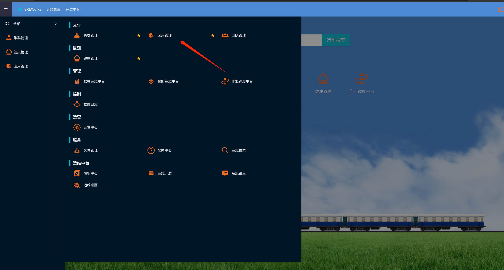

<a name="Jtqlh"></a>

#### 2. 新建 Flink 应用
登录 SREWorks 后，进入“交付/应用管理-应用开发”页面，点击“新建云原生应用”，在滑出的表单中输入 Flink 应用定义相关信息，完成 Flink 应用模板定义。<br />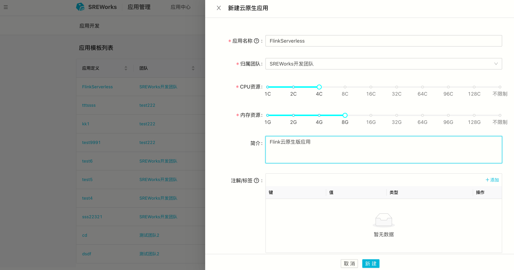

在应用开发模板列表下，点击应用定义名称，进入应用开发页面。<br />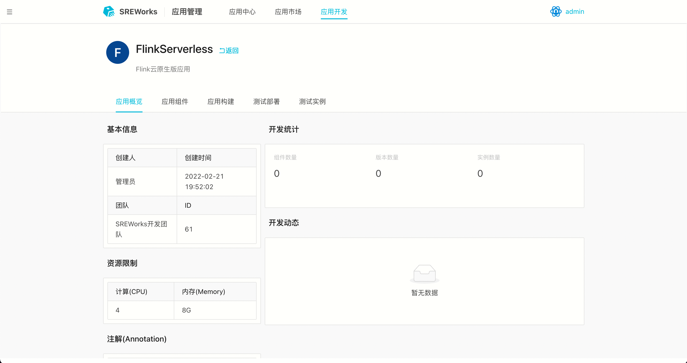

<a name="xdgpY"></a>

#### 3. 添加 Flink 应用组件
进入 Flink 应用模板后，在应用组件中添加“Helm”组件类型，将 Flink 中的 VVP 组件添加进来，vvp全名是(Ververica Platform)，是Flink全生命周期的工具。<br />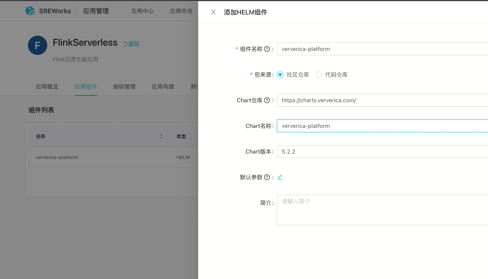

<a name="YUW2Y"></a>

#### 4. Flink 应用构建
在完成组件添加后，可以在“应用构建”页面进行一键构建，当前一键构建会自动计算版本，创建构建任务后，在构建列表中可查看刚刚提交的构建任务。<br />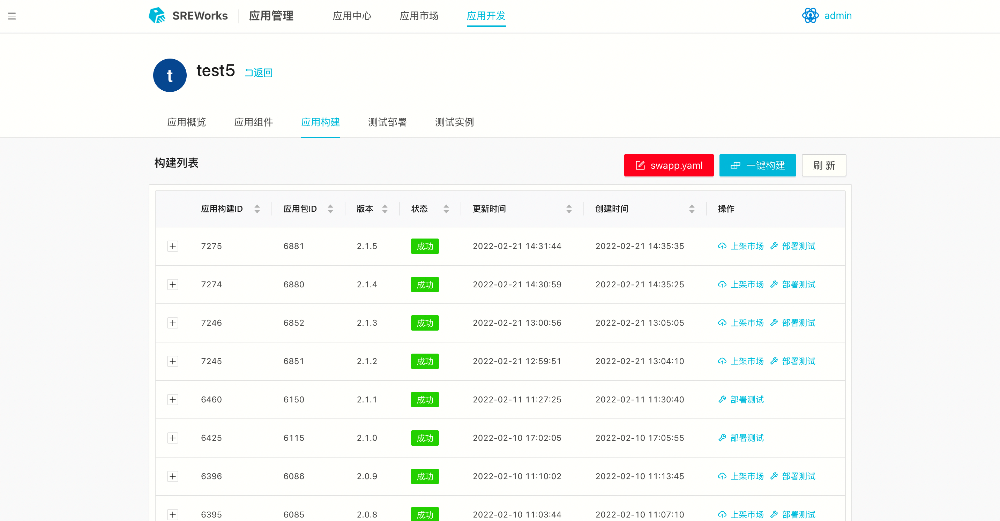

构建完成后，即可在构建列表中展示当前构建的应用及组件构建状态，同时可以在操作中一键部署测试和上架市场。

<a name="b4aYz"></a>

#### 5. Flink 应用测试部署
应用测试实例支持多套部署，并会自动生成全局唯一的实例名，规则为“应用名-uid”。该实例被部署在同名的 namespace 下。<br />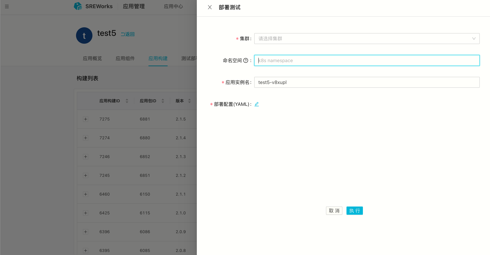

用户可自行对应用进行测试，测试通过后，可选择一键发布到市场的操作将应用版本发布到市场中。

<a name="GHq7W"></a>

#### 6. Flink 应用发布上架
通过构建列表中指定构建任务的“上架市场”操作完成应用到市场的发布。<br />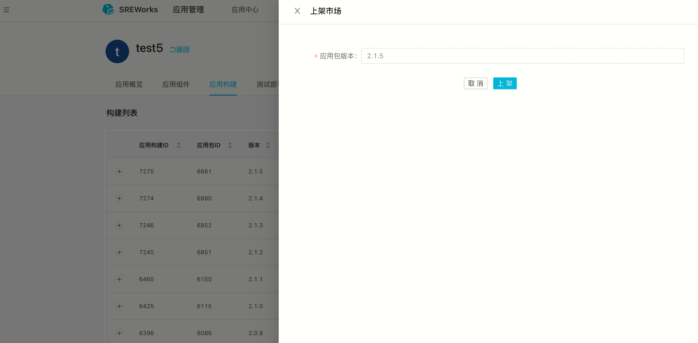

<a name="bxvrw"></a>

#### 7. Flink 应用生产部署
在市场中可以指定应用一键部署，当前默认部署应用的最新版本。<br />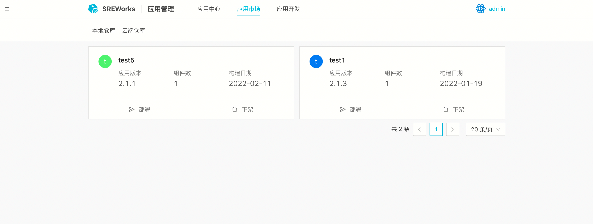

<a name="cJwdD"></a>

#### 8. Flink 应用实例管理
应用实例列表展示当前部署在 prod 的企业应用生产实例，并提供升级、回滚、卸载操作。<br />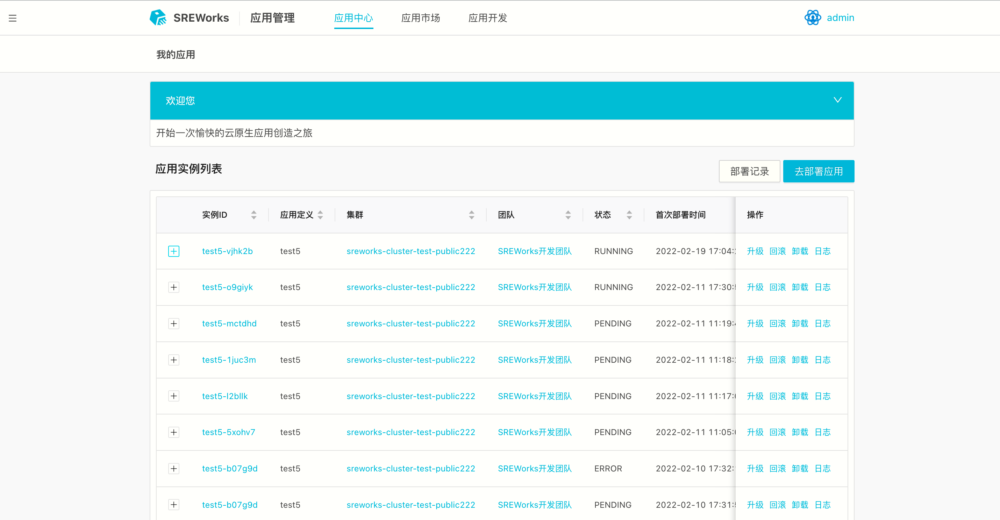

Git 仓库：[https://github.com/alibaba/SREWorks](https://github.com/alibaba/SREWorks)


