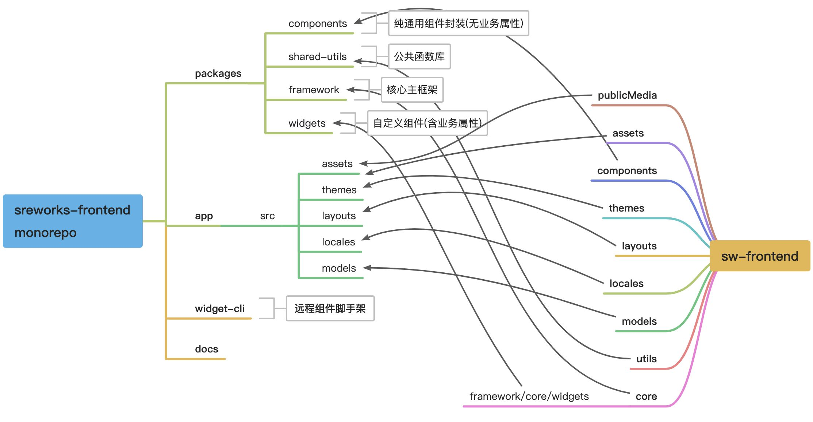
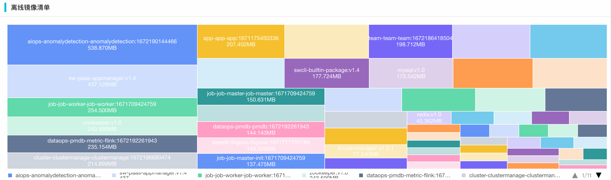

在v1.3版本之后，SREWorks团队收集了较多的用户反馈，大家普遍对于SREWorks的内网离线安装有较大的诉求。于是团队决定进一步增强这部分的安装能力。<br />前端工程部分(frontend)，为了团队更加敏捷高效的协作开发，及便于社区开发者参与共建sreworks前端组件生态，对工程架构重新梳理拆分，进行了Monorepo模式架构演进; 同时对工程构建工具及配置进行了优化升级。<br />下面为v1.4的版本功能版本介绍：
<a name="htUcL"></a>

## 1.  前端工程Monorepo模式重构
Monorepo即单仓(repository)多包(package)，大型前端工程项目采用这种模式进行开发管理，能带来诸多的开发和管理便利: 

- 更加清晰的模块结构和依赖关系
- 更细粒度的独立构建单元便于协作开发和不同更新频率的子包单独发版
- 更加高效的代码复用等

我们在v1.4版本中采用lerna + yarn workspace 的技术方案进行了Monorepo的架构实践：将原工程拆分为@sreworks/app主包应用，和@sreworks/components、@sreworks/widgets、@sreworks/framework、@sreworks/shared-utils四个npm子依赖包。目录结构变动如下图所示：<br />

工程重构过程中，我们对原有构建工具也进行了优化升级：

- 主包应用采用webpack5作为构建工具，子依赖包采用Rollup作为构建工具。
- 通过调优构建配置，将构建时间由v1.3版本的74秒降低到23秒，提升68%
- 通过统一各子包依赖版本、合并重复依赖、以及部分npm依赖cdn引用本地化处理等方式进行了构建体积调优，调优至1.6M，较Monorepo初版本的5.4M，降低70%
- @sreworks/widget-cli 远程组件脚手架进行了同步的构建升级
<a name="pBGxK"></a>

## 2. 离线安装
早期版本的离线安装，依赖用户的Maven源、PIP源在用户内网做应用的二次构建，用户普遍反馈内网场景对于这些源的支持也不齐全，更希望无构建直接拉起。<br />于是在v1.4版本中，我们将整个底座(appId: flycore)也都上架到了运维市场，使得其相关镜像及元信息，能够作为**部署基线**固化至开源代码中。<br />经过收敛之后的镜像清单如下链接，后续每次发版有应用版本更新，都会自动更新该镜像清单。<br />[https://github.com/alibaba/SREWorks/blob/master/images.txt](https://github.com/alibaba/SREWorks/blob/master/images.txt)

清单中总共59个镜像，共计存储空间约为5.9G。<br />下图为通过SREWorks前端组件绘制的按照镜像大小排列的清单矩形树图：<br />

离线部署的命令示例如下，底层依赖软件和运维应用的镜像仓库需要分开设置：<br />镜像仓库以 `sreworks.io/hub-test` 为例
```bash
# 下载sreworks到本地
git clone http://github.com/alibaba/sreworks.git -b v1.4 sreworks
cd sreworks/chart/sreworks-chart

# 安装SREWorks
helm install sreworks ./ \
--create-namespace --namespace sreworks \
--set global.accessMode="nodePort" \
--set global.images.tag="v1.4" \
--set appmanager.home.url="http://localhost:30767" \
--set saas.onlyBase=true \
--set global.images.registry="sreworks.io/hub-test" \
--set global.images.imagePullPolicy="IfNotPresent" \
--set appmanagerbase.kruise.manager.image.repository="sreworks.io/hub-test/kruise-manager" \
--set appmanagerbase.mysql.image.registry="sreworks.io" \
--set appmanagerbase.mysql.image.repository="hub-test/mysql" \
--set appmanagerbase.zookeeper.image.registry="sreworks.io" \
--set appmanagerbase.zookeeper.image.repository="hub-test/zookeeper" \
--set appmanagerbase.redis.image.registry="sreworks.io" \
--set appmanagerbase.redis.image.repository="hub-test/redis" \
--set appmanagerbase.minio.image.registry="sreworks.io" \
--set appmanagerbase.minio.image.repository="hub-test/minio" 
```

<a name="mBbNq"></a>

## 3. 其他

1. appmanager kankio 构建逻辑优化升级
2. 使用 rancher/local-path-provisioner 作为默认存储供应，移除openebs依赖
3. skywalking进行版本升级（从8.5.0升级到9.3.0），解决skywalking初始化es相关index异常的问题
<a name="Of6ou"></a>

## 如何从当前版本升级到v1.4

- 升级包含底座，页面可能会有5-10分钟的不可访问，请注意。
- 用户自行开发的云原生应用不会受影响(不重启)，SREWorks网关到应用的流量会有中断。
```
git clone http://github.com/alibaba/sreworks.git -b v1.4 sreworks

cd sreworks
./sbin/upgrade-cluster.sh --kubeconfig="****"
```

如在使用过程中遇到问题，欢迎各位在GitHub中提出Issues或Pull requests。<br />SREWorks开源地址：[https://github.com/alibaba/sreworks](https://github.com/alibaba/sreworks)

也欢迎各位加入钉钉群（群号：35853026）分享和交流～

_在此感谢来自开源社区的 @kw214(Kimmy Wang) 同学在Monorepo演进方案中积极的讨论参与以及代码贡献，也欢迎更多的伙伴能够参与到我们的开源工作组中来，一起将项目做的更好（有意向的同学可以联系群中小助手或群管理员进组）_


