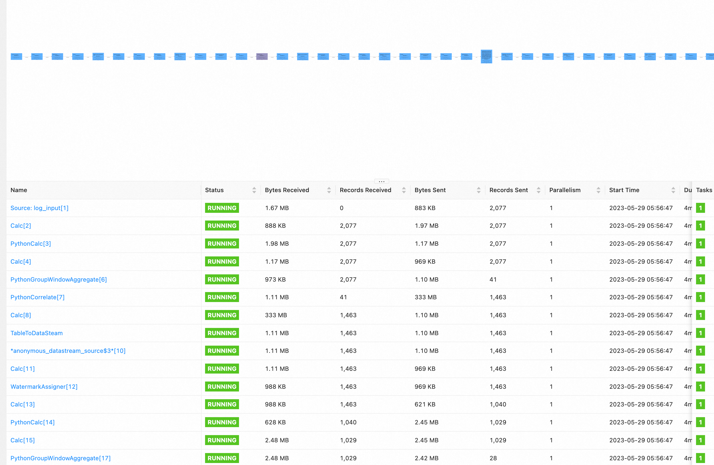

在经过v1.0~v1.4四个版本迭代后，SREWorks的核心底座已经表现出极高的稳定性和成熟性。在v1.5版本中，SREWorks开发团队在核心底座上，进行了较多的数智化能力迭代。同时，在数智能力迭代过程中，我们也维持着与SREWorks用户较高的沟通频率。我们发现大家普遍对于监控数据之上的数智化能力比较关注，于是我们在这些点上做了一些深挖分析，发现普遍都会遇到这样几个问题：

1. 自研监控系统在数据体量上升后，可靠性下降。
2. 日志等各类非结构化的数据引入，导致工程复杂性急剧上升，实时性方面也面临更大的挑战。
3. 简单的表达式(expression)往往无法满足业务多样化的监控需求。

于是很多用户选择从自研监控系统切换至流计算引擎Flink，但是Flink Job本身的使用门槛以及运维又成为一大难题。SREWorks开发团队经过多轮的分析研究，决定将这些问题拆成两阶段解决：

1. **降低Flink Job的使用门槛，赋能SRE将运维需求快速转化为计算力，使SRE能够真正具备touch数据的能力。**
2. **利用SREWorks工程能力构建开源Flink运维产品，进一步降低Flink运维难度。**

在v1.5版本中，我们先将完成阶段1的开源，同时在实时作业平台之上，我们会引入大家呼声较高的**日志聚类作为这种数智能力的最佳实践：通过Flink ML极大地提升海量日志的实时聚合效率。**有关阶段2，近期会披露一篇有关Flink智能诊断利器--Flink Advisor介绍，本文暂不展开。下面先开始阶段1的开源产品：实时作业平台。
<a name="htUcL"></a>

# 1.  实时作业平台
在SREWorks刚开源的一段时间里，因为SREWorks中包含了社区版的Ververica Platform来管理Flink Job，有段时间，社区版vvp的使用答疑居然占据了我们大部分和用户沟通时间。于是经过这些需求的沉淀和打磨，我们将实时处理链路也集成到作业平台中，作业平台中的作业分为定时作业 和 实时作业：

- **定时作业**提供分钟级的作业执行调度，适用于小数据量、低时效性的批处理场景。
- **实时作业**基于 Flink + 社区版Ververica Platform 提供实时作业管理。

<br />在收集了大量的用户反馈之后，我们决定将SRE较习惯的Step By Step的步骤型的编排作业能力融合到实时作业中去，进一步降低SRE的使用门槛，最终功能如下图所示：<br /><br />我们将一个Flink Job拆成了三种结构便于管理：

- **输入源: **对应Flink的Source源，可有多个输入源。
- **Python处理**：对应Flink汇总的处理过程，当前基于pyFlink，可直接编写Python脚本，也可以根据业务需求拆分成多个Python处理过程。
- **输出：**对应Flink的Sink，可有多个输出。
<a name="DSiJm"></a>

## 输入源&输出
在输入输出这块，我们直接读取Ververica Platform已经注册的Connector供用户选择，以及在配置参数时的下拉提醒，极大地避免用户手写`CREATE TABLE`时候字段及参数的疏漏。<br />
<a name="kCKll"></a>

## 运行环境
常使用Python的同学可以知道，Python运行环境管理是一个比较麻烦的问题：如果使用Docker镜像来管理出包过程过于冗长，如果使用requirements来进行管理又常常会遇到包装不上的问题。于是实时作业平台中，我们做了一个折中的处理，使用Python虚拟环境来进行管理。<br /><br /><br />同时，我们也对环境这个概念进行了组合化的扩展：**Flink的容器镜像、PyFlink的运行时Jar包**等一系列的对象，都算作环境中的设置。由于环境收敛了所有的可变资源，大大降低SRE维护作业的复杂度，原本多个运行时资源间版本不兼容的问题一去不复返，所有同一环境作业，都使用同一组合。<br />当前v1.5提供两个环境可用：flink-ml 和 default，环境的自主管理能力会在下个版本上线。
<a name="TzbEy"></a>

## Flink作业运维
实时作业平台做了较多抽象，简化了作业提交的流程，但在Flink作业运维上我们深知其中的复杂度，并没有额外做过多的包装，直接使用Flink Dashboard作为运行中的观测平台，方便熟悉Flink的同学快速上手排查问题。下图为实时作业平台中启动作业的Flink Dashboard页面：<br />

<a name="KmzlE"></a>

# 2.  日志聚类
在实时作业平台之上，本次v1.5版本同时开源了日志聚类算法，有关算法原理可以参考《基于Flink ML搭建的智能运维算法服务及应用》，本文主要阐述开源工程实践。<br />日志聚类的算法代码位于目录 `https://github.com/alibaba/SREWorks/tree/master/saas/aiops/api/log-clustering`
```bash
├── db-init.py
├── log-clustering-job
│   ├── pythons
│   │   └── log_cluster_pattern.py
│   ├── settings.json
│   ├── sinks
│   │   └── pattern_output.json
│   ├── sources
│   │   └── log_input.json
│   └── template.py
└── ...
```
目录主要由两部分组成：

- `db-init.py`：特征工程的数据库初始化，需要用少量典型的日志样本初始化日志关键词列表以及日志样板特征。
- `log-clustering-job/*`：日志聚类算法作业，在v1.5版本中已默认导入至作业平台中，手工将其打成zip包导入亦能实现相同的效果。

下面我们基于这个开源工程，完成一次完整的日志聚类的实践。本次实践的输入为kafka（SREWorks内置的kafka）的日志流，输出为MySQL中的特征库。<br />
<a name="oyuav"></a>

## STEP 1 特征工程初始化
我们本次实践以SREWorks中应用引擎（AppManager）日志为例：<br />先用标签`name=sreworks-appmanager-server`查询出AppManager Pod的名称，这个标签在后面采集的时候还会被用到。
```bash
$ kubectl get pods -l name=sreworks-appmanager-server -n sreworks
NAME                                         READY   STATUS    RESTARTS   AGE
sreworks-appmanager-server-c9b6c7776-m98wn   1/1     Running   0          5h39m
```
然后提取该Pod的少量日志作为初始化日志样本，存储文件名为 `example.log`。
```bash
kubectl logs --tail=100 sreworks-appmanager-server-c9b6c7776-m98wn -n sreworks > example.log
```
`example.log`里面日志的内容大概是这样：
```bash
[2023-05-26 21:46:02 525] DEBUG [http-nio-7001-exec-6][o.s.web.servlet.DispatcherServlet:119]- GET "/realtime/app-instances?stageIdList=prod&appId=&clusterId=1id&optionKey=source&optionValue=app", parameters={masked}
[2023-05-26 21:46:02 526] DEBUG [http-nio-7001-exec-6][o.s.w.s.m.m.a.RequestMappingHandlerMapping:522]- Mapped to com.alibaba.tesla.appmanager.server.controller.RtAppInstanceController#list(RtAppInstanceQueryReq, HttpServletRequest, OAuth2Authentication)
[2023-05-26 21:46:02 527] DEBUG [http-nio-7001-exec-6][o.s.w.s.m.m.a.RequestResponseBodyMethodProcessor:268]- Using 'application/json', given [*/*] and supported [application/json, application/*+json]
[2023-05-26 21:46:02 527] DEBUG [http-nio-7001-exec-6][o.s.w.s.m.m.a.RequestResponseBodyMethodProcessor:119]- Writing [TeslaBaseResult(code=200, message=SUCCESS, requestId=null, timestamp=1685137562527, data=Pagination( (truncated)...]
[2023-05-26 21:46:02 527] DEBUG [http-nio-7001-exec-6][o.s.web.servlet.DispatcherServlet:1131]- Completed 200 OK
...
```
 使用 db-init.py 进行特征工程数据库初始化，该动作会在数据库中增加一张表，并且将 `example.log`中的日志处理成特征行存入表中：
```bash
python3 ./db-init.py example.log --host *** --user *** --password *** --database *** --table ***
```
这个数据库的连接变量记一下，在下一步中马上就会用到。
<a name="NjoSa"></a>

## STEP 2 作业参数运行配置并启动
打开SREWorks中的实时作业平台，点开《日志聚类模式提取》这个作业对应的【运行参数】按钮，在启动参数中，将STEP1 中数据库连接参数填入：<br /><br />填写完成后，我们可以直接点击作业启动。作业启动后，我们点击【运行中】的状态可以直接跳转到Flink Dashboard看到整个流计算处理链路已经准备就绪，但还没有日志输入。<br />
<a name="vtBXe"></a>

## STEP 3 日志采集输入并聚类
ilogtail是阿里云开源的可观测工具，在阿里云的采集场景中有着非常广泛的应用。ilogtail对于云原生的适配也非常好，采用DaemonSet的方式在每个Node中拉起，Pod中只要包含对应的label就会对其进行采集。<br />于是，我们可以通过运维市场，非常方便地将ilogtail安装进集群，同时安装的时候，对应的采集label配置为`name=sreworks-appmanager-server`即是对应用引擎（AppManager）进行日志采集。<br /><br />在日志采集运行起来之后，通过Flink Dashboard我们可以看到原本空空的实时处理链路一下子就繁忙了起来，像一个工厂的流水线一样，每个运算单元都在不断地收发处理数据。<br /><br />通过查看MySQL中的特征(pattern)表，我们可以看到日志特征处理完之后已经被落到了我们在STEP 2中定义的MySQL表中。<br />特征表中的几个关键点我们可以关注一下：

- 特征表为日志的特征收敛，在初期数据量会迅速扩大，经过一段时间后，当没有新的特征之后，数据量会趋于平稳。
- 特征表中的字段 `pattern` 为这行日志的摘要，字段 `top_pattern` 为聚类后处于中心的日志摘要，通过 `top_pattern`我们可以很方便地统计出总共有几类日志，也可以看出每一类日志下有哪些日志。

如下图可以看到这些文本非常相似但又不同的debug日志，被聚到了同一个 `top_pattern` 下。<br />
<a name="Mmjqw"></a>

## 日志聚类的实践应用
围绕日志聚类算法，可以展开很多数智化的实践。围绕《基于Flink ML搭建的智能运维算法服务及应用》已披露的案例，结合着上文的工程实践，我们可以再来看一下完整的链路：<br />

- STEP 3中我们查看的特征(pattern)表可以进一步演进为一个日志知识库，引导SRE结合运维经验来进行标注。
- 日志知识库沉淀的日志输入答疑机器人作为答疑语料，快速解决用户问题，降低工单数量。

期待大家集成并使用日志聚类算法之后的反馈，同时SREWorks团队也会根据内部的运行效果和大家的反馈，持续打磨数智运维算法。
<a name="DG541"></a>

# 3.  企业应用开发部署增强
在v1.5版本中，我们同样对底座的应用开发能力进行了增强，包含以下这些功能点：

- 企业应用增加多分支开发能力，适配企业的多版本迭代需求。
- 企业应用实例部署完整的OAM可视化。

<br />在企业应用上，我们常常结合SREWorks一线用户的声音，将内部使用的强大能力通过产品化的打磨优化，提供给SREWorks的用户们。我们也会保持这种状态，期望云原生的应用开发模式和数智运维体系，能够助力企业聚焦业务价值，进行快速的功能产品发展迭代。

<a name="Of6ou"></a>

# 如何从当前版本升级到v1.5

- 升级包含底座，页面可能会有5-10分钟的不可访问，请注意。
- 用户自行开发的云原生应用不会受影响(不重启)，SREWorks网关到应用的流量会有中断。
```
git clone http://github.com/alibaba/sreworks.git -b v1.5 sreworks

cd sreworks
./sbin/upgrade-cluster.sh --kubeconfig="****"
```

如在使用过程中遇到问题，欢迎各位在GitHub中提出Issues或Pull requests。<br />SREWorks开源地址：[https://github.com/alibaba/sreworks](https://github.com/alibaba/sreworks)

也欢迎各位加入钉钉群（群号：35853026）分享和交流～

_v1.5版本感谢 Flink ML  和 PyFlink 团队在日志聚类工程开源落地过程中给予的大力支持。_

