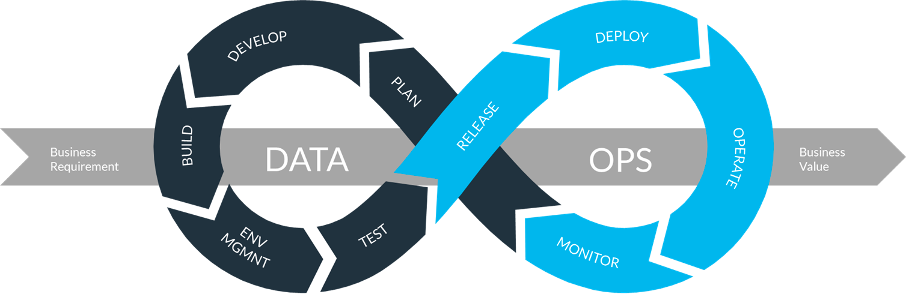
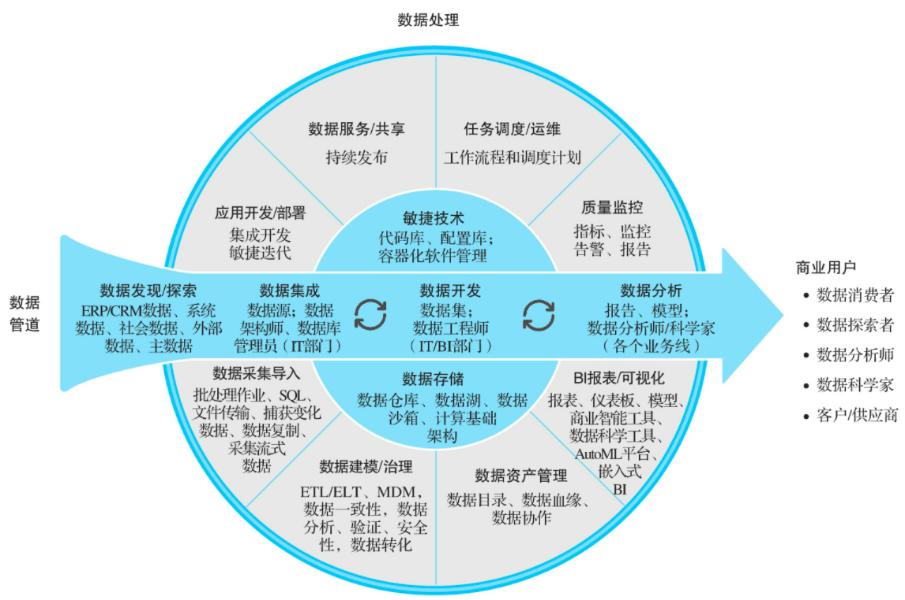
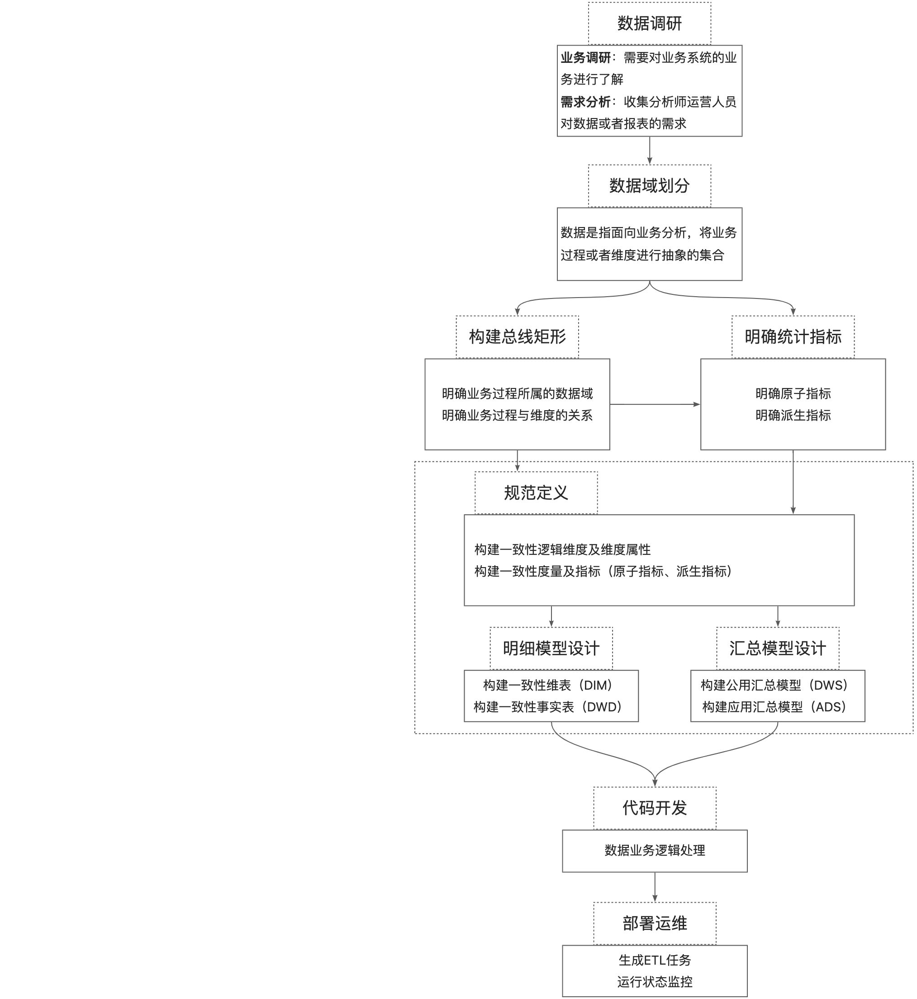
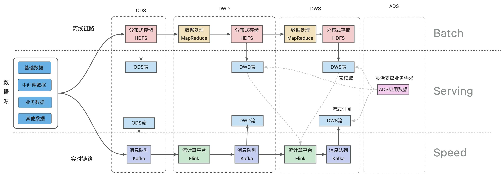
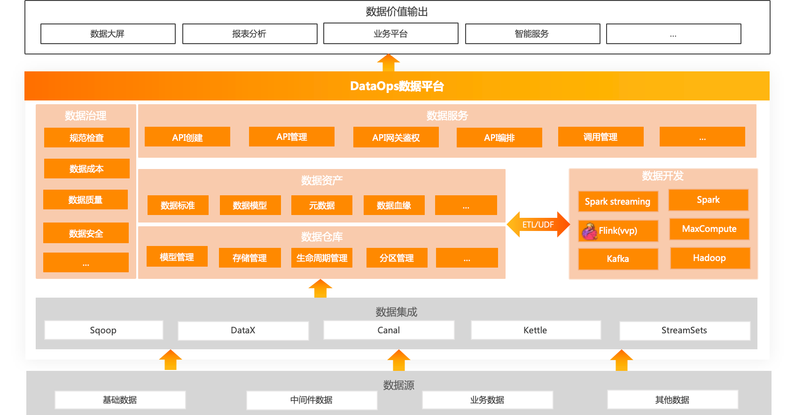

## 1. DataOps到底是什么？
伴随着全球数字化转型的高速发展，在云计算、物联网、5G、边缘计算、元宇宙等新技术的驱动下，数据爆炸的时代已经来临。IDC Global DataSphere显示，2021年，全球数据总量达到了84.5ZB，预计到2026年，全球结构化与非结构化数据总量将达到221.2ZB。 此外，在《数字化转型架构：方法论和云原生实践》一书中也提到云原生应用平台的发展将经历DevOps—DataOps—AIOps的演进路径，可以看出在云原生的浪潮下，企业也越来越需要数据。但在面对数据量巨大、数据种类繁多、数据急剧增长的困境时，对企业驾驭数据的能力也提出更高的要求。如果不能对海量数据进行合理有序的组织和管理，非但不能产生数据价值，反而会对企业造成极大的负担，从某种程度上来说，也是一种“数据灾难”，而这也是DataOps一直处于热门话题的原因。在开源SREWorks项目数据化建设过程中，我们也一直在思考：DataOps到底是在做什么？ 在讨论DataOps之前，我们先来看下DevOps。DevOps是一种软件交付管理的思想，它追求一种敏捷的、规范的、跨团队的软件研发协作状态，力求将一套软件的开发模式，从小作坊形态演变成一条标准的生产流水线。DevOps在一定程度上为DataOps的发展奠定了基础，因此，DevOps是我们在讨论DataOps时绕不开的重要话题。 DataOps本身也是属于敏捷开发范畴，类似DevOps以较短的开发迭代周期快速满足各自的需求，同时DataOps也需要大量标准化数据工具或组件，依赖团队之间协作，进行数据的开发和分析。与DevOps不同的是DataOps主要专注于数据流，**因此，通过数据化的方法或方法论来推动企业运营水平的提升都可以隶属于DataOps的范畴。**

DataOps 是 data operationalization的缩写，DataOps 不单单指数据技术的工具和平台，更重要的是一套数据全生命周期管理的方法论和思想。基于数据驱动，通过一系列面向流程的工具和平台，将DataOps思想进行工程化落地实践，能够将所有系统的相关数据采集起来，打破数据孤岛，统一建设高效规范的数据模型和数据体系，深度挖掘数据价值。 DataOps的方法论和思想主要是被分析和数据团队使用，旨在简化数据使用、降低数据分析门槛，提高数据分析质量、缩短数据分析周期。也就是说，数据作为一种大数据时代的“新能源”，本身是需要通过平台化的能力， 实现围绕“数据集成、数据开发、数据存储、数据治理以及数据服务”等体系化的数据管理流程。更进一步，基于数据驱动的思想，进行数据分析和数据消费，通过数据赋能，做好各个业务领域的相关工作，真正解决实际生产过程中遇到的痛点问题，实现数据价值落地的场景化输出。

## 2. DataOps能够解决哪些问题？
下面列举一些常见的数据相关的问题，对于想要实施DataOps的公司来讲，可以判断一下是否有遇到：

1. 如何确保生产的数据质量？
2. 如何判断生产的数据能否满足业务的需求？
3. 如何判断某个数据型项目工程的价值并持续投入？
4. 如何寻找大数据人才？
5. 如何提高数据处理的性能？
6. 大数据方案采用什么技术栈？
7. 大数据方案的运维稳定性如何保障？
8. 引入了多个大数据方案，如何统一进行管理？
9. 大数据的数据权限如何管理？
10. 数据分析结果如何指导最终的决策？

上面常见的问题，可以归为三大场景：数据管理、数据运维和数据使用。通常实施数据化的公司都是在初期尝到了一些数据带来的甜头，但是在持续投入之后，却又发现这块的收益产出似乎带有很大的不确定性：数据表逐渐地被杂乱的数据堆满，数据产出链路常常延迟，而通过数据分析进行决策似乎也没像之前那么有效了。 简而言之，当数据量变大，数据工程变复杂之后，如果没有规范的体系和流程，整体的协作关系又容易变回小作坊形态，存在诸如数据计算口径不统一、数据重复建设以及数据质量不高等问题，需要寻求一些标准化、规范化、体系化、工程化的方式来进行解决。

## 3. 如何进行DataOps实践？
正如前文所说，DataOps本身是一套完整的数据体系建设的方法论，其目标是能够让数据持续用起来，实现“数据集成、数据开发、数据存储、数据治理以及数据服务”等数据管理能力。这也意味着需要依赖众多的数据技术或数据组件来建设和运营DataOps数据平台，进而形成高效可靠的数据资产化体系和数据服务化能力，也即针对Data的数据运维。

### 数据集成
数据集成是构建企业级DataOps数据平台的第一步，依赖企业内部的跨部门协作，能够将不同来源的数据（不同的业务系统）以及不同类型的数据（结构化、半结构化、非结构化、离线以及实时数据等）进行整合，实现互联互通。从源头上避免数据的重复造轮和资源浪费问题，为构建规范化的数据体系、沉淀数据资产以及挖掘数据价值作准备。 数据集成一般是通过数据引入方式，将一个系统的数据按时按量集成到另一个系统中。通常采用ELT(Extract-Load-Transform，提取-加载-转换)的模式，重点在于数据汇聚，即将数据提取后直接加载到目标端存储中，这个阶段一般不做或者只做简单的数据清洗和数据处理。业界优秀的数据集成工具包括像Sqoop、DataX、Kettle、Canal以及StreamSets等。

### 数据开发
数据开发的目标是能够将数据集成阶段的原始数据，按照业务的需求进行加工处理、将原始的低业务价值的数据转换成高业务价值的数据资产，也就是说数据开发阶段是实现数据资产化的核心技术手段。 数据开发作为数据加工处理的核心阶段，通常会采用ETL(Extract-Transform-Load，提取-转换-加载)的模式并集成一系列的数据开发管控流程和工具，方便数据开发人员对ETL任务的编写、构建、发布、运维以及任务资源管控等，提升效率。通常数据开发主要分成离线数据开发和实时数据开发两大场景。 离线数据开发主要用于离线数据的批量定时加工处理，离线数据开发需要包含离线计算引擎、作业开发、任务调度、数据管控以及运维监控等核心能力，实际使用过程中，相关的离线ETL任务会按照预先设定的加工逻辑和ETL之间的拓扑依赖关系，进行调度执行。常见的离线处理框架包括MapReduce、Hive以及Spark等。在阿里巴巴内部也早已形成体系的MaxCompute通用大数据开发套件，快速解决用户的海量数据离线计算问题，有效降低企业成本并保障数据安全等。 实时数据开发主要涉及对实时流式数据的加工处理，满足像监控告警、数据大屏等对实时性要求较高的场景。在实时计算场景下，业务系统每产生一条数据，都会通过消息中间件（比如Kafka）被实时发送到流式处理平台进行加工处理，不再依赖调度引擎。常见的流式处理框架包括Storm、Spark Streaming以及Flink等。在阿里巴巴内部也基于Apache Flink构建了一站式的实时大数据分析平台，提供端到端的亚秒级实时数据加工处理分析能力。

### 数据存储
有了数据集成和数据开发的能力，下一阶段就是考虑如何进行数据存储和数据组织，其核心是标准规范的数据仓库和数据模型建设，也就是说数据仓库是实现数据资产化的呈现载体。 目前用的最多的数据建模方式是维度建模，典型代表有阿里巴巴建设的“OneData”数据建模体系，主要包括数据规范定义、数据模型设计以及ETL开发规范三部分。 数据规范定义：数据主题域、业务过程、指标规范、名词定义以及时间周期等命名规范。 数据模型设计：模型层次划分(分成数据引入层ODS、数据公共层CDM以及数据应用层ADS三层，其中CDM层又包括明细数据层DWD、汇总数据层DWS和维度数据层DIM)、模型设计原则、模型命名规范、模型生命周期管理以及数据质量规范等。 ETL开发规范：数据处理作业的研发流程、编码规范以及发布运维原则等。

 数据仓库实施工作流（来源：《大数据之路》）

 数据仓库建设工程链路（离线链路+实时链路）

### 数据治理
数据治理主要是对数据资产，配置数据管理策略，主要包括数据标准、数据质量、数据成本以及数据安全等内容。通过多维度进行量化评估，针对数据建设提出改进与优化建议，确保数据质量、标准、安全、易用。它包含以下功能：

- 数据标准化管理：负责数据仓库中数据的表达、格式以及定义的规范性，包括模型规范、数仓元数据规范、名词术语规范、指标规范等进行管理，针对未标准化的内容提出改进建议。
- 数据成本：主要从存储量和访问情况等沉淀相关治理项，比如：空表、无效表（未关联ETL任务表）、长期未访问表、长周期表、大数据量表等，通过对治理项的运作，提出优化建议，推动数据开发人员进行成本治理。
- 数据质量：围绕数据的完整性、准确性、一致性、有效性和及时性五个维度并对数据的重要性进行资产等级划分，对质量保障既包括事前保障，比如数据开发流程、数据标准执行等，又有事中保障，比如DQC的数据质量实时监控和告警，还有事后保障，比如数据质量故障复盘，确定质量问题根因等。
- 数据安全：评估数据安全风险，对数据设定安全等级，包括支持安全认证和权限管理、资源隔离、数据加密、数据脱敏等，保障数据安全可靠的被传输、存储和使用。

### 数据服务
数据服务旨在提供统一的数据消费服务总线，能够将数据资产生成API服务，其目标是把数据服务化，让数据能够快速集成到业务场景当中，发挥数据平台的价值。它包含以下主要功能：

- 异构跨库查询：如果数据分布在多个异构数据库时，用户无法简单的实现数据关联查询，通过数据查询服务，可以减少数据同步作业，直接实现从多个源数据库加载数据与完成查询的能力。
- 数据API 定义与管理：部份常用的数据点查或统计分析，可通过定义数据集与API名称，并最终暴露为一个HTTP资源路径的方式，并对数据API进行发布和访问授权，方便在各类脚本或代码中使用数据。
- 数据缓存：对于常用的数据查询，可定义缓存与更新策略，来减少数据查询穿透到数据库，提高性能并降低对数据库的性能负载。
- 服务编排：按照业务逻辑，以串行、并行和分支等结构编排多个API及函数服务为工作流。

### 数据应用
有了标准化的数据体系以后，针对数据进行分析和使用又是DataOps所关心的另一个维度的问题，这也是数据驱动的关键环节，也即以数据为中心进行决策，驱动业务行为。数据分析人员利用各种数据统计分析方法和智能算法，通过数据平台提供的数据服务API，对相关数据进行多维度、深层次的分析挖掘，支撑业务相关的数据应用场景，持续让数据用起来，真正发挥数据平台的业务价值。 不同的业务有各自的应用场景，所以这一部分很难面面俱到。本文仅简单介绍几种常见的数据应用场景，希望能帮助大家更好的理解，如何基于数据平台的数据资产和数据服务，进行数据分析和使用。 **数据大屏**：通过对数据进行分析计算，借助BI类软件，结合业务需求，以图表等形式，把一些关键的汇总性数据展示出来，实现数据可视化，为业务决策提供准确可靠的数据支持。 **智能场景**：属于AIOps范畴，基于数据平台的数据，通过AI算法，从数据中进行提炼、挖掘、洞察，为业务基于数据进行决策和运维运营时提供智能能力，获得更有前瞻性的数据支持。比较典型的智能应用场景包括像智能推荐、智能客服、智能预测以及健康管理等等。 当然，数据分析也并不是数据的终点，因为随着数据的沉淀，业务规模的扩大，很多数据分析的结果也可能会作为另一个更高维度模型的数据输入，被纳入数据平台的数据资产当中。因此，数据分析和开发人员需要从一个更高的维度和视角，去整合海量的数据。这也就意味着数据处理的链路并不是一成不变的，数据量会随着业务不断增长，数据模型也同样需要不断演进。

## 4. 总结
总的来说，**DataOps 作为一种数据管理方式，利用 DevOps 方法论对数据的全生命周期进行管理，通过数据平台把数据变成一种服务能力，进而提升数据的使用效率，实现数据持续用起来的目标。**以数据平台为承载，以数据场景为驱动，支持更大的创新空间和更优秀的业务模式。 SREWorks云原生数智运维平台，沉淀了阿里大数据运维团队近十年经内部业务锤炼的SRE数智化工程实践，包含DataOps在运维领域的最佳实践，欢迎体验。我们旨在秉承“数据化、智能化”运维思想，帮助更多的从业者采用“数智”思想做好运维。

**_参考材料_** [https://www.synopsys.com/blogs/software-security/agile-cicd-devops-difference/](https://www.synopsys.com/blogs/software-security/agile-cicd-devops-difference/) [https://zhuanlan.zhihu.com/p/55066486](https://zhuanlan.zhihu.com/p/55066486) [http://www.uml.org.cn/bigdata/202108115.asp](http://www.uml.org.cn/bigdata/202108115.asp) [https://en.wikipedia.org/wiki/DataOps](https://en.wikipedia.org/wiki/DataOps) [https://www.tamr.com/blog/from-devops-to-dataops-by-andy-palmer/](https://www.tamr.com/blog/from-devops-to-dataops-by-andy-palmer/)

