在上篇中，我们已经基本了解了多云管理。现在，我们将深入探讨多云管理关键能力实现：**AppManager**。

### **什么是AppManager？**
上面我们讲了理论、我们自己使用的交付流程和整体架构，下面我们进入关键能力实现与解析的环节，看看我们是如何实现上述这些能力的。 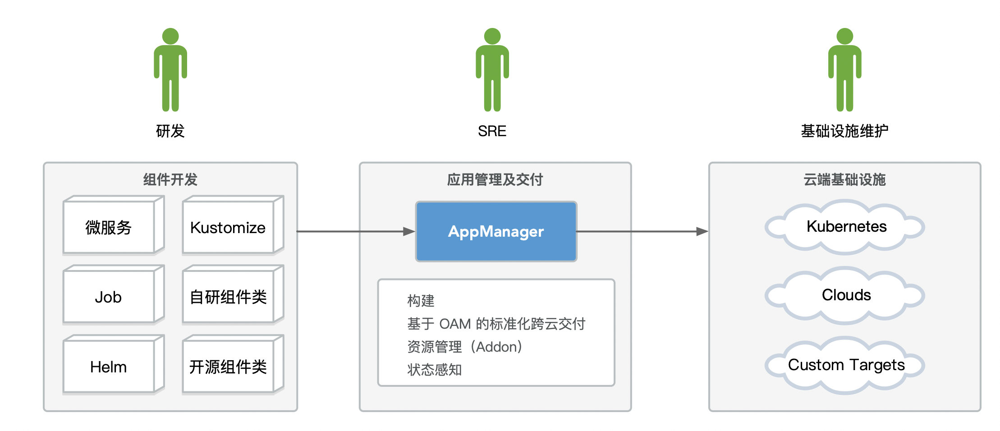 回到 AppManager 这个服务本身，它就是一个基于 OAM 的几种分离的角色，能够实现应用管理及交付的一个服务。 它因大数据侧业务诉求而生长，注重扩展能力、网络隔离环境交付、资源管理和版本管理。

### **扩展能力**
首先来看最重要的扩展能力。不管在一开始的平台设计的时候有多么完善，都很难满足后续持续演进的业务需求。所以扩展性是一个 PaaS 平台的重中之重。 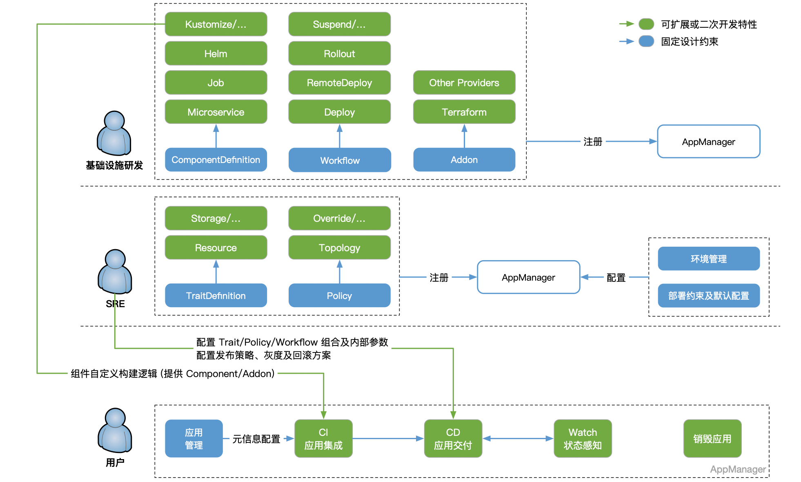

依托于 OAM 的设计，我们将所有的 Component / Addon / Trait / Policy / Workflow 等均做成了可插拔动态加载的 Groovy 脚本，并在此之上提供了插件管理及市场分发的能力。 图中的所有绿色的地方都是可根据业务需要自行扩展的，所有能力都可以在整个流程中动态引入、插拔和替换。 最上面基础设施研发的同学负责编写支持的组件类型、工作流类型、资源类型的 Groovy 脚本，并注册到 AppManager 内部。 中间的 SRE 同学负责编写 Trait、Policy 的 Groovy 脚本注册到 AppManager 内部，并负责配置环境及部署约束条件等信息。 下面的用户只需要把自己的应用代码写好，然后按照预先定义的 CI、CD、Watch 流程运行即可。 三类角色各司其职，共同高效的完成多云环境下整体应用的管理与交付过程。 图中所有绿色的地方扩展的 Groovy 脚本都是去实现预先定义的 Interface 抽象接口的，任何实现了这些 Interface 的 Groovy 脚本，都可以像搭积木一样被组装和替换到各个应用的生命周期中发挥自己的能力。包括构建、部署、销毁、状态监测。 在服务内部，我们为每个脚本定义了自己的 kind (类型) / name (名称) / revision (版本) 三元组，全局唯一。对于相同的 kind + name 组合，仅加载指定的单个版本的代码版本。通过这样的设计，实现不同用途，不同名称的脚本动态加载，且可以自由切换脚本代码版本。

### **扩展能力 – 插件包**
虽然单个 Groovy 扩展方便且灵活，但不易分发，而开源版本 SREWorks 中社区用户的需求又千差万别，所以在此之上，我们增加了插件包的机制，插件包通过对一系列 Groovy 脚本的组合，实现对应功能的封装。用户只需要一键下载及安装即可实现对应的能力加载。 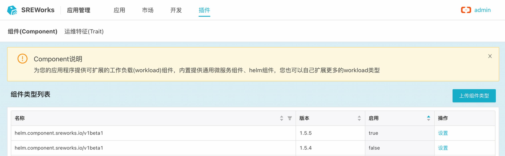 对于插件包本身，我们也定义了一套规范，用于社区用户进行二次开发编写自己需要的插件并上传到插件市场。 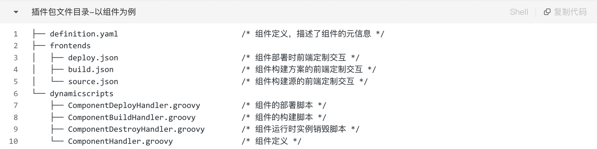

### **构建打包**

如果我们回顾过去这些年来的交付介质演进，可以看到抽象层次是越来越高的。从最开始的 RPM 等系统层面的软件包，到 Docker 出现后的镜像，再到后面以镜像为基础，进行各种包装而产生的交付物，如 Helm Chart/Kustomize 等。 那么我们也不例外，在物理机时代，我们作为 SRE 去维护各种物理机的软件一致性以及在此之上交付各类服务，甚至还研发了配套的流程平台、作业平台、配置平台等等。在 Docker 普及之后，这项工作就简单了很多，只需要处理镜像即可，但镜像本身的管理及交付仍然是头疼的问题。 好在现在是云原生的时代，我们有各类 CRD+Operator，有完善及可靠的 Kubernetes 原语，更有事实上的打包交付的标准 Helm/Kustomize 来帮助我们更好的完成交付物的封装。接下来我们就看一下，我们在整个应用交付的流程中，如何处理好构建打包、制品管理及外部 CI 对接的。 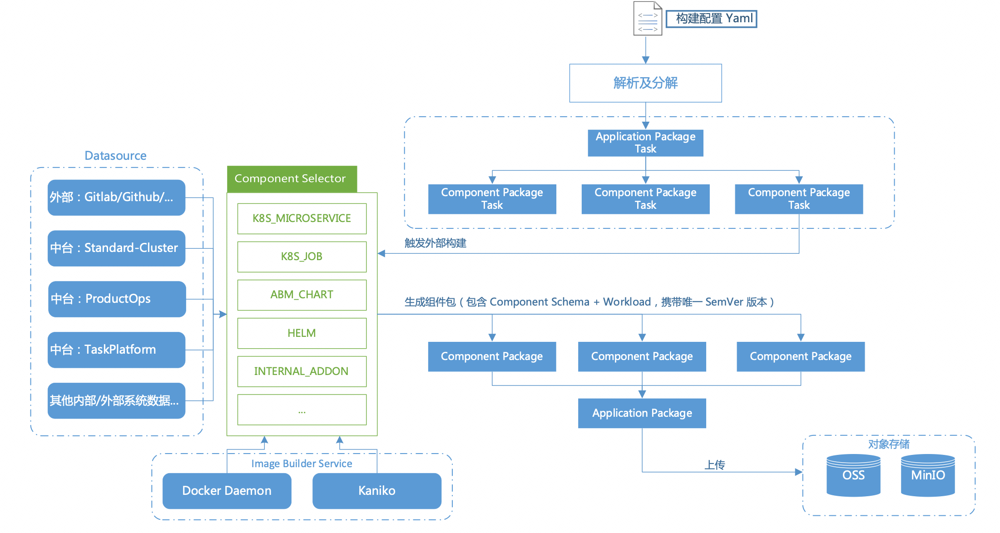 通过图上我们可以看到，首先用户自定义的构建配置被提交，之后会被 AppManager 解析为应用包任务以及一个个的组件包任务，每个组件包任务会根据自己的组件类型选择对应的构建逻辑进行构建，这里可以有不同的数据源，也可以通过不同的方式产出镜像，不管是 Docker Daemon 还是 Kaniko 的方式都支持，也会推送到指定的镜像仓库中。最终完成后生成一个个组件包，以及拼装为一个应用包，赋予版本及标签后，最后上传到 OSS 或 MinIO 上进行制品存储。一个常见的用户场景是，通过标签声明当前制品的用途，在实际使用的时候通过标签进行过滤，并进而选择自己需要的版本号以确认唯一的制品。 当存在外部 CI 系统需要对接的时候，只需要将外部 CI 系统产出的镜像及其他 commit 信息通过 Trigger API 触发即可，后面的流程和上述人工主动触发一致。

### **应用部署**
当获取到制品之后，就来到了整个系统中最核心也是最复杂的部分：应用部署。此处暂时先忽略多环境下的制品下发及相关细节，后面会单独讲到。现在先假设我们已经将制品传输到了指定环境中，并且镜像也已经在对应环境中可用，只是单纯的执行一次部署流程，会有哪些事情发生。 首先看一下整个 Application 的 Yaml，它完整定义了一个应用部署的模型，描述了一个应用应如何可靠而又灵活的交付到目标环境中。如前面所说，Component/Addon/Trait 为面向终态设计，Policy/Workflow 为面向过程设计。 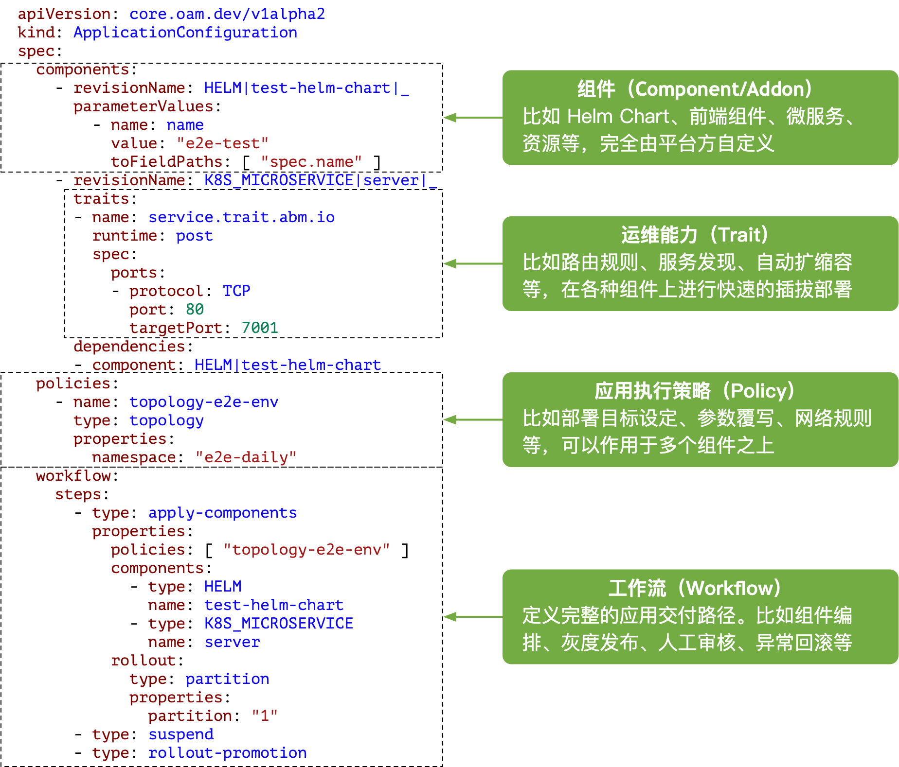 之后来看一下整体的部署层级关系，从大到小分别是 Workflow 部署、Application 部署、Component 部署(含 Trait 部署)。当然并不局限于这三层，Workflow 是可以按业务需求进行各种嵌套的，后面会单独讲到。接下来我们用相反的顺序来介绍实现细节，自底向上，逐步拼出来我们最后的实现方案。

#### 应用部署 - Trait
Trait 我们会归类为三种功能：

- 根据配置修改绑定的 Component Workload Yaml。
- 新增 / 修改资源 / 做你想做的事，并在完成后产出数据给自身对应的组件或后续其他组件使用。
- 持续监听目标集群中当前组件的事件（不只是部署过程中），并实时根据事件做出反应（Groovy 实现），常用于根据组件的当前状态做出一些外部反应，比如 Pod 漂移 IP 变动后需要重新做一些信息注册或维护类的工作。

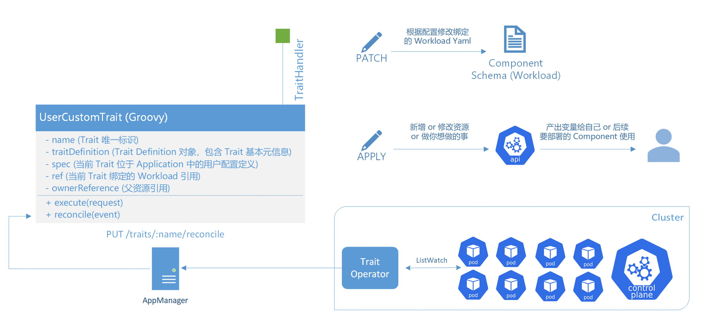 所有的 Trait 也都是 Groovy 脚本实现，并封装为插件包注册到系统中。每个 Trait Groovy 的 class 说明如上图，其中会包括两个 interface：

- 一个是 execute，所有类型的 Trait 在部署过程中均会执行该方法，并产出数据供下游使用，当然产出数据是可选的
- 另外一个是 reconcile，只有第三类需要持续监听目标集群事件的 Trait 才会使用，本质上是目标集群运行着我们开发的一个 Trait Operator，在 execute 执行的时候下发一个监听 CR 到该集群，Trait Operator 检测到该 CR 后会启动一个新的 Controller 来监听指定组件事件，并在事件到来后直接调用 AppManager 的 Trait Reconcile API，该 API 会直接同步调用对应 Trait Groovy 脚本中的 reconcile 方法，完成业务自定义的事件触发动作。这里其实等价于我们把常见的 K8S Operator 的 Reconcile 链路延长到了 AppManager 自身，并通过 Groovy 来实现业务逻辑，简化了常规 Operator 的开发流程，并且中心化也更好维护一些，尤其是面对茫茫多的目标集群的时候。

#### 应用部署 - 组件
对于组件而言，我们定义了几个固定类型，分别是构建、部署和状态感知。其中构建前面介绍过了，状态感知是可选的，会在最后进行介绍。这里主要介绍下部署逻辑。 组件部署的时候，一样会执行对应的 Groovy 脚本，并且系统会在进入脚本执行前自动将选定的制品解压到本地目录供脚本使用，以执行业务自定义的部署逻辑。目前我们已经根据各个业务情况编写了 6 类内部使用的组件，这些因为和阿里云业务相关无法开源。在开源场景下，我们默认提供了微服务、Job、Helm 几种类型，并开放了扩展机制，供有需要的用户自行编写新的组件类型来控制自己的组件如何部署。这里的组件类型是抽象的，也可以完全和 K8S 无关，比如是自己公司内部系统的某些特定配置导入导出。 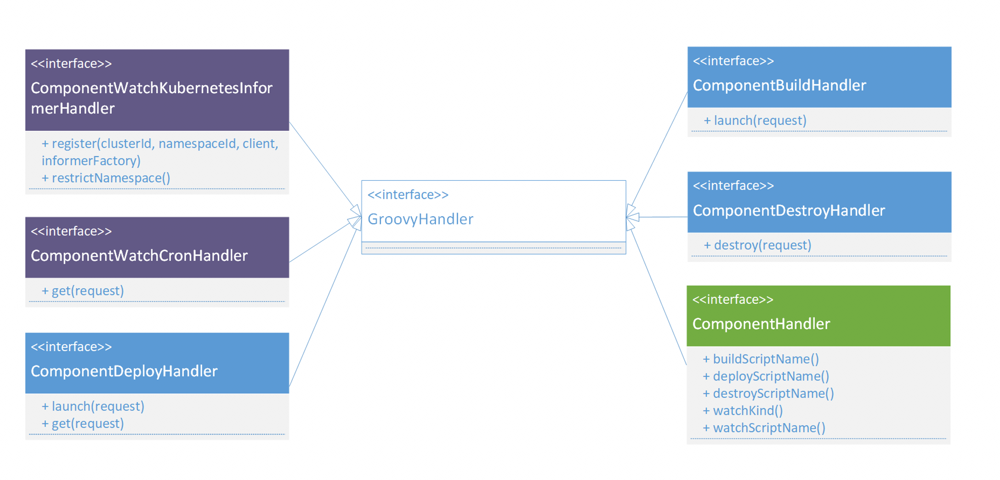 由上面的图可以看到，在部署过程中，Groovy 脚本中的 launch 方法会首先被调用，并完成对应的部署流程，这里可通过 fabric8 进行 K8S 远程调用 apply 下去对应的 Yaml，当完成后立即返回即可。之后，AppManager 服务会不停轮询当前 Groovy 脚本中的 get 方法，期望查询到成功的返回值，否则就会一直等下去，直到超时或失败。 这里在检查业务组件终态的时候其实还可以和组件自身的状态感知的能力产生互动，比如一直没有终态，但是没有终态的原因是什么呢？是可以通过后面说的状态感知来分析失败原因并返回给用户的。后面我们再细讲。

#### **应用部署 – 应用 & 组件 & Trait 间依赖关系**
说完了组件和 Trait 的部署，我们上升到应用层面，来看下在应用的视角下，自身的组件、Trait 在整个部署流程中的数据关系。 因为实际的业务场景中，每个组件和 Trait 都有可能产生数据输出，并且会被别的组件和 Trait 引用到，在这种依赖关系下，产出数据的组件不跑完，引用数据的组件是不能跑的。但如果两个组件间没有任何依赖关系，那么他们是需要并行跑来提速的。 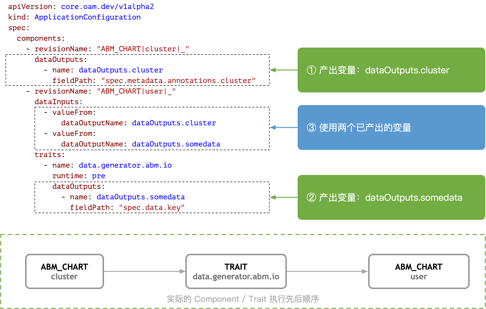 所以按照 OAM spec 的描述，我们在 Application Yaml 中为每个组件和 Trait 都提供了 dataInputs 和 dataOutputs 能力，如图上的 Yaml 所示。 在 AppManager 系统收到上面的 Yaml 后，在整个应用部署的过程中就需要对针对所有的组件和 Trait 之间的关系建图连边了。 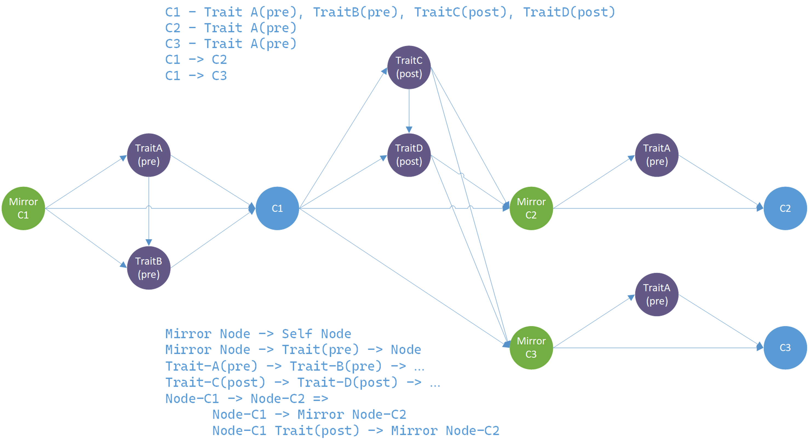 在构图的时候，Component 和 Trait 是一视同仁的，这种对等关系会降低复杂度，同时保证数据流依赖关系在两种类型上保持一致。 对于每个 Component，会单独再构造一个镜像节点，用于确保前置组件的后置 Trait 节点的运行在当前组件之前。这样整体构图之后，只需要按照这个 DAG 无脑执行即可满足约束顺序。

#### **应用部署 -Workflow**
在早期的业务支撑中，其实是没有 Workflow & Policy 这一层的，但是上面讲到的应用部署只是针对单目标的，如果是批量目标环境的部署，就需要在更高的纬度发起多个应用部署单子来解决。

OAM 针对这一情况也在 0.3.1 的草案中提出了解决方案，也就是 Workflow & Policy。这里简要说明一下：

- 一个 Workflow 包含多个步骤，执行顺序可以顺次，也可以并发，如果并发的话就是按照上面说的 dataInputs/dataOutputs 的 DAG 构造方式。
- 每个 Workflow Step 也都是 Groovy 脚本来实现，所以每个步骤执行什么，怎样执行全部交给平台方来定义。
- 每个 Workflow Step 的 Groovy 脚本中，可以调用 Policy 对全局 Application 进行自定义修改，并且将修改后的 Application 提交应用部署单，也就是前面说的逻辑，这样就可以实现不同目标环境有不同的覆写配置。
- Workflow 在执行的过程中可以有更多的控制及人工介入，如暂停、恢复、设置上下文等等，在灰度发布场景、涉及回滚动作的时候尤其有用。
- Workflow Step 可以继续产出一个 Workflow，实现复杂场景实现套娃效果。

### **资源管理（Addon）**
秉承着所有可扩展的东西都通过 Groovy 脚本来插拔，资源 Addon 也不例外，其实也可以把它看做是 Component 组件。 对于 Addon，会有和 Component 不同的语义。资源需要申请和释放，也就是 apply 和 release，所以这两个方法是 Addon 层面的 interface。同时 Addon 也会存在自己的规格 Schema 定义，前端会在资源申请的时候识别这个定义，让用户在页面选择需要申请的资源规格（比如 8c16g 的数据库）。 在我们的实践过程中，直接写了一个对接 Terraform 的 Groovy 脚本就完成了大部分的内部业务诉求。对于所有的 tfstate 文件也会透出以 Addon Schema 的形式存储到数据库中供后续其他组件使用或共享。 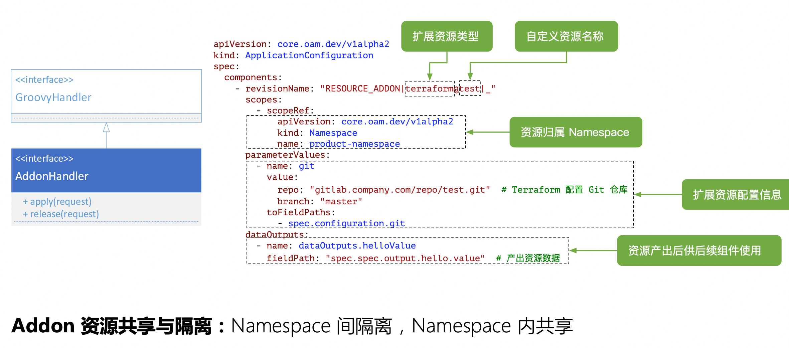 注意资源的特性是应用下根据 Namespace 隔离的，但 Namespace 下的同名资源会进行共享。一个典型的场景是生产的 Namespace 下申请的数据库会共享到预发和生产两个环境的服务中。这里在下一页的多环境支持中进行介绍。 如果你对于其他第三方的各类异构资源有需求，比如有的资源需要通过特定的 API 申请的，完全可以再扩展一个插件注册进去即可实现。

### ** 多环境支持**
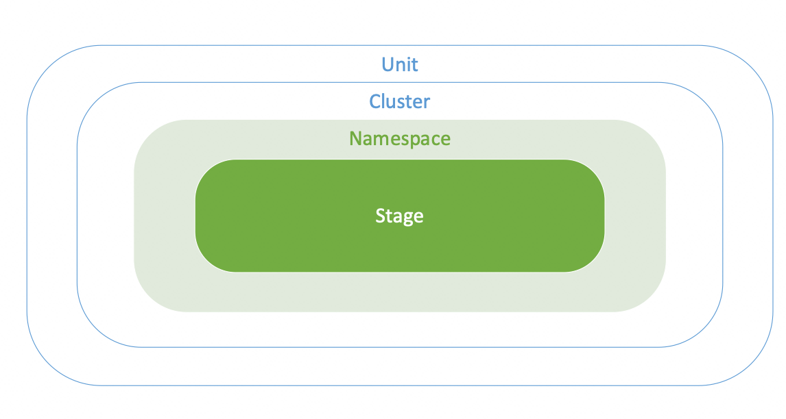 我们在 AppManager 中定义了四种环境层级，如上图。从上到下分别是：

- Unit(单元)：单元间网络隔离。每个单元需要一个 AppManager 实例进行管控。一个单元可包括多个 Cluster。
- Cluster(集群):一个独立 K8S 集群，集群间网络可达。集群直接注册 kubeconfig 到当前单元下的 AppManager 即可使用。
- Namespace(命名空间): 对应 K8S 的 Namespace 概念，用于一个 Cluster 下的资源及应用的隔离，一个 Namespace 对应了一个信息孤岛。
- Stage(阶段/环境): 一个 Namespace 可包含多个 Stage，每个 Stage 共享了当前 Namespace 下的所有资源。

### **应用状态感知**
一个应用被交付到目标环境之后，运行的状态怎么样？这块其实有很多种外部开源方案或监控手段可以来搞的，不展开。这里只介绍下 AppManager 内置的一个简单的状态感知方案。 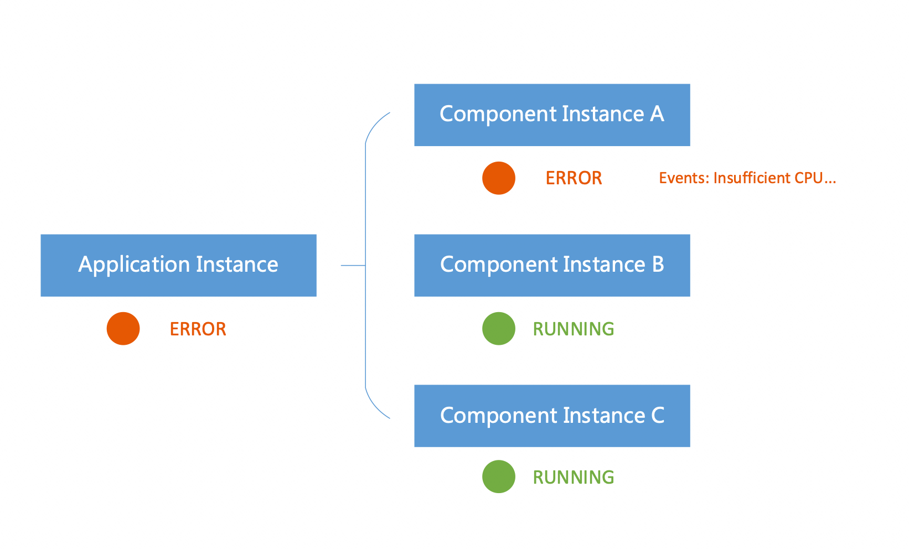 由上图可以看到，一个应用被部署到了一个目标环境中，就变成了一个应用实例 Application Instance。一个组件被部署后也一样会变成组件实例 Component Instance。应用实例的状态是由组件实例的状态汇聚而来的，那么组件实例的状态需要怎么来呢？ 首先来看 Watch 的方案，时效性高，但支撑的集群数量只有几百个，小规模下使用。本质上是在组件注册的时候通过 Informer 机制 List/Watch 集群事件，然后将 Event Handler 的实现交由组件开发者自己自行判断，并根据内容返回业务自定义的状态结果。 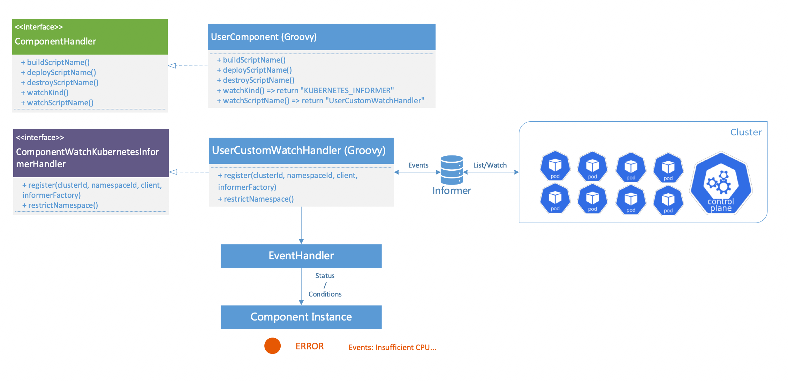 接下来是 Pull 方案，可以支撑最高 10 万量级的应用及集群，但时效性在应用状态正常时会逐步降低到 5min。只有在发生异常时会快速提升检测频率，直到再次恢复正常。当然具体的状态判定的脚本也是交给组件开发者来写的，可以根据业务需要自行扩展，灵活性非常高。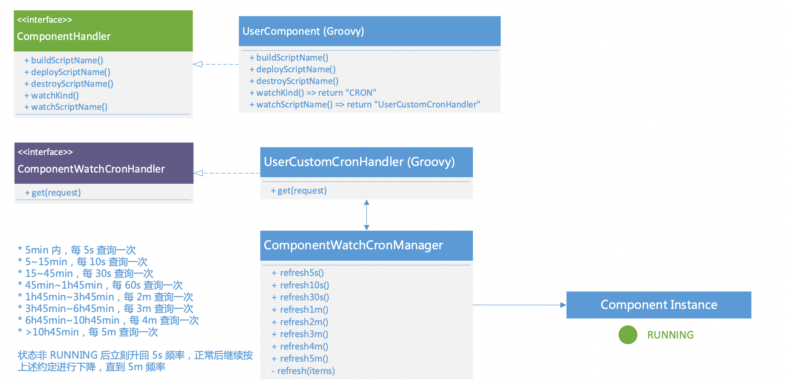

以上为本次分享全部内容，谢谢大家的聆听。

