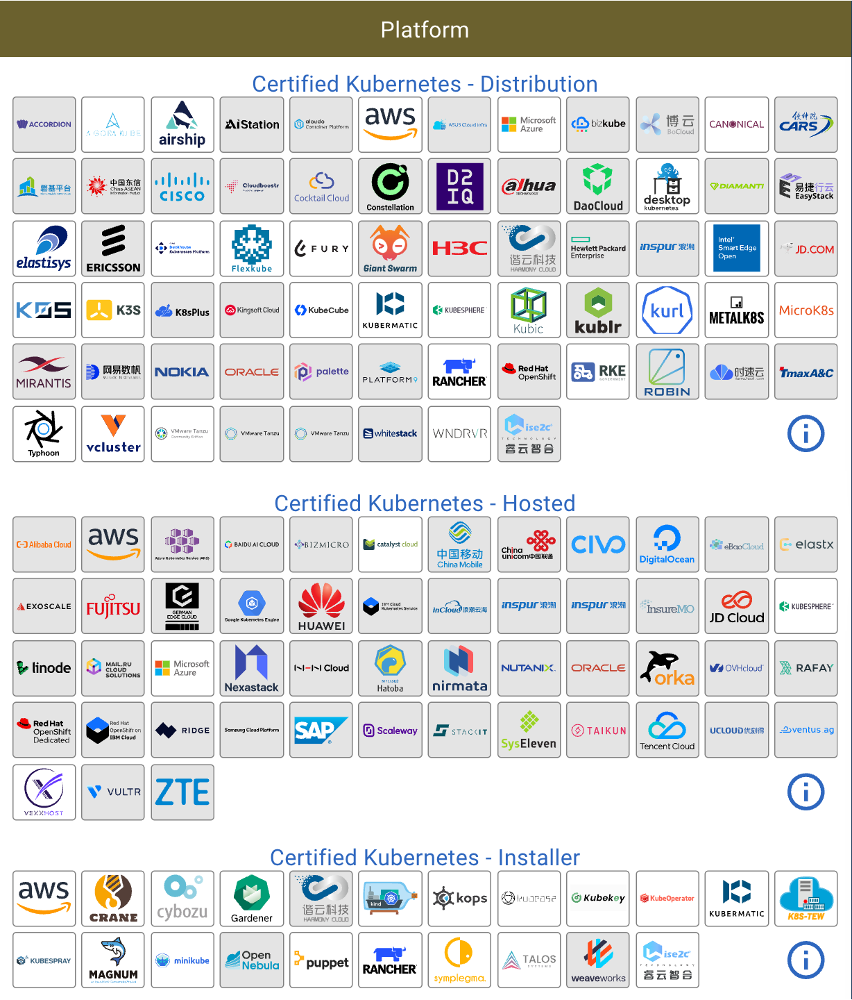
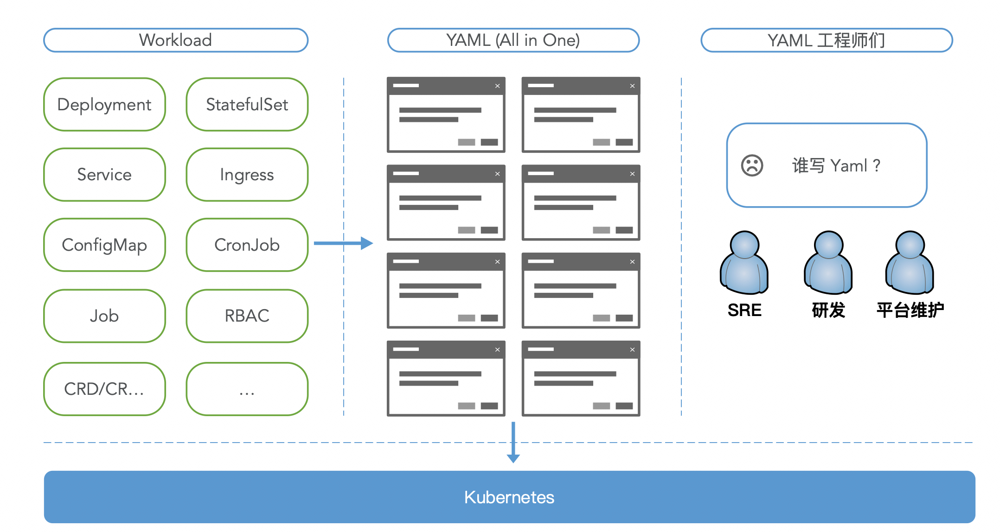
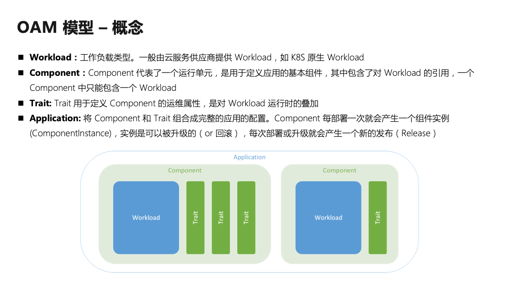
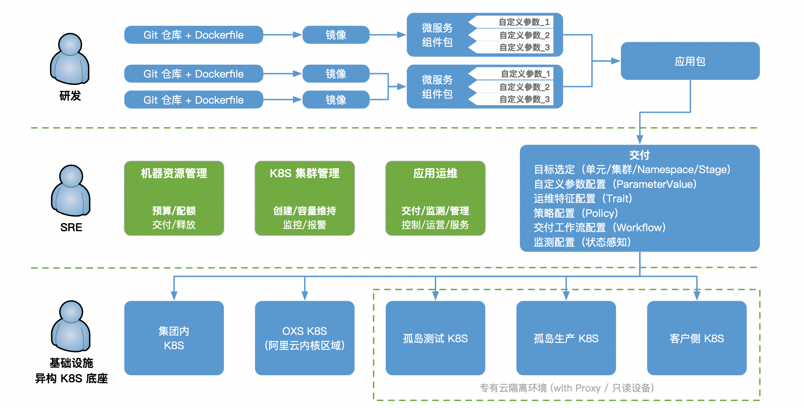
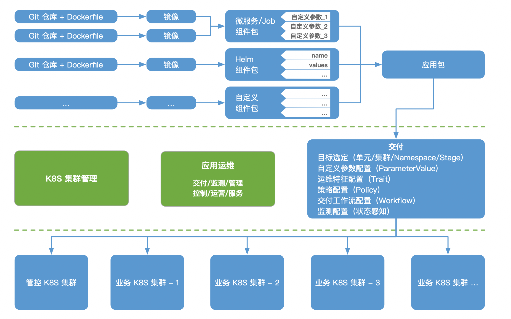
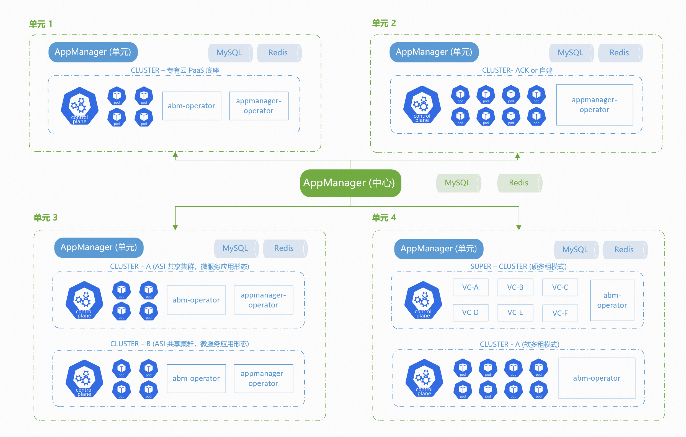

大家上午好！我是来自阿里云大数据基础工程技术团队的郭耀星，花名雪尧。今天我很高兴能够来到QCon，与大家分享我的经验和心得。**在当前的多云环境中，作为运维支撑团队，如何在分裂严重、存在多个不同环境的异构Kubernetes底座情况下，高效率地管理与交付业务应用，是一个值得探讨的话题。**

在开始正式分享之前，先做一个简单的自我介绍，我是 17 年武汉大学毕业，之后一直在阿里云的计算平台大数据基础工程技术团队，从事大数据运维平台的研发工作，也算是见证了大数据运维平台持续迭代演进的过程。

在我刚入职之后，我负责过多个运维中台服务的开发和建设。后来随着大数据架构从物理机向云化转变，我逐步开始从事容器化相关的改造，再到现在完全是云原生的天下。在这个过程中，我主导了我们这边的 ABM，也就是大数据运维平台，在专有云及公共云上，几十个应用从物理机到 on K8S 的转型，这个过程很痛苦，但也以此为契机，沉淀出了一套多云环境下的云原生下应用管理与交付的服务以及相对应的实践经验，期望在接下来的时间里与大家分享。

**今天我分享的内容主要有四个部分：**

- **多云环境应用管理与交付痛点**
- **理论先行：OAM**
- **多云环境交付实践 - 微服务 / 大数据产品 / SREWorks开源社区**
- **关键能力实现与解析：AppManager (OAM Runtime)**

**首先来介绍多云环境下应用管理与交付的痛点，然后看在这些痛点之上，我们为什么选择了 OAM 作为我们的理论模型，以及基于这套理论模型，我们在多个业务场景下的实践经验，最后是我们自己研发的这套 AppManager 服务关键能力的实现方案与解析。**

## 多云环境应用管理与交付痛点

### 痛点 1 – 多云环境下的 K8s 底座适配问题
首先是第一部分，多云环境下，应用管理与交付的痛点是什么？ 由于在统一底层基础架构细节方面的出色表现，K8S 已经成为企业多云管理的事实基础。但单服务商的单 K8S 集群真的满足需求么？ 答案是否定的，作为基础设施的运维，我们会和形形色色的 K8S 集群打交道。有当前已有的各个厂商提供的公共云 K8S 集群，也有专有云版本部署在网络隔离机房环境下的 K8S 集群，以及单独拿出来做日常开发测试的 K8S 集群等等。除此之外，在阿里的内部场景还有更多的虚拟 K8S 集群，比如 Flink 全托管场景等。  一般来说，大家常见的诉求是：

- 需要物理隔离，避免业务间相互影响。尽管 K8S 自身提供了 Namespace 级别的隔离，你可以设置每个 Namespace 各自使用的 CPU 和内存，甚至可以使用 Network Policy 配置不同 Namespace 的网络连通性，但这些仍然不彻底，企业还是需要一个更加彻底的物理隔离环境，以此避免业务之间的互相影响。
- 需要混合云。混合云场景下，企业希望可以选择多个公有云厂商和私有云解决方案，避免受限于单一云厂商，或降低一定成本。
- 需要应用异地多活。部署业务多个副本到不同 region 集群，避免单个 region 的断电造成应用的不可用情况，实现不把鸡蛋放在同一个篮子目的。
- 需要环境分离。为了区分开发测试生产环境，把这些环境部署到不同的集群。
- 需要一定的集群拓展性来突破单一集群的容量上限。

当然从纯粹的多集群视角来看，目前方案有 Federation V1 / Federation V2 / OCM 等解决方案，还有多个 kubeconfig 直连的方式。不过这块不是本次讨论的重点，这里并不讨论多集群的问题，而是讨论异构 K8S 底座，多集群方案可以看做是异构 K8S 底座方案的一个子集。 所以最后重点是：如何在一个分裂的非常严重的，位于多个不同环境的异构 K8S 底座下，高效率的进行应用管理与交付。

### 痛点 2 – 研发与运维的诉求冲突
我们团队自身其实定位于运维平台开发，上面会有两类角色，一类是研发，一类是 SRE。在更小规模的公司体量下，运维开发和 SRE 会归为一体，对研发提供运维平台及服务。  当一个人的时候，我们推崇全栈工程师，DevOps。但随着规模和体量越来越大，一定会出现很多责任田，归属到不同的团队和不同的人。 在上述演进的过程中，研发和运维之间的矛盾会愈发凸显：在研发及产品视角，疯狂迭代疯狂上功能才能拿下用户拿下市场；在运维视角，不动线上不做变更就不会出问题。

### **痛点 3 – 研发与运维的分工冲突**
在物理机/ECS时代，我们自身控制着从下到上的整个链路。为了调和上述矛盾，我们制定了各种各样的变更规范，开发了各式各样的变更工具和流程，当然也吵过了很多的架。 

那么在云原生的浪潮之下，Kubernetes 统一了底层的基础设施，减少了大部分的底层运维工作，大家开玩笑说全部变成了 YAML 工程师。但还是有一个很重要的问题没有解决，就是：YAML怎么写？谁来写？如何交付到目标 K8S 集群？ 过去的两年多的时间里，上面这些问题实实在在地摆在了我们团队的面前，在当前的定位与场景下，要支持专有云、公共云、集团内部、开源社区等环境下的形形色色各式各样的 K8S 集群上面的服务托管与交付。

## 理论先行：OAM
古时候有兵马未动，粮草先行。这里我们是代码未动，理论先行。先说一下我们为什么会选择 OAM(Open Application Model) 作为我们解决问题的理论基础。 我们上面讨论了多种多样的痛点后，基本可以总结下面几点：

- 一个是开发者花费了太多的时间在基础设施的细节中。机器从哪来，网络环境怎么样，中间件资源/DNS/负载均衡怎么生成，集团内部的服务怎么适配到公共云/专有云各个底座上等等。或者更进一步，每个开发者都是 Yaml 工程师，哪怕都是 K8S，但每个底座让你提交的 YAML 都不一样。
- 另外一个是可扩展性低。有越来越多的平台 or 底座在尝试去支撑各种类型需求的业务，但一般来说，应用本身对于平台的诉求会很快超越平台的能力。
- 还有云服务供应商绑定。当选择了一个固定的底座后，应用交付的方方面面将会打上这个底座的烙印，当想尝试转到另一个底座的时候难于登天。
- 最后是随着团队规模的膨胀，研发、运维、平台人员之间开始各种相互踩脚，沟通和协调的成本也越来越高。

OAM 针对上述痛点提出了以下几个观点：

- 应用为先：一个应用的交付与部署应该是自包含的，其中的各类操作行为应该作为应用定义的一部分，这些内容与实际基础设施无关。
- 清晰和可扩展性：定义一套开放标准，可以模块化整个应用交付流程，根据个人需要将这些模块自由组装，达成自己想要的结果。
- 云服务供应商无关：定义的开放标准应该是一套更高级别的抽象，可以跨本地集群、跨云服务供应商，不会被锁定到任何一个厂商的底座。

 OAM 通过一系列概念的定义，完成了对一个应用的抽象，实现了角色职责的分离，将应用交付这件事情与底座解耦，使得跨云快速交付应用成为可能。开发同学也不再关心底座实现细节，只关心自己的应用模型即可。OAM 的诞生，旨在定义云原生应用标准。

接下来我们简单介绍下 OAM 中的部分概念： 

一个 Application，也就是上图中最外面的蓝框，代表一个应用，是包含多个组件 Component 的，这里的组件就是我们日常交付的最小业务单元，也就是上图中的浅绿色部分，比如一个微服务、一个 Job、一个 Helm 包等。那么组件 Component 的内部是由蓝色的 Workload 和深绿色的 Trait 组成的。Workload 就是工作负载类型，描述了当前 Component 是谁，而 Trait 则定义了当前组件的运维属性，比如我需要给这个微服务加个 200G 存储，加一条网关路由，限制多少 CPU 内存资源，或者更复杂一点，当 Pod 漂移后 IP 变动了去做一些外部数据维护的事情。上面我描述的这些都可以用 Trait 来抽象及描述。 上面说的这几个概念，都是面向终态的，和 K8S 自身的面向终态的逻辑是一致的，我只需要声明式的写出我希望的实际交付后的应用的样子，而不需要关心内部是怎么 Reconcile（调和） 去实现的。 

除此之外，还有工作流 Workflow 和应用执行策略 Policy 的概念作为补充，他们是面向过程的，用于解决单纯的面向终态的声明方式无法覆盖的交付过程控制，比如人工审核、回滚、多集群发布等等。 我认为 OAM 模型带给我们的最大影响是，我们需要时时刻刻将“关注点分离”这个事情作为最大的准则，简单来说就是明确人员分工。这里面有三个角色：

- 第一个角色是应用开发人员，也就是写业务代码的同学，他们只需要负责组件 Component 的定义，比如我是什么类型的服务，镜像怎么构建，需要哪些参数来启动运行。
- 第二个角色是应用运维人员，他们定义上面讲到的运维特征，也就是 Trait，并将应用开发人员定义好的 Component 和这些 Trait 绑定到一起，辅以 Policy + Workflow，来生成最终交付的 Application YAML，并提交到 Runtime 实现，去维护整个应用的生命周期。
- 最后一个角色是基础设施运维人员，他们去控制整个平台有哪些 Workload 可供上面两类角色使用，以及维护整个平台层面的稳定性。

当然在实际实践的过程中，根据团队规模，有可能一人身兼数职，但随着团队规模的扩大，按上面的描述进行团队的分工，可以最大限度的降低沟通协作的成本，提高应用管理与交付的效率及稳定性。

## 多云环境交付实践
终于讲完了理论，我们接下来进入实践环节。 先简要描述下我们的团队所面临的业务场景，有四大块，分别是专有云、公共云、集团内部还有开源社区：

- **专有云**：将 ABM 交付到各个客户现场环境中，依赖统一的阿里专有云 K8s 底座。大部分的客户环境是网络隔离的，不出差到现场的情况下，只能拍照一来一回解决问题。
- **公共云**：交付各个阿里大数据产品到公共云 ACK 集群上(资源集群 or 业务集群)，多 Region，为云上客户提供服务。
- **集团内部**：部署各个大数据产品到集团内部 K8S 集群上，多 Region，为集团内部各业务方提供服务；另外还需要将我们自身交付到 OXS(阿里云内核区域)K8s 公共集群中 (权限受限)。
- **开源社区**：交付 SREWorks 到各类用户自建的集群下以及各大厂商公共云。

### 产品形态
面对上面所说的复杂多云环境，我们最终设计的产品架构如下： 

大家可以看到，我们针对于多云下的应用管理和交付场景，自研了一套基于 OAM 模型的  AppManager 服务，可以认为是一套 OAM 模型的 Java Runtime 实现。它作为应用引擎，提供了很多能力，涵盖构建、部署、制品管理、工作流引擎、插件、多云支持、多环境支持、状态感知等等，提供底层能力并向上暴露 API。在此之上，我们针对三个场景提供了对应的用户界面，并对实际用户提供服务。

- 首先是企业应用管理：各类开源/自有应用的云原生部署方案，可扩展各种组件类型，让使用者可以一键部署复杂应用支撑业务。
- 之后是运维应用管理，这里会细分一下：
   - 第一类是使用前端低代码模式构建的运维应用配置，能够被快速嵌入集成运维中台能力。此类应用无实际后端，均为纯粹的应用配置集合。
   - 第二类是使用微服务类型构建的运维应用，能够识别并托管上面说的的应用配置，实现对应的运维中台能力。
- 最后是大数据应用管理，对应开源场景 SREWorks 下的企业应用管理。在内部我们通过该系统实现阿里云上的所有大数据产品的交付、售卖及管控能力。

为了更好的和外部互动，我们开源了 SREWorks，作为一整套数智化运维的解决方案，也就是上图中的 AppManager + 企业应用管理 + 运维应用管理，期望能为大家提供开箱即用的云原生应用 & 资源交付的运维平台。大家感兴趣的可以去 Github 上进一步了解，一会儿会单独介绍。其中，AppManager 和我们内部使用的是同一套代码和分支，一直保持着和开源社区的同步；企业应用管理和运维应用管理经过一定剪裁和开源适配；而大数据应用管理因为涉及阿里云上各个大数据产品的交付、售卖及管控细节，暂不开源。

### 微服务

接下来我们针对不同的业务类型来看一下整体的流程：  首先是最简单的微服务，通过 AppManager，研发的同学配置好自己的仓库和 Dockerfile，就可以自动构建出来对应的镜像，以及包装后的制品——微服务组件包，多个微服务组件包最终打包为一个独立带版本的应用包。 之后是 SRE 同学入场，通过选择研发同学提供的制品，配合自己配置的一系列交付参数，比如部署到哪些目标集群、需要针对每个集群设置什么参数、加上哪些运维特征 Trait、配置什么策略、用什么工作流来编排、如何监测感知应用运行状态等等，这些最终生成了一份 Application 的 Yaml 文件，提交到 AppManager 运行。之后会由 AppManager 解析上述 YAML 并按要求交付到各个环境中，完成整个多云环境下的应用交付过程。 另外在右下角这类专有云隔离环境下，我们还支持了离线包交付，方便在网络隔离的环境下仍然简单高效的交付全部的应用。

### 大数据产品
接下来看阿里云上售卖的大数据云产品的场景： 

大数据产品因为业务特性复杂，有大量的动态渲染及相互依赖关系，所以目前采用了我们内部自研的 AbmChart 组件类型来承载，还有通用的 Helm/Kustomize 两种形态，但不管采用哪种形态，都是 Component，在流程上和刚才并没有什么不同，都是构建、打包、交付、监测。只不过组件类型的内部处理流程较为复杂，以及交付的目标集群及形态多样化。

### SREWorks开源社区
最后是 SREWorks 开源社区，SREWorks 是我们团队对SRE理念的工程实践的一套开源产品。通过抽象通用运维模型，实现五大核心价值场景，包括智能化运维、数据化运维、云原生 DevOps、云原生运维开发、多云管理。支撑“质量、成本、效率、安全”的运维需求，提供“交付、监控、管理、控制、运营、服务”全生命周期能力支撑。 

### 统一管控方案
看完了应用管理及交付的流程，之后我们来看一下统一管控的方案： 

因为是多云环境，所以会需要一个中心环境 AppManager 服务来作为整体的管控，也就是中心绿色的部分。 我们把每一个网络隔离或用途隔离的环境称为一个单元 Unit，单元内自成一体，对外无任何依赖。 每个单元需要部署一个 AppManager 作为这个单元自己的管控，并负责自己这个单元下所有应用的交付动作。中心 AppManager 只负责向各个单元 AppManager 下发命令即可。 在这个管控架构下，我们目前有几种类型的单元，每个单元可以非常灵活地适配其底座架构部署。

鉴于本次演讲篇幅比较长，我们将演讲稿分为了上下两篇文章。在这上篇中，我们已经对多云管理有了一个基本的了解。在下篇中，我们将更深入地解析多云管理的关键能力：AppManager。

