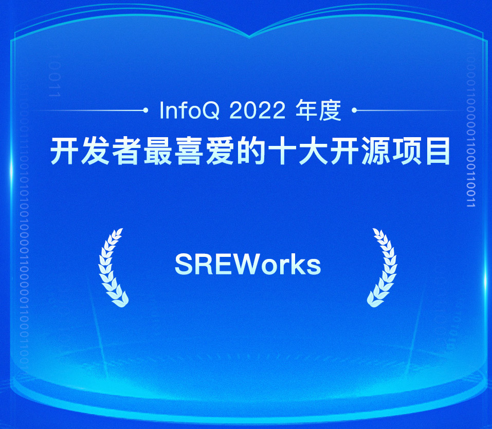
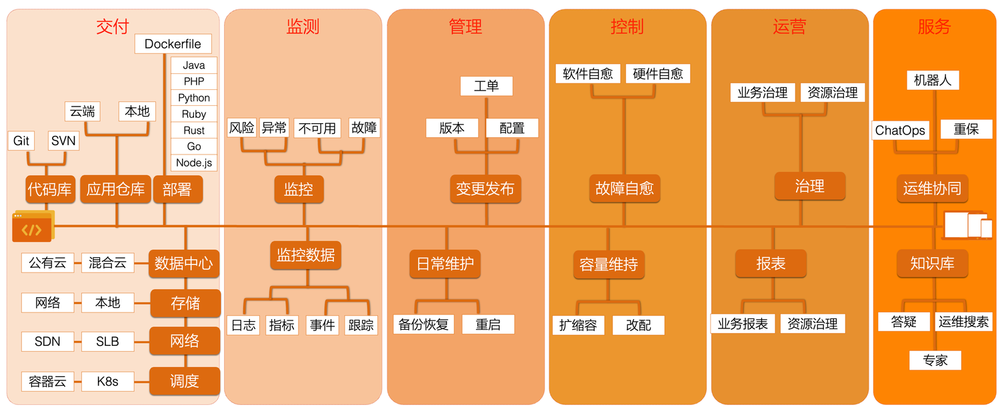
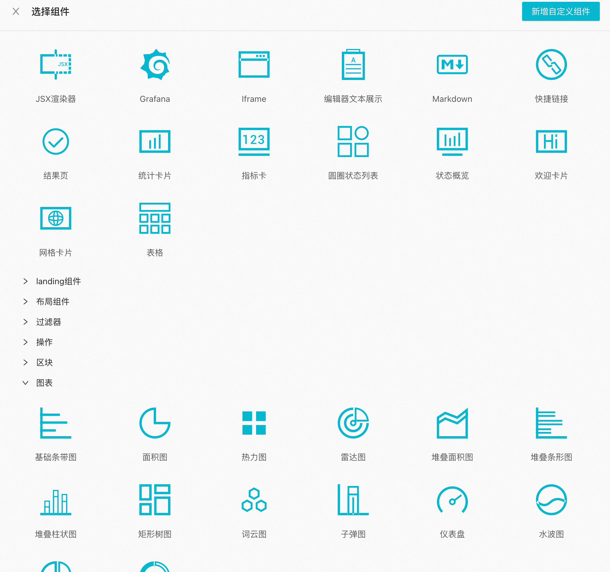
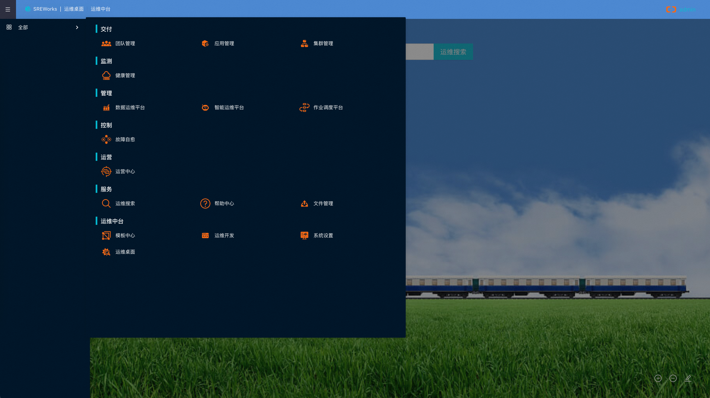

2022年3月SREWorks项目正式开源，到目前为止已经整整一周年了。自开源以来，我们始终立足云原生运维场景，秉承“数据化、智能化”的运维思想，采用“小步快跑”的快速迭代方式，使得整个SREWorks项目也取得了长足的进步。于此同时，得益于社区用户、企业伙伴的积极参与和贡献，也为SREWorks项目的发展注入了新的活力。下面我们来回顾一下SREWorks的开源故事并展望其未来的发展。

# 开源故事
相信大家或多或少听说过飞天的5K项目，这是中国云计算领域的一个里程碑式的项目，我们团队承担了其中的运维工作。超大规模集群的运维保障任务，让我们意识到：如果没有系统性的运维工程，即便我们再殚精竭虑，集群稳定性也是会是一件靠天吃饭的事情。于是我们逐步将大量的运维实践进行工程化落地，使之成为了一个可靠的运维平台，在内部我们称之其为ABM：Apsara Bigdata Manager -- 飞天大数据运维平台。 有了ABM之后，我们常常会对外分享平台化的运维工程实践，也收到了较好的同行反馈。本着 "Talk is cheap. Show me the code." 的想法，我们进一步探索如何将这些平台工程实践代码进行开源，帮助更多从业者提升运维效能。 随着云原生以及Kubernetes集群的大量推广，我们发现这些大规模的工程实践，同样适用于k8s集群。于是，我们对ABM进行了分层改造，升级为应用引擎 + 运维平台的模式。抽取其核心引擎部分为AppManager，使用OAM作为应用模型，其原理及实现可以参考如下文章： [QCon演讲实录（上）：多云环境下应用管理与交付实践](https://mp.weixin.qq.com/s/zCKS-Lkv-EVTCFPfhmGqDg) [QCon演讲实录（下）：多云管理关键能力实现与解析-AppManager](https://mp.weixin.qq.com/s/VA6n3EbRMyL199Qj6cQE5g) 同时，我们将运维平台ABM移植到k8s集群下，并进行了优化裁剪，这个过程有点像从Mac OS X中裁剪iOS--我们将这个裁剪出来平台命名为SREWorks。有了SREWorks之后，我们的各种对外经验分享对于同行来说不再处于隔靴搔痒的状态，我们有方案有实践有代码可落地。

# 开源历程
在这一年时间里，SREWorks进行了几次重要的版本发布：

| 日期 | 版本 | 说明 |
| --- | --- | --- |
| 2022/3/22 | v1.0 | 工程代码首次公开推送 |
| 2022/5/9 | v1.1 | 组件插拔场景化部署能力 [SREWorks v1.1 版本发布 &#124; 组件插拔场景化部署能力](https://mp.weixin.qq.com/s/_kqItPbivVmIrOVXvEaVlg) |
| 2022/6/21 | v1.2 | 公共应用市场上线，数据平台能力增强 [SREWorks v1.2 版本发布 &#124; 新增运维市场能力](https://mp.weixin.qq.com/s/9zEzKs-NpRciPA2cZzduyA) |
| 2022/11/16 | v1.3 | 应用插件机制上线 [SREWorks v1.3 版本发布 &#124; 插件机制发布](https://mp.weixin.qq.com/s/9Em8xMxuuPHcC7mBtvTEhQ) |
| 2023/1/6 | v1.4 | 纯内网离线安装方案支持，底座支持热升级 [SREWorks v1.4 版本发布 &#124; 离线安装&前端重构](https://mp.weixin.qq.com/s/dd75QNDspOIyx9wOSNoK_A) |

承蒙广大开发者和用户的支持与认可，SREWorks在2022年底被InfoQ评为开发者最喜爱的十大开源项目。 

# 开源意义
在这开源的一年里，在与外部的讨论沟通上，我们常常会不可避免的碰到这么一个问题：为什么国内开源项目做成功的这么少？我们可以从开源项目使用者的角度，来思考这个问题：一个开源项目应该更像个工程还是更像个工具？似乎优秀的开源项目通常两者兼有之：**方便快捷的工具帮助开发者快速解决问题，吸引他们快速入坑；工程的深度吸引业界高手持续往里填坑。**反之，缺乏工程深度项目能帮助用户解决短平快的问题，但无法持续发展，而缺乏快捷工具的工程如无源之水无本之木，还未积累足够的用户基数用户案例就枯竭了。 再往深分析一层，为什么国内开源项目常常会陷入上段提到这些困境？因为开源项目的推广并不像朋友圈的点赞，认同这个项目的人，会将这个项目实际用起来，继而接纳开源项目作者在项目中所传达的思想及方法。所以开源项目必须要有其独创性，才能服众，否则使用者就会产生一种“好像我也行”的冲动另起炉灶。这就像老生常谈的那句话“一流企业做标准、二流企业做品牌、三流企业做产品”，一个优秀的开源项目常常引导了这个领域的一些标准的落地。 我们希望通过SREWorks数智运维平台，让更多从业者利用“大数据和人工智能”的能力做好运维，进入到“数据化、智能化”时代。从代码到线上业务服务的全流程，我们划分了“交付、监测、管理、控制、运营、服务”六大场景，每个场景中都其有代表性的核心功能。 

# 开源生态
围绕着SREWorks数智运维平台，我们秉承开放协作共享的理念，致力于构建一个人人可参与的生态圈。

## 前端可视化生态
前端可视化常常成为一个产品功能快速迭代的瓶颈，SREWorks中提供了自由的前端低代码组件布局方案，无需前端开发同学配合，只需要轻松地拖拉拽一把，就可以快速将几个前端页面落地。**大家在SREWorks中看到的所有功能页面，均是通过这种可视化布局产生的**，我们的前端研发提供了丰富的前端组件库供布局使用，具体对此感兴趣的同学可以参考下面两篇文章或直接上手体验一把： [SREWorks前端低代码工程设计概览](https://mp.weixin.qq.com/s/0PMoNr1wtCpEpF3aJoexOA) [SREWorks低代码组件生态演进:monorepo架构和远程组件加载实践](https://mp.weixin.qq.com/s/dj7S2HIq_orVSAwyFXrOgw)  我们的前端研发同学生怕各种组件无法完全满足业务需求，想方设法提供了各类组件扩展及能力增强方案：

- **组件不够多？**我们利用monorepo架构将组件部分变成一个独立的npm工程，方便开发者二次开发以及往里新增组件。
- **接口数据格式无法完全匹配组件？**我们在组件中提供各种数据处理插槽，允许用户直接写js函数来处理数据。
- **组件的文字格式上希望做一些调整？**各种展示文本均支持使用React JSX进行格式渲染增强。
- **想嵌入一些自己开发的组件？也不是基于React开发的？**没关系，远程组件加载满足你，Vue组件轻松加载。
- **不想在本地开发代码，但想快速把几个页面元素合成一个新组件？**我们支持使用React JSX在前端直接编写新组件。

## 应用及插件生态
在应用开发中，构建环节是至关重要的。有时候线上环境看起来十分井井有条，但是构建环境却会为了快速出包，暗藏各种脚本或有状态的小魔法。时间一长，这条清澈的小溪就会布满各种岩石、急流、暗礁，大多数情况能有惊无险地通过，但总会有那么几次问题的排查让人刻骨铭心。SREWorks基于k8s提供完整的云原生研发及构建方案，没有有状态的构建机，每次构建都是一个独立Pod，用完即毁，保持良好的弹性伸缩能力。具体技术细节可以参考 [SREWorks持续交付云原生化: 镜像构建](https://mp.weixin.qq.com/s/24v8J1JYgYMl4Eoakrb5dA) **SREWorks中所有功能都是由标准的OAM应用构成的，应用就是组成平台的最小原子。**同时，我们将SREWorks中的应用划分成两个大类：运维应用和企业应用：在运维应用中，我们如上文提到的“交付、监测、管理、控制、运营、服务”六大场景，内置了丰富的运维应用；在企业应用中，研发同学可以借助SREWorks的云原生研发流程快速落地功能。  在v1.2版本之后，所有的SREWorks平台实例中都上线了公共应用市场，也就意味着已经部署SREWorks的用户可以通过这个公共应用市场，来持续安装以及升级应用、增强能力。我们鼓励SRE同学将各种经验沉淀成一个应用，进而设计成一个完整的应用产品，上架到市场供更多的同行使用。 另外一方面，为了能够满足更丰富的应用形态需求，我们在v1.3版本上线了插件机制，提供了工作负载等插槽允许用户通过插件进行扩展。当前工作负载中已有插件是微服务和Helm，后续会上架更多的插件，也欢迎有需求的公司进行插件共建。

## 数智运维生态
在SREWorks中我们提供了基于ElasticSearch的完整的数据运维平台以及智能运维平台，但说实话，数据化和智能化这块能力让公司来一键接入还是有难度的，于是我们基于SLS(阿里云日志服务)的SREWorks微应用，无需部署SREWorks，帮助部分用户一键体验轻量级SREWorks的数智服务，需要深入了解的同学可移步这篇文章 [SREWorks 数智服务尝鲜，你的数据准备好了吗？](https://mp.weixin.qq.com/s/XAb6u5U1fU38-tkYr92VdQ) 在智能运维算法这块，对外我们不断规划更多的算法开源，对内我们不断夯实算法理论基础：

- 在2021年，我们与阿里云达摩院合作的时序多周期检测相关论文《RobustPeriod: Robust Time-Frequency Mining for Multiple Periodicity Detection》被SIGMOD 2021接收，这也是阿里首次以第一单位在 SIGMOD 的Research Track发表的论文。
- 在2021年，我们与达摩院决策智能团队合作撰写的论文《CloudRCA：面向云计算平台的通用根因分析框架》，国际顶会CIKM2021的Applied Research Track录取。
- 在2022年，我们与达摩院时序智能团队合作的《NetRCA: An Effective Network Fault Cause Localization Algorithm》在 ICASSP‘22 AIOps Challenge通信网络智能运维大赛获得冠军。

我们欢迎在数智运维领域与使用SREWorks的公司有更多的共建与合作，持续打磨工程及算法，使之产生更广泛更更普适的价值。

# 后续规划
在**引擎(Appmanager)**上我们会进一步完善插件机制，同时引入更多的工作负载(workload)和运维特征(trait)来实现更丰富的应用场景。在应用持续集成(CI)链路上，我们会根据已有案例持续进行打磨能力，使得应用开发及构建方案对其他公司更加适配。 在**平台层(PaaS)**上我们会进一步增强权限体系和接口服务，使得SREWorks在其他公司中嵌入集成更加简单。同时我们会将中台能力进一步抽取，使得运维应用之间通过中台能力交叉引用更加方便高效。 在**应用层(SaaS)上**我们会根据内部新上线的功能情况进行开源，可能会包含应用管理的增强以及业务流程编排相关的功能点。 在**数智能力(DataOps&AIOps)**上我们在今年会开源基于Flink ML的日志聚类算法服务，更强的异常检测服务，大敬请期待。 在**开发者生态(Developer Ecosystem)**上我们今年会进一步扩充应用市场的应用，提供更多的培训课程及文档，方便更多用户，能快速基于SREWorks完成云原生的应用开发。同时今年会上线SREWorks应用测评系统，在日常组织一些比赛进行基于SREWorks的应用开发比赛。

# 写在最后
开源并非一件易事，曾有人这样问我：“你们开源是怎么活下来的？” 通过内部大量的工程实践的打磨，使得我们孵化了这样的平台，磨合了这样的一种工作方式：我们希望将这其中的价值以及思考传递给更多的人，路虽远行则将至，事虽难做则必成。

