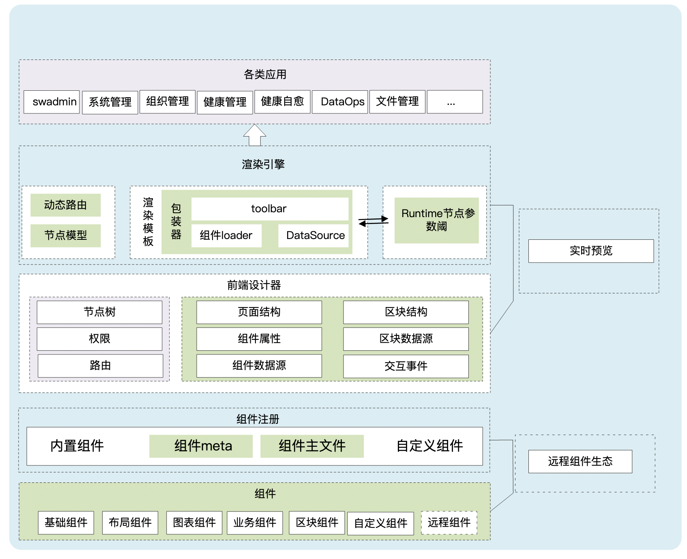
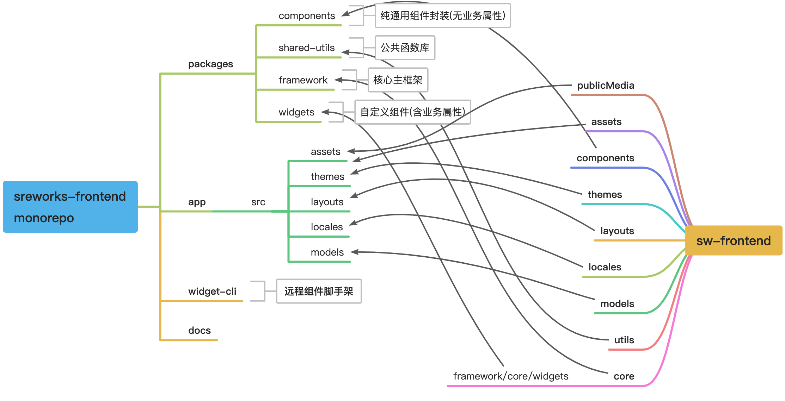
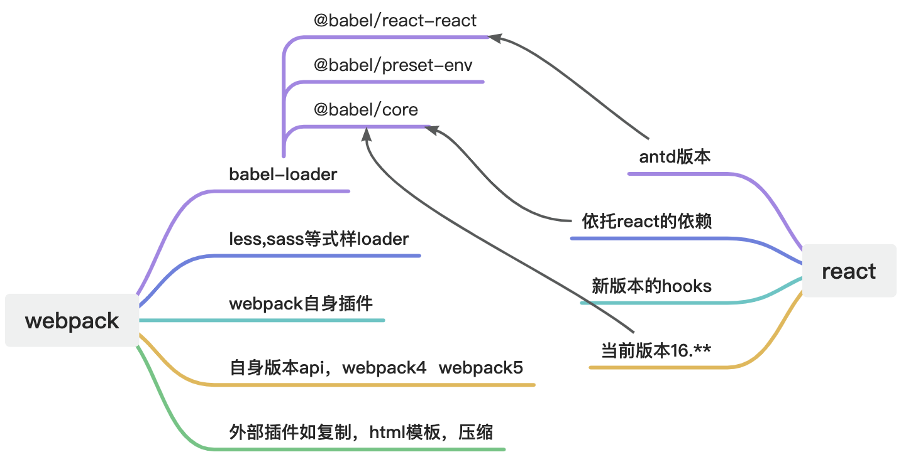
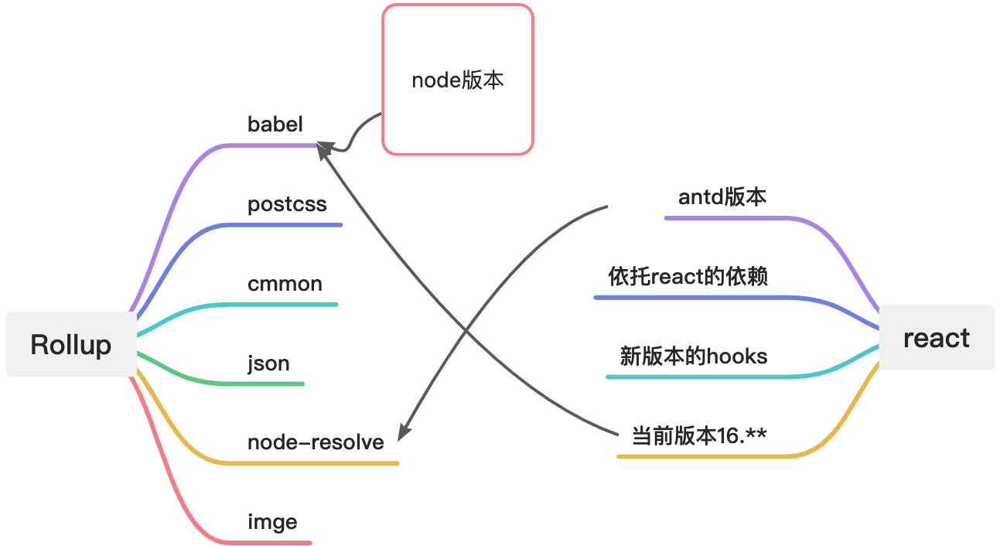
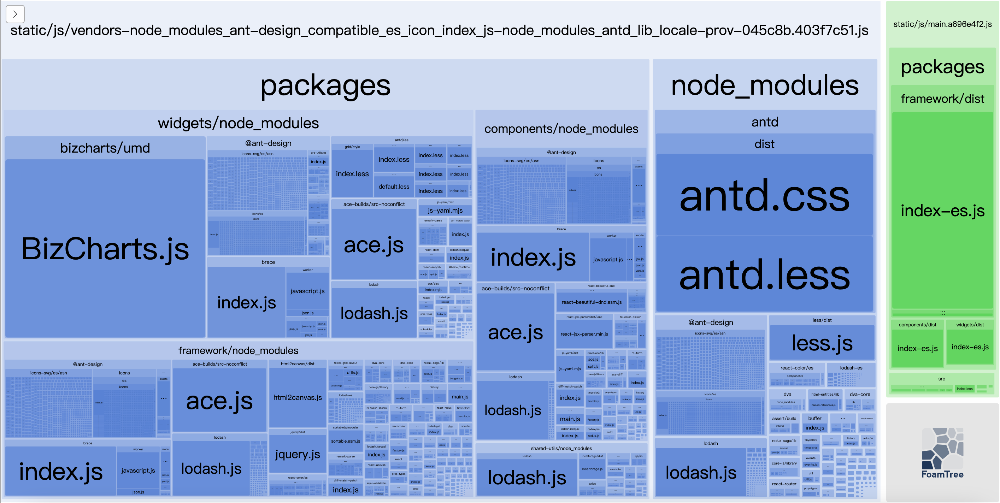
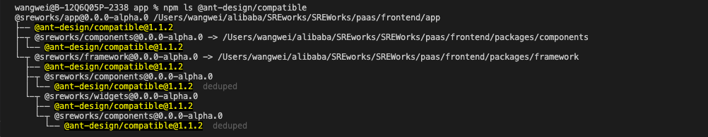
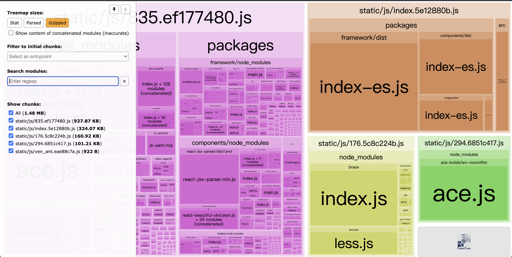

作者：王威（地谦）
<a name="s4onN"></a>

## 文章结构

- 项目背景
- 演进分析
- monorepo架构演进
   - Webpack与Rollup
   - 如何平滑迁移
   - 构建优化
- 组件的可扩展与可插拔
- 演进总结
- 版本动态

<a name="TgQKm"></a>

## 项目背景
SREWorks是一个面向企业级复杂业务的开源云原生数智运维平台，是大数据SRE团队多年工程实践的锤炼及沉淀。前端统一托管工程（frontend）作为平台的重要一环，提供了一套serverless体验的配置化前端低代码技术方案：低代码、配置化是前端低代码方案的基础特性。<br />frontend工程采用React+antd为主的技术框架，设计了一套组件映射、编排、解析、渲染的工程体系：以antd组件为自由编辑粒度，用户在前端设计器通过可视化交互或者json编辑的方式，依据运维工作的实际使用场景，对组件进行属性配置/组件嵌套拼装；同时根据使用景目标需求对页面组件进行布局的编排、数据源的绑定以及在合适点位插入Dynamic Logic，完成页面节点的设计工作，形成节点模型nodeModel，经模板解析引擎进行解析渲染。由于之前已对架构设计做过一篇详细的介绍，在此不再赘述，详情可移步这一篇 [https://mp.weixin.qq.com/s/_kqItPbivVmIrOVXvEaVlg](https://mp.weixin.qq.com/s/_kqItPbivVmIrOVXvEaVlg)<br />

我们开源这套前端工程的愿景是：沉淀更多的使用场景，整合更多的用户需求，与社区一起共建一个丰富的前端运维组件生态。在过去的半年中，为了让前端组件生态更好地演进，frontend 针对 “**可扩展、方便插拔**”这两个关键点进行架构升级：

1. 架构层面进行了monorepo模式重构；
2. 前端组件支持远程动态加载；

在文本中，我们对整个迭代过程中陆陆续续碰到过一些问题，以及技术方案的选择与思考做一个阶段性的归纳和总结。
<a name="Z4i2B"></a>

## 演进分析
关注我们开源动态的同学应该知道，我们初版开源的frontend代码量近10万之多，在没有可靠详实文档的帮助之下，想要快速理清楚整套工程的设计理念，结构机理进而能参与贡献还是有一定难度的。同时工程内部细分来看，设计器，模型层，组件层各自又有相差很大的更新频率，在开发时一个小小的改动都需要整个工程进行构建。<br />另外一方面，frontend来源于公司内部工程实践的版本，两者虽然同源，但是由于公司内部和开源场景都在快速功能演进，最初设计的公共框架层和组件层共享机制已经有些举步维艰，这也为后续这次演进迭代埋下了伏笔。结合我们打造开源生态“**可扩展、方便插拔**”两大目标，综合来看需要解决以下问题：

- 基座层面支持runtime远程组件的加载，解决用户的多样化的场景与诉求
- 结构上对大而全的工程进行细粒度拆分
- 提取framework框架层和widget组件层并能够单独构建
- share-tools工具可共享
- 内部业务代码剥离
- 在适配内部业务运转的前提下升级各依赖版本，便于新技术引入与演进
- 构建工具的升级与配置调优，有效提升构建效率降低构建体积

针对以上待解决的问题，对演进方案进行了技术调研，也参考和采纳了社区同学的建议，我们决定采取下面两个方案来解决上文提到的问题：

1. 架构层面，采用monorepo模式进行重构提取出framework框架层、widget组件层、shared-tools等几个子依赖包，以webpack5(主应用包)+rollup(子依赖包)作为构建工具进行过调优构建；
2. 针对无法进入代码库的组件，提供远程组件脚手架，支持将远程组件打包umd格式并以动态script标签形式进行动态引入和移除，做到runtime加载扩展；

下面我们来详细分享下这两项方案的实施：
<a name="yq0N6"></a>

## Monorepo架构演进
Monorepo即单仓(repository)多包(package)，大型前端工程项目采用这种模式进行开发管理，能带来诸多的开发和管理便利:

- 更加清晰的模块结构和依赖关系
- 更细粒度的独立构建单元便于协作开发和不同更新频率的子包单独发版
- 更加高效的代码复用等

在v1.4版本中采用lerna + yarn workspace 的技术方案进行了Monorepo的架构实践：将原工程拆分为@sreworks/app主包应用，和@sreworks/components、@sreworks/widgets、@sreworks/framework、@sreworks/shared-utils四个npm子依赖包。目录结构变动如下图所示：<br /><br />通过lerna+yarnworkspace的方案，将各子包配置进入workspace空间，workspace空间的各子依赖包的更新，会实时同步到主应用包的node_module，无需发布npm，且能选择针对特定子包单独发布npm版本或者各个包同步发布新的版本，可以更小粒度的更新主应用依赖，便捷高效。
<a name="fdDVr"></a>

### Webpack与Rollup
在设计好子包的拆分之后，就开始着手进行文件结构的改造、组件引入挂载方式的变更、远程组件加载的处理优化，主题式样的迁移等等问题（由于篇幅有限，本文仅对大的通用环节进行介绍，对处理细节感兴趣或者想讨论沟通的同学可以加入文末的交流群)。<br />在处理完工程结构代码后，我们开始着手工程的构建：构建工具的选择，关于构建工具，webpack，gulp，rollup以及后来的vite，综合我们实际的情况，最后选定了Webpack和Rollup作为备选方案：Webpack和Rollup本质都是对非ES5代码的转义与打包，一个功能强大的compiler函数，通过配置入口读取目标文件，然后输出转义文件；要完成整个工程的打包，还需要babel-loader，React和Vue等loader的处理和一系列plugin的适时挂载处理才能完成对诸如图片，css文件、JSX及Vue template等类型文件的处理，及js挂载html的工作。<br />Webpack与Rollup的特点：

| 工具 | Webpack | Rollup |
| --- | --- | --- |
| 优点 | <br />   - 热更新方面：webpack支持HMR<br />   - tree-shaking：webpack5有更好的tree-shaking（去除未使用代码）<br />   - 分包方面：webpack支持代码切割，有利于首页体验优化<br />   - ESM打包：现在webpack5支持es6module输出<br /> | <br />   - 更加小巧，打包生成的文件更小<br />   - 打包的产物比较干净，没有webpack那么多工具函数<br />   - 支持tree-shaking<br />   - Rollup 的插件机制设计得相对更干净简洁，配置相对简单<br />   - ESM打包：支持<br /> |
| 缺点 | 配置繁琐，自身的非业务代码嵌入较多 | 热更新方面：原生不支持HMR；识别commonJs需要插件 |

根据以上特点对比以及参考业内优秀开源项目实践，frontend选择了主包应用使用Webpack5作为构建工具，Rollup作为子包应用构建工具的方案，主包应用HMR对于日常开发而言是刚需，因此选择Webapck；对子包依赖而言，更便捷的配置和更小的输出才是更佳的选择。<br /><br /><br />	
<a name="MwXFW"></a>

### 如何平滑迁移
整个这么大的工程体量，在没有完全进行代码层面准确无误的拆解并构建的情况下，是跑不起来的，一个很小的错误都会造成整个项目抛错。且二方包使用了sourcemap也是没有用的，经过了主包构建，很难排查出哪里除了问题，于是就又要推倒重来……在开始的实时过程中，耗费了很多的时间，叠加每个子包的修改排查，主应用包的构建等验证周期很长，探索性改造的难点就在于此。<br />那么能更小粒度的验证和迁移吗？远程组件的加载给了启发思路。尝试性将组件包@SREWorks/widgets打包成esm格式并在原来大而全的工程中直接修改node_modlues引入依赖包打包文件, 和相应加载机制，在能运行起来的工程上去验证各子依赖包，配合sourcemap, 问题排查瞬间提速。就这样，又依次进行@SREWorks/framework等其他包的验证，蒙眼构建排查问题得解。<br />式样问题比较头疼，在此采用的方案是通用式样在主包保留，子包由于式样重置覆盖的场景较少，采用了css-module的方式进行隔离构建。
<a name="I6iXy"></a>

### 构建优化
经过各子依赖包在原有工程上进行平滑验证，来到主应用包的构建环节，构建体积竟然达到了惊人的5.5M，还是gzip压缩后的体积：<br /><br />通过分析这张图，该版本构建存在以下问题：

- 同名依赖多次出现，各子依赖包存在重复的依赖
- 部分依赖包构建体积偏大，如BizCharts

针对以上存在的问题对@sreworks/app整体进行三个维度的优化处理:<br />第一，通过统一子包依赖排查合并依赖版本，优化至2.8M<br />
```js

const namespace = {
  appRoot: path.resolve('src'),
  appAssets: path.resolve('src/assets'),
  // 减少子依赖包内部重复依赖
  '@ant-design': path.resolve(process.cwd(), 'node_modules', '@ant-design'),
  'js-yaml': path.resolve(process.cwd(), 'node_modules', 'js-yaml'),
  'ace-builds': path.resolve(process.cwd(), 'node_modules', 'ace-builds'),
  'brace': path.resolve(process.cwd(), 'node_modules', 'brace'),
  'lodash': path.resolve(process.cwd(), 'node_modules', 'lodash')
}
...
  resolve: {
    alias: paths.namespace,
    modules: ['node_modules'],
    extensions: ['.json', '.js', '.jsx', '.less', 'scss'],
  },
```
第二，抽离部分大依赖包到cdn，如下在externals配置项进行剥离；将体积优化至1.6M。但考虑到某些专有云使用场景，无法使用外部cdn。于是采用自定义构建脚本，从node_modules中迁移目标依赖到输出文件夹并加载至html的方案，降低参与构建的大依赖包数量，同时保证专有云环境对其正常的使用。
```js

  externals: {
    // 剥离部分依赖，不参与打包
    'react': 'React',
    'react-dom': 'ReactDOM',
    "antd":"antd",
    ...
  },
```
第三，调整关键组件路径和1.48M, 减少体积70%，构建时间由V1.3版本的74秒，优化至23秒，提升68%。<br />

<a name="DK4E4"></a>

## 组件的可扩展与可插拔
虽然frontend已内置运维场景常用的基础组件，图表组件，landing组件，布局组件等五十余个组件。根据开源之后用户的使用反馈来看，用户仍然有着定制化，可扩展的共性诉求：总的来讲大致分为两大类：

1. 前端框架也是React，有自己定制化的使用场景，内置组件不能满足当前需求，需要扩展
2. 前端技术栈是Vue，历史组件积淀比较多，全部进行React重构成本太大

**针对问题一**，frontend本来就有提供JSXRender，支持用户以JSX进行简单的静态渲染类的组件自定义扩展，但不支持属性配置以及数据源及dynamic业务逻辑处理等高级特性。前端插件化，很容易想到npm包的引入，但是这也只能在工程代码开发的场景下才适配，要runtime使用和移除，就要另寻方案。再进一步深入追溯，前端开发从jQuery时代发展到当今的Agular，React，Vue三驾马车以及各种工程化构建工具的参与，但本质其实并没有发变化，依然是以html中以script标签挂载js代码进行渲染加载的。因此自然想到以script标签的形式加载我们的远程组件，不过这里要做到动态、批量加载、可移除，即：将远程组件打包umd格式并发布到云端，并获取相应准确路径，以动态script标签的形式引入：
```js

(function (){
  let script = document.createElement('script')
  script.type = 'text/javascript'
  script.src = url // 目标组件url
  document.getElementById('targetDomId').appendChild(script)
})()
script.addEventListener('load',callback,false) // 嵌入逻辑
```
如果要批量加载多个的话，即：
```js

const loadRemoteComp = async () => {
  let remoteCompList = ["url_a","url_b","url_c",...];
  try {
    remoteComList.forEach(item => {
      pros.push(Promise.resolve(loadSingleComp());
    })
    window['REMOTE_COMP_LIST'] = await Promise.all(pros);
  } catch (error) {
    console.log(error);
  }
}
loadRemoteComp()
```
当然这里还涉及到浏览器终端适配，容错等细节。在此frontend采用比较成熟的systemjs包进行组件的加载，对以上细节都有做妥善处理，合理借力，省时高效。<br />**针对问题二，**技术栈不同，即异构组件的加载。目前来说frontend暂且只针对Vue组件做了异构兼容渲染，在React中使用Vue组件。一开始想到的是使用转换工具，将vue组件手动转换为React组件，之后再粘贴构建，但这种方式有个很大的缺陷：不同版本api差异较大，手动转码一般需要对转换过后的代码进行人工二次排查调整，需要开发人员对于两种框架的新老版本属性熟悉了解，对于不符合的代码或已更新的hooks等进行二次确认，无形中提高了使用门槛。<br />受到Docker容器的启发，思考React和Vue虽然属于不同的技术栈体系，但区别于Java和Golang的差异，Vue和React在本质上都是原生js对象的封装，所以理论上讲是可以在React中进行容器化渲染Vue组件的：即本质是绑定挂载Vue对象的操作：
```js

createVueInstance (targetElement, reactThisBinding) {
  const { component, on, ...props } = reactThisBinding.props
  reactThisBinding.vueInstance = new Vue({
    el: targetElement,
    data: props,
    ...config.vueInstanceOptions,
    render (createElement) {
      return createElement(
        VUE_COMPONENT_NAME,
        {
          props: this.$data,
          on,
        },
        [wrapReactChildren(createElement, this.children)]
      )
    },
    components: {
      [VUE_COMPONENT_NAME]: component,
      'vuera-internal-react-wrapper': ReactWrapper,
    },
  })
}
```
通过frontend远程组件脚手架@sreworks/widget-cli,对React组件和Vue组件进行打包并发布到cdn，然后在物料开发处，进行编辑即可便捷进行远程组件runtime加载和移除，解决了问题一和问题二，达成了“**扩展性**”和“**可插拔**”的目标。
<a name="NRAuE"></a>

## 演进总结
到这里，基本解决了开篇列举的一系列问题，为构建前端运维组件生态铺设好了共建路径，可以做到：

- 从@sreworks/widgets包开发，JSXRender自定义组件，使用@sreworks/widget-cli开发远程组件三个维度扩展组件应用丰富度
- 更加清晰的结构依赖关系，降低学习和贡献参与这套低代码工程的门槛
- 以更小粒度的更新单元，更短的构建时间，便捷日常协作开发
- 子包拆分后，为后续小规模分步引入TS提供了条件

<a name="Tsxbb"></a>

## 版本动态
我们会根据工作项目节奏，持续对功能进行完善优化和升级，当前主要是前端低代码功能的输出，后续API低代码编辑编排已纳入版本规划，以覆盖全链路低代码使用，大家有比较好的建议欢迎多提issue，同时也欢迎更多的开发者能够参与到我们的生态建设中来(@小助手，也可以直接前端@地谦)<br />SREWorks开源地址：<br />https://github.com/alibaba/sreworks/paas/frontend<br />也欢迎各位加入钉钉群（群号：35853026）分享和交流～
