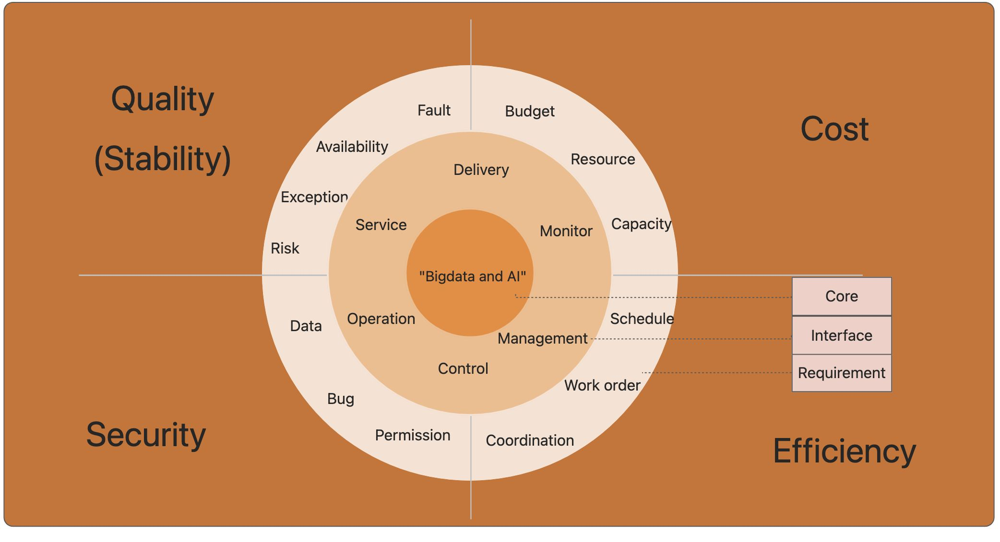
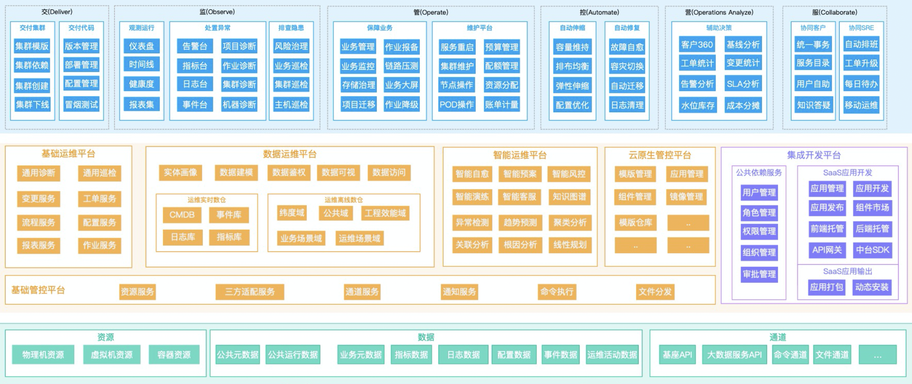
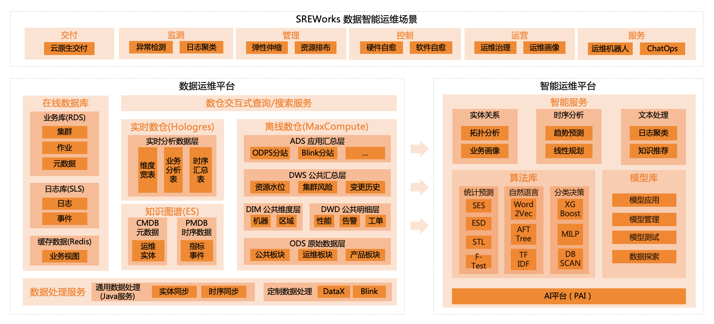
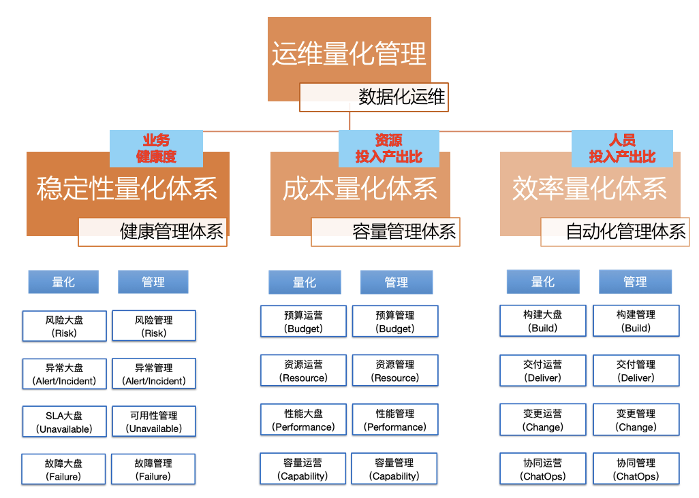

SREWorks产品解决方案的核心思想：以“数智”能力为驱动**内核**，抽象运维业务的“交、监、管、控、营、服”场景**界面**，支撑运维领域**需求**—— 质量，成本，效率，安全。

## 运维业务领域（需求）
在不同的公司，或者是同一个公司里不同的发展阶段，运维所承担的职责都会有所不同，运维的价值也没有固定的公式去计算或衡量。但无论是职责多变，还是价值各异（体感高低），运维相关的内容边界或者是需求都可以划定在“质量、成本、效率、安全”的几个本质维度下，所有公司或阶段的运维工作无非都是解决上述四类领域场景需求。

### 质量
对于质量的解释，美国著名质量管理专家 J.M.Juran 博士从顾客的角度提出的定义：“**产品(服务)质量就是产品(服务)的适用性，即产品(服务)在使用时能成功地满足用户需要的程度**”。简洁一点描述即“满足用户需要的**程度**”，在阿里我们更多将质量称之为“稳定性”，近年来也有业务“连续性”的说法。围绕其相关工作的泛称即稳定性管理，或业务连续性管理。无论是稳定性或连续性，都属于产品或服务质量的一种“程度”描述。

### 成本
本质上对应业务部门产生效益，而运维则属于成本部门，也就是花钱的部门，**但是运维可以通过成本控制产生效益**。在海量规模服务的情况下，资源/人力都是非常昂贵的资源，成本的控制精细化考验了运维团队的技术能力和管理能力。

### 效率
效率无处不在，在不同的场景下都有涉及，比如资源、业务交付效率，研发活动效率，变更效率，故障定位，问题处理效率等。效率是运维平台的能力体现，特别是在海量规模服务的场景下，假如没有运维平台的效率提升帮助，那将会整体阻碍业务乃至公司的发展。

### 安全
安全是一个互联网产品的生命基线，要建立一个全面的安全体系，从系统安全、数据安全、网络安全、应用安全等各个维度去对待安全的问题，其中对于数据的安全保护，更是中重中之重。整体上安全涉及的内容非常的多，一般稍微大点规模的公司需要建设专业的安全团队。

在上面我们从四个维度出发看运维本质相关工作，运维要搭平台，建规范，做标准，还要用自动理念提升效率、数据驱动测试/开发/运维、智能手段提前发现/预测风险问题等。这些可以看成是方法论，如何能从理论快速获得一套体系化、工程化、产品化的能力实践，去支撑满足上述四个维度的需求就是我们SREWorks所考虑的问题。  我们利用分层思想构筑SREWorks平台产品体系，借鉴经典SPI（SaaS/PaaS/IaaS）三层划分思路，SREWorks也可以由“运维SaaS应用场景层、运维PaaS中台服务层、运维IaaS接入层”。在SREWorks中融入运维规范、标准化思想，利用产品承载自动化流程、数据驱动、智能内核的思想方法论实践。

## 运维业务场景（界面）
在运维SaaS应用场景层，我们思考一个问题：对于研发活动，从代码到线上业务服务的整个过程，运维或多或少都参与了哪些工作？如下图所示，我们将所支撑的运维业务场景划分为“交付、监测、管理、控制、运营、服务”六大场景块，每块内容里都有代表性的核心功能。 我们统一以应用抽象来描述业务系统，开发人员将研发完成的应用制品在**交付**阶段完成上线后，对于线上应用实例，负责其生命周期管理的**监管控**，并将我们所拥有的运维数据能力提供增值化的**运营、服务**，帮助有需要的人员提供便捷的视图、管理能力等，下面将对这六大场景块做详细的定义及边界说明。 

### 交付
定义从应用的代码开发测试，到发布线上部署应用实例的过程为**交付场景**，该场景对应业界的DevOps或GitOps所覆盖范围，交付场景提供的功能包含代码托管管理、代码编译构建流水线管理、应用制品分发、线上部署等，同时还包含基础设施依赖的管理。 在云原生时代，交付环境更加统一标准化，可借助Kubernetes统一不同基础设施差异，向应用提供统一的资源采用模型，而基础设施管理也可以统一抽象为Kubernetes集群管理，或多云管理。

### 监测
当应用实例部署到线上运行后，应用运行时将会产生日志、指标、事件、跟踪等一系列运维原始数据，**监测场景**的主要功能就是对一系列运维数据进行监控或二次加工处理，用来监测应用实例的运行情况是否在我们预期范围内。 监控领域发展很久，工具繁多，协议标准也各异，在云原生时代由于底层基础设施的统一抽象化，监控领域也迎来了“**云原生全观测**”时代的统一理念，这一领域的标准化协议规范也在火热构建中。

### 管理
当监测到系统运行风险异常或故障时，我们需要对线上系统进行一些**一次性的**变更管理，或者是正常计划中的应用版本配置变更、日常维护变更等，这类**由人去决策并触发执行的场景**我们定义为**管理场景**。通过一系列自动化的变更管理工单实施，让应用运行在我们预期范围内。 其中在云原生时代有个核心理念：不可变基础设施。因此云原生时代的线上变更更多是应用版本化的变更，会直接通过应用实例Pod的重新rolling来完成，尽量去避免修改线上环境配置等。

### 控制
对于**控制场景**，本质上也是对线上系统进行变更管理，相对于管理场景的差异，我们定义由**由系统不断去发现、决策并触发执行的场景**我们定义为**控制场景**。通过对线上系统运行状态的一系列描述及监测，我们有相应的“自愈”或者“调和”功能模块去**不断重复“感知、决策、执行”的逻辑**，确保系统运行在我们的预期范围内。 也可以将控制场景理解为，无人值守或无人运维（NoOps）场景，在一开始的时候我们将一些简单的运维场景去无人运维化，随着运维工作的展开，我们可以尝试将更复杂的，模拟人处理的日常维护场景去做无人运维化，参考汽车的自动驾驶的发展演进，有异曲同工之处。控制场景的丰富与否体现了AIOps实践的成熟度。

### 运营
当我们拥有了全量的组织人员、系统、应用全生命周期的数据后，我们可以很容易实现一系列**运营场景**。可以实现基础设施或平台的资源运营、稳定性运营等，也可以利用应用中业务对象实例相关数据，实现线上业务的运营。还可以对运维平台自身进行运营，可视化运维领域工作成果等。

### 服务
研发体系内角色众多，一般包含开发，测试，运维，运营，资料以及管理人员等，无论是烟囱式、还是一体化的研发队形，都有分工协作的场景，而运维作为掌握线上线下各系统数据最多的角色，他们有义务将一系列相关能力提供出来为他人所用，所以我们定义运维能为其他角色提**供协同服务的场景为服务场景**。典型代表为知识库、ChatOps、机器人答疑等场景。

## “数智”运维（内核）
大数据&AI的思路可以用于商业化价值挖掘，同样在运维领域也能适用，“数智”的缩写“数据化、智能化”就是指的大数据&AI技术，使用数据化和智能化实践运维产品的思想，向运维工具或平台注入血液和经络，赋予了运维产品的灵魂。 借助于大数据&AI思想及平台工具，可构筑面向运维领域的数据化、智能化运维能力，我们称之为DataOps，并在DataOps基础之上叠加AI的能力，并实现“智能感知、智能决策、智能执行”的闭环使之成为我们的AIOps体系。利用数据打通、连接产品的每一项功能，附加AI能力去进一步增强、关联运维的数据和功能，探索、挖掘出对业务更有价值的场景。  借助阿里飞天大数据&AI平台能力构筑的“数据运维平台”和“智能运维平台”是大数据SRE在数据化运维和智能化运维的最佳实践，在开源版中可以窥探到部分功能及场景的实践，方法论思想是一致的。

### 数据化运维（DataOps）
数据化运维的本质——从运维数据到知识的价值提取。什么是数据化运维? 我们这样定义：数据化运维是一套能将“生产系统”进行运维量化管理的业务模型，基于该业务模型建设标准化的运维数仓，把所有系统的运维数据统一采集起来、真正打通，深度挖掘这些数据的价值，为运维提供数据决策基础和依赖。 从系统“稳定性、成本、效率、安全”多个维度去驱动自动化、智能化的运维运营。相比于传统运维，DataOps的改变可能就是把传统的使用命令、人工决策的运维过程转变成数据+算法的模式。  整体思路分解下来包含了标准化运维数仓建模，统一的运维数据采集、数据计算、运数据服务以及运维数据应用，按照规范建立运维数据仓库，然后把所有运维相关的数据做分类抽象，包含公共数据、业务数据、元数据，runtime实时数据。基于这些数据抽象，我们提供了大量的运维服务和数据服务，比如异常检测分析、故障自愈、可视化流程、运维搜索、运筹优化、全链路诊断等。

### 智能化运维（AIOps）
AIOps 中的 AI 经过修改后，目前最新的释义是 Artificial Intelligence。为什么说实现 AIOps 必须要经过DataOps 阶段？因为我们认为 AIOps 其实就是在传统的数据化运维之上附加智能，如果在感知、决策、执行每个阶段都附加上AI的附加值之后，我们认为这才真正实现了 AIOps。 常见的AI手段包括算法、深度学习、神经网络等等。AIOps 绝对不是从无到有，它一定是随着你在某个领域持续地构筑、持续地积累，然后在每个阶段附加上新的AI。

## 
