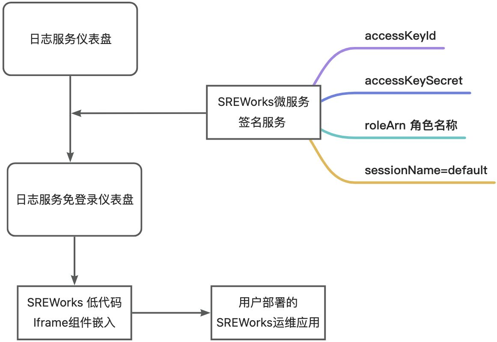
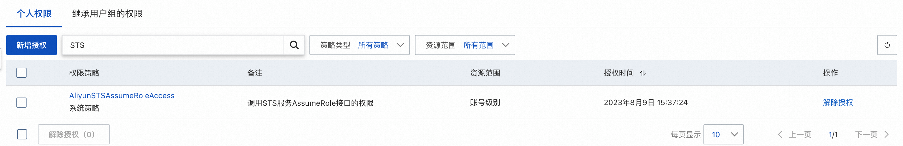
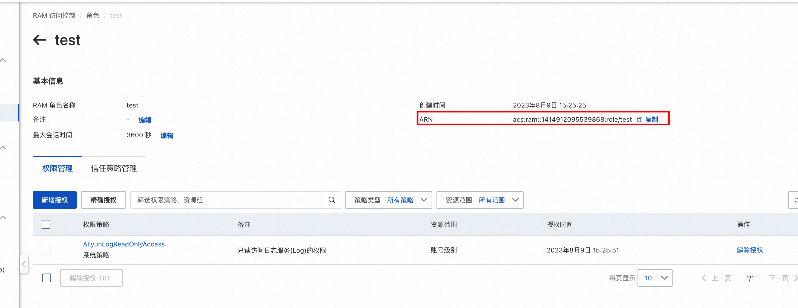
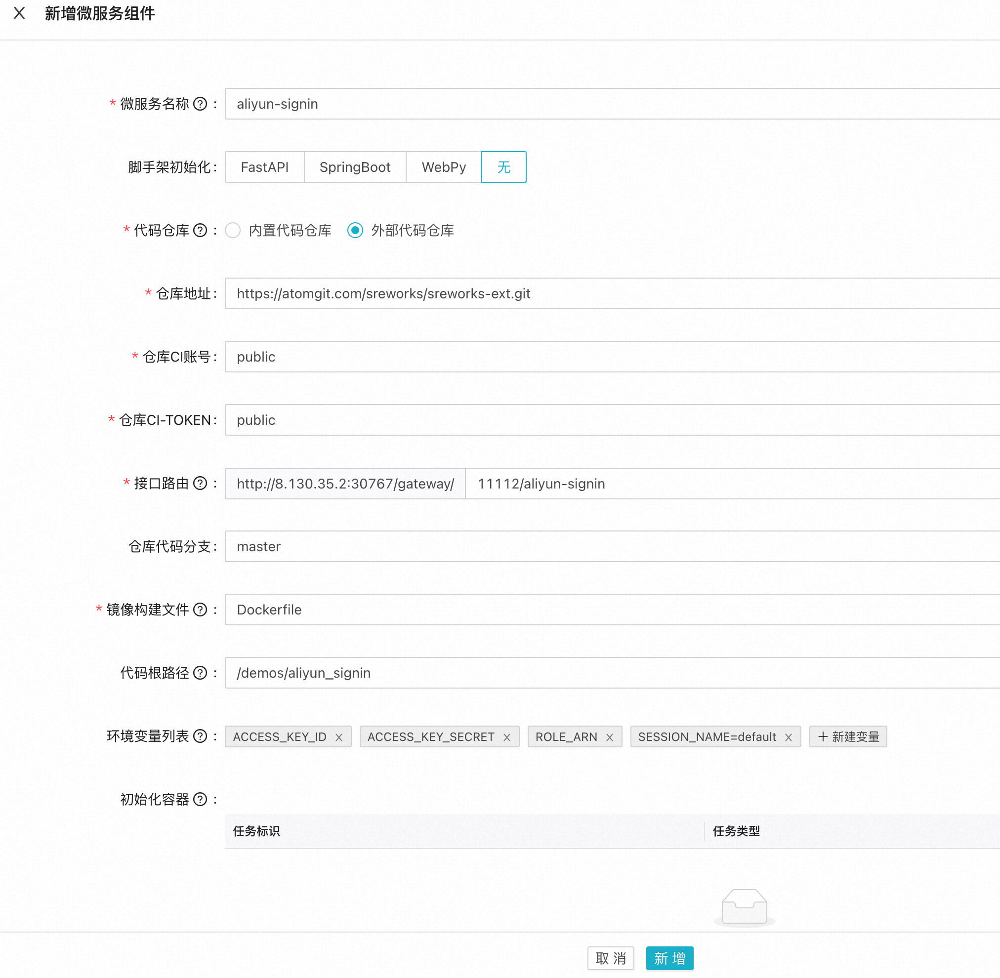
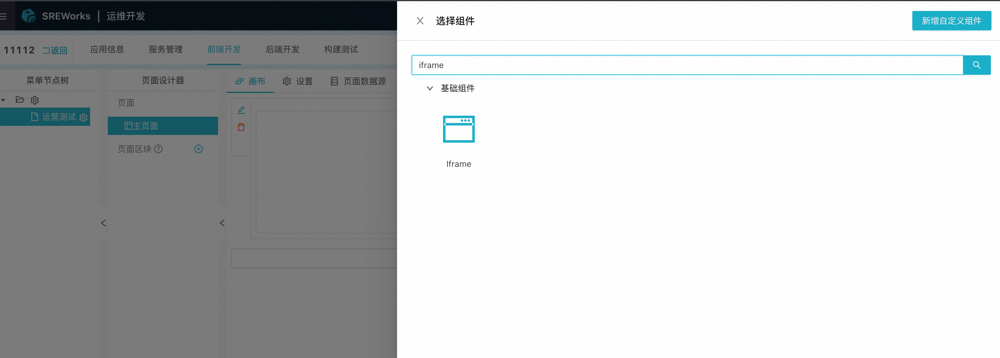
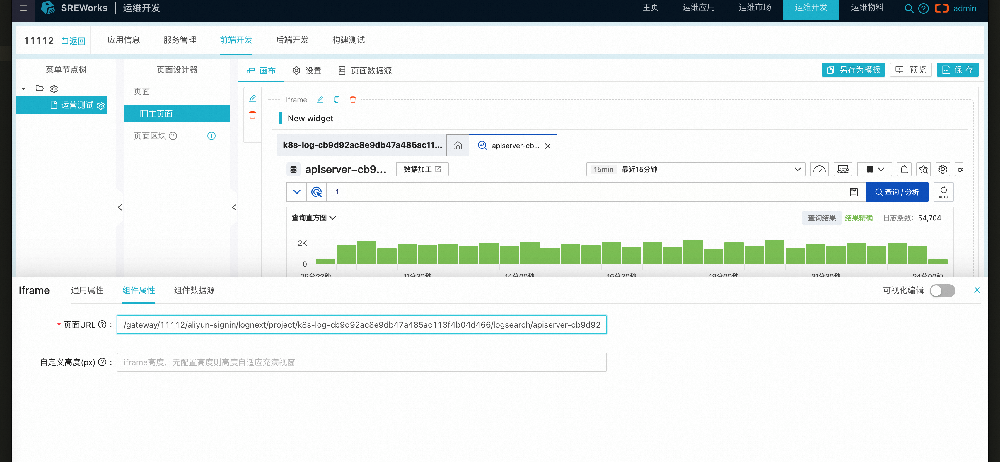

<a name="Psrcf"></a>

# 背景
SREWorks运维应用是一个强大的运维中台，它可以帮助用户快速构建和管理运维应用。通常，用户会同时使用多种云厂商的服务来满足不同的需求。于是，常常会有用户在SREWorks运维应用中整合各种云服务的控制面板。<br />本文将以阿里云日志服务（SLS）为例，展开讲一讲。<br />SLS是阿里云提供的日志服务，它可以帮助用户收集、存储和分析大规模的日志数据。在SREWorks上整合SLS的日志面板，能够帮助用户更加高效地管理、监控、分析应用以及基础设施的情况。<br />在阿里云日志服务的官网中，提供嵌入式集成的方案，如下链接所示。本文将会围绕这个嵌入式集成方案，进行SREWorks上的落地实践。<br />[如何通过嵌入式集成查询分析和仪表盘查看日志数据_日志服务-阿里云帮助中心](https://help.aliyun.com/zh/sls/developer-reference/embed-console-pages-and-share-log-data)<br />
<a name="QIZQv"></a>

# 
<a name="cMIKv"></a>

# 一、签名用RAM子账号以及角色准备

1. 在阿里云RAM子账号页面创建一个子账号 [https://ram.console.aliyun.com/overview](https://ram.console.aliyun.com/overview)。同时获取到该账号的 `accessKeyId` 和 `accessKeySecret`。
2. 在该子账号的权限管理中增加`AliyunSTSAssumeRoleAccess`权限，用于调用角色扮演接口。

  3. 在阿里云RAM角色中增加一个角色 [https://ram.console.aliyun.com/roles](https://ram.console.aliyun.com/roles)。

4. 为这个角色增加 `AliyunLogReadOnlyAccess`权限，使得扮演该角色的账号能够具有SLS日志只读权限。
5. 在角色页面中复制出 `ARN`变量用于后续的签名。



6. 下载 [https://github.com/alibaba/sreworks-ext/blob/master/demos/aliyun_signin/test.py](https://github.com/alibaba/sreworks-ext/blob/master/demos/aliyun_signin/test.py) 测试脚本，替换下面四个变量用于测试：
   - `accessKeyId` 步骤1得到RAM子账号的ak。
   - `accessKeySecret` 步骤1得到RAM子账号的sk。
   - `roleArn`步骤5中得到的RAM子账号。
   - `destination` 填写需要签名的SLS面板URL，可以参考下列的URL进行拼接。参考文档 
      - 完整查询分析页面 `https://sls4service.console.aliyun.com/lognext/project/**<Project名称>**/logsearch/**<日志库名称>**?hideTopbar=true&hideSidebar=true&ignoreTabLocalStorage=true`
      - 查询页面 `https://sls4service.console.aliyun.com/lognext/project/**<Project名称>**/logsearch/**<日志库名称>**?isShare=true&hideTopbar=true&hideSidebar=true&ignoreTabLocalStorage=true`
      - 仪表盘页面 `https://sls4service.console.aliyun.com/lognext/project/**<Project名称>**/dashboard/**<仪表盘ID>**?isShare=true&hideTopbar=true&hideSidebar=true&ignoreTabLocalStorage=true`

如果能够成功签名，执行日志应如下所示，该链接可以免登录直接访问：
```shell
################### Step 1: 扮演角色，获取STS Token ####################
{'RequestId': '2A9938CD-85EB-5A38-B6D0-F44AB87505CC', 'AssumedRoleUser': {'Arn': 'acs:ram::1414912095539868:role/test/default', 'AssumedRoleId': '300652397324788779:default'}, 'Credentials': {'SecurityToken': 'CAIS6gF1q6Ft*******', 'AccessKeySecret': 'Cz2rE1zTXe8YL*****', 'Expiration': '2023-08-09T08:57:34Z'}}

################### Step 2: 使用STS Token换取控制台Signin Token ####################
svX6LF3dYRC382********

################### Step 3: 生成登录链接 ####################
https://signin.aliyun.com/federation?Action=Login&LoginUrl=http%3A%2F%2Fwww.aliyun.com&Destination=http%3A%2F%2Fsls4service.console.aliyun.com%2Flognext%2F*****&SigninToken=svX6LF*****
```

<a name="wypwS"></a>

# 二、构建阿里云签名微服务
在第一章节中，我们使用脚本完成了URL的签名，并且验证可以免登录直接访问，但这个访问链接是有时效性的，我们需要把这个签名变成一个web服务。代码如下： [https://github.com/alibaba/sreworks-ext/blob/master/demos/aliyun_signin/server.py](https://github.com/alibaba/sreworks-ext/blob/master/demos/aliyun_signin/server.py)

1. 我们将 `ACCESS_KEY_ID`、`ACCESS_KEY_SECRET`、`ROLE_ARN`作为环境变量在服务启动的时候传入，使得服务具备有签名URL需要的参数。
2. 需要签名URL从服务中实时传入，使得任意需要免签的URL都可以灵活被签名，无需重启服务。
```shell
FROM python:3.11-alpine
COPY . /app
RUN sed -i 's/dl-cdn.alpinelinux.org/mirrors.aliyun.com/g' /etc/apk/repositories
RUN apk update \
   && pip install -i http://mirrors.aliyun.com/pypi/simple --trusted-host mirrors.aliyun.com -r /app/requirements.txt
WORKDIR /app
ENTRYPOINT ["python", "/app/server.py"]
```
将这个微服务注册进SREWorks的微服务组件之中，同时将环境变量的key也都注册进去。<br />

在应用部署的时候注意将上述提到的几个变量传入。<br /><br />于是在部署完成之后，我们得到了一个签名微服务 `http://部署地址/gateway/运维应用名(11112)/微服务组件名(aliyun-signin)/待签名路径`。我们将第一章提到要签名的URL `lognext/project/**<Project名称>**/logsearch/**<日志库名称>**?hideTopbar=true&hideSidebar=true&ignoreTabLocalStorage=true`替换掉待签名路径即可，这个服务直接返回的302跳转免签地址，因此，可以直接放在iframe中使用。
<a name="vyrBq"></a>

# 三、前端组件服务面板整合
我们在运维应用的前端开发 -> 菜单节点树 -> 页面设计器 -> 选择组件 中能够找到iframe组<br /><br />在页面URL中填入相对地址即可 `/gateway/运维应用名(11112)/微服务组件名(aliyun-signin)/待签名路径`，效果如下图所示。<br />
<a name="Lshjj"></a>

# 小结
通过SREWorks运维应用中的前端低代码组件和微服务的配合，我们可以方便地将各种云服务免签面板整合进运维面板中--同时整个过程也避免编写一些重复的代码，使得SRE同学能够更加聚焦运维需求的实现。
:::info
针对阿里云的ARMS监控，我们同样可以使用这个方案进行免签整合，参考文档，只需要把签名的地址换一下即可。[如何将ARMS页面嵌入自建Web应用_应用实时监控服务-阿里云帮助中心](https://help.aliyun.com/zh/arms/application-monitoring/use-cases/embed-arms-console-pages-in-self-managed-web-applications)
:::
